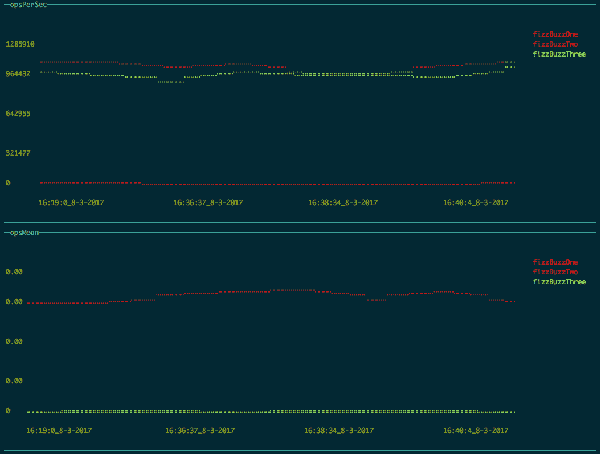
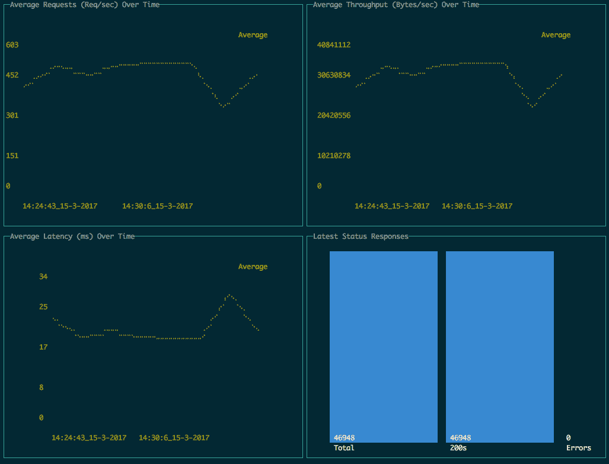

# Node.js 如何帮助时尚电子零售商 Net-a-Porter 处理压倒 Java 的销售流量

> 原文：<https://thenewstack.io/la-node-yoox-net-porter-moves-node-js/>

Yoox Net-a-Porter Group 是互联网上最重要的高端设计师服装和配饰时尚供应商之一。该公司拥有超过 290 万高消费客户的客户群，全球每月独立访客超过 2900 万，2016 年总净收入超过 20 亿美元。

鉴于该网站的高价、超豪华商品，流量通常是稳定的——也就是说，直到 Net-a-Porter 举行其史诗般的一年两次清仓大拍卖。时尚达人蜂拥而至，交通流量以两位数的数量级激增……直到一切崩溃的那一刻。在过去的十年里，每一次大型销售都是如此，导致销售损失和顾客失望。

解决方案是增加基础设施来处理增加的负载，对吗？现场工程师的想法不同。Yoox Net-a-Porter Group 的首席开发人员[罗宾·格伦](http://techblog.net-a-porter.com/author/robin/)在最近的一次采访中解释道:“由于时尚的本质，比任何人都更早买到便宜货，这就像是在原本稳定的交通状况下，六个小时的疯狂上涨。”。“假设我们有两个主要的销售市场，夏季和冬季，传统的解决方案会让我们所有这些冗余的硬件除了每年 12 个小时之外什么也不做。”

该公司最初是一家 Java 商店，使用 Spring 模型-视图-控制器(MVC)平台。“这是一个随着公司成长而成长的平台，但主要问题是它永远无法承受销售流量，”Glen 解释道。他补充说，拥有一个庞大的、单一的 Java 代码库还有其他不太好的方面——比如六周的发布周期和没有自动化测试周期。

Net-a-Porter 短暂而急剧的交通高峰是目前需要基础设施的最佳例子，而不是未来十年。(这是一个技术世界趋势——只要看看 [DevOps](/category/devops/) 和[微服务](/category/microservices/)的崛起就知道了)。为了寻求创新的想法，该公司成立了一个工程师任务小组，给他们 10 周时间来找出解决问题的方法——一种不需要向数据中心添加物理机器的方法。

团队并不真正知道任何新的解决方案实际上需要处理多少流量，这一事实使得这一任务变得复杂。“因为我们从来没有能够承受的流量，我们从来不知道我们可以期待什么样的流量——我们去了一两个小时，网站就会崩溃，”格伦说。最终，该团队决定将销售流量从网站本身移走——处理他们的大销售流量——会以最少的努力和干扰获得最大的收益。

最终，Yoox Net-a-Porter 决定 [Node.js](https://nodejs.org/en/) 是其半年度销售混乱的解决方案。

“我们最初关注 Node，因为我们所有的网站都是完全无状态的，只是一系列产品，”Glen 说。“当时，我们有大量的 JavaScript 开发人员，但可用的 Java 开发人员很少。这不是一个简单的转变，你仍然需要天赋，但对语法的理解，这种资源是存在的。”

## 以 JavaScript 挑战为例

他们组建了一个小团队，期限很紧:10 周构建一个节点应用程序，包括部署到 AWS 的 DevOps。事情进展顺利，就在该网站 2014 年冬季销售之前，Net-a-Porter 的 IT 团队将整个销售部分的运营推至新系统……该系统完全按计划运行。

"这是 10 年来第一次销售没有被否决！"格伦欣喜若狂。

格伦说，整个转变非常成功。不仅仅是因为它有效:还因为团队取得了所有权。他解释说:“有时候，随着那些坏习惯和丑陋的捷径被清除，修复一些东西比重新开始更难。”“开发人员更加小心，投入更多，因为他们知道这是干净的。代码是你的，没有重新格式化的包袱，不用担心你做的任何事情会破坏其他东西。”

在第一次尝到 Node.js 的成功后，Yoox Net-a-Porter 想要更多。“我们已经尝试将网站的一部分变成微服务，这很好，”格伦说。

Glen 说，最终目标是建立一个持续集成/持续部署(CI/CD)工作流。如今，该公司的堆栈中有“少量遗留 Java”，但 Glen 报告称，“总体而言，90%至 95%的流量由 Node.js 处理。”

函数图:这显示了在 Net-a-Porter 内部创建的测试函数的工具中，以三种不同方式编写的三个函数(例子是 fizz buzz)。当 Net-a-Porter 实现一个解决方案时，它总是对代码进行性能测试。

Glen 对 Node 在 CI 管道中的性能基准测试特别满意:“在我们的节点堆栈上实现所有自动化，这是非常罕见的。”

这个服务器图显示了一个正在使用相同的 Net-a-Porter 基准测试工具进行负载测试的假装模拟服务，该图再次直接打印到终端中。在这里，您可以看到引入了一些代码，增加了延迟，进而降低了并发性。Net-a-Porter 在管道中使用这个图来观察性能回归。

公司的目标是完全信任代码，避免引入回归——同时加速生产周期。“以前我们会在发布前进行几周或几个月的测试，现在我们有信心，我们所做的改变只会产生我们想要的影响，”他说。以前基于 QA 模型，现在商店有测试专家工程师来帮助指导开发团队——但是“我们没有任何 QA”

Glenn 说，该公司最终希望部署“无头商务”，即一系列后端产品 API 和数据端点，可以通过 Node 从任何前端消费。

Glen 说，迁移到不仅在技术层面上发生了变化，而且“对我们公司来说，这是一次真正的文化转变”。Net-a-Porter 从“与大的技术公司合作，有目标的交付流”到依靠他们的开发者进行响应性的、几乎实时的平台迭代。这使得 Net-a-Porter 及其兄弟网站(如波特先生)能够通过将其前端团队分成子团队，每个子团队专注于从浏览到结账的整个客户体验的不同微观方面，在竞争激烈的市场中保持领先。

“我们可以将注意力放在客户端性能上——改变浏览器模式、复制原生应用程序和丰富的用户体验——因为我们对我们在 Node 上所做的事情有足够的信心，相信一切都能正常工作。”

因此，一家成立于 2000 年的公司发现，成功的关键是提供奢华、个性化、尤其是无缝服务的豪华购物体验。这家公司的特定前提是，在线零售的新世界仍能提供传统奢侈品。这种商业模式使 Yoox Net-a-Porter 成为全球电子商务的领导者之一。在这种情况下，给你的开发团队足够的带宽来专注于让你的公司如此成功的事情。

听起来 Node.js 就是时尚的高度。

来自 [Net-a-Porter 的网集](https://www.thenetset.com/)的特征图像。

<svg xmlns:xlink="http://www.w3.org/1999/xlink" viewBox="0 0 68 31" version="1.1"><title>Group</title> <desc>Created with Sketch.</desc></svg>