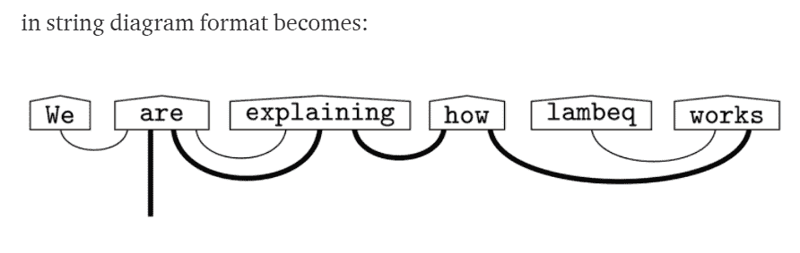

# Lambeq，量子自然语言处理工具包

> 原文：<https://thenewstack.io/lambeq-a-toolkit-for-quantum-natural-language-processing/>

自然语言处理(NLP)对于高性能计算(HPC)和企业来说变得越来越重要，从自动化日常任务到深入了解正在生成的大量数据。

作为[人工智能](https://thenewstack.io/category/machine-learning/)(AI)[NLP](https://thenewstack.io/openais-gpt-3-makes-big-leap-forward-for-natural-language-processing/)的一个组成部分，它通过让系统更容易[理解人类语言](https://thenewstack.io/the-promising-duo-five-use-cases-for-natural-language-processing-in-fintech/)并破译所用单词和短语的含义，从本质上改善了人与机器之间的关系。根据市场研究公司 Statista 的数据，全球自然语言处理领域的收入预计将从今年的 175 亿美元增长到 2025 年的近 433 亿美元。

现在，英国的一家初创公司正在采取措施，在量子计算领域实现 NLP。[剑桥量子](https://cambridgequantum.com/)最近发布了公司官员所说的第一个用于[量子自然语言处理(QNLP)](https://medium.com/cambridge-quantum-computing/quantum-natural-language-processing-748d6f27b31d) 的工具包和库。名为[lambeq](https://quantumcomputingreport.com/cambridge-quantum-release-lambeq-a-quantum-natural-language-processing-toolkit-and-library/)——以已故数学家和语言学家 [Joachim Lambek](https://en.wikipedia.org/wiki/Joachim_Lambek) 命名——软件[工具包旨在将句子转换成量子电路。](https://thenewstack.io/quantum-computers-are-here-but-what-to-do-with-them/)

## **真实世界量子 NLP 应用**

目标是帮助开发人员为自动对话、文本挖掘、语言翻译、生物信息学和文本到语音转换等任务创建真实世界的 QNLP 应用程序。Cambridge Quantum 已经向开源社区发布了 lambeq，供开发人员和研究人员更广泛地使用。它与该公司的 [TKET](https://cambridgequantum.com/tket/) 量子软件开发平台协同工作，该平台也是开源的。

Lambeq“自动化了大规模实现 QML[[量子机器学习](https://en.wikipedia.org/wiki/Quantum_machine_learning)流水线所必需的任务，这些流水线是根据语言的组合模型设计的，”[剑桥量子的首席科学家 Bob Coecke](https://www.linkedin.com/in/bob-coecke-9389627/)告诉新的堆栈。“任何对探索自然语言处理的质量控制潜力感兴趣的学术界或工业界的研究人员都可以使用我们的工具包来实现这一目标。”

经过几十年的讨论和实验，全球[量子计算](https://thenewstack.io/a-quantum-challenge-building-a-skilled-workforce/)空间有望在未来几年快速增长。据经验证的市场研究分析师称，到 2028 年，这一空间将从去年的 2.522 亿美元跃升至[近 18 亿美元，部分原因是计算能力的提升、数据中心工作负载的扩大以及](https://www.verifiedmarketresearch.com/product/quantum-computing-market/)[正在进行的向软件即服务的转变](https://thenewstack.io/project-calico-kubernetes-security-as-saas/) (SaaS)。

## **量子计算机与经典计算机**

经典计算机使用传统的二进制位，可以存储为 1 或 0。量子系统依赖于量子比特，量子比特可以存储为 1 和 0，极大地扩展了计算机的计算能力。霍尼韦尔、IBM、微软和谷歌等老牌公司正在加入一系列初创公司的行列，推动量子计算领域向前发展。

2014 年推出的剑桥量子(Cambridge Quantum)就是这些创业公司之一。该公司在 6 月份宣布，它将与霍尼韦尔的量子业务霍尼韦尔量子解决方案合并，成立一家新公司，专注于运行量子计算机的离子捕获方法论。霍尼韦尔自 2019 年以来一直是剑桥量子的投资者。IBM 是这家初创公司的另一个投资者。

除了 TKET 软件平台，剑桥量子还为化学、机器学习、金融和网络安全等行业开发了软件。现在公司已经向 NLP 迈进了一步。把一个普通的句子转换成量子是一个复杂的过程。

## **量子 a 复杂任务上的 NLP**

量子系统中的 NLP 处理绝非易事。根据剑桥量子大学科学家的一篇博客文章，它首先将语法树转换成语法树格式，然后将语法树转换成字符串图，字符串图表达了句子的语法结构。科学家们用“我们正在解释 lambeq 是如何工作的”这句话作为字符串图表的例子，如下所示:

“弦图可以通过应用重写规则来简化或转换，”他们写道。“例如，人们可能希望这样做，以使图表更容易转换为适合当前可用的量子硬件的电路。然后，根据在量子或经典计算机上执行的选择，重写的弦图将被转换为实际的量子电路或张量网络。”

然后，开发人员可以将此传递到 TKET 平台，以移动到量子模拟器或量子计算机。

lambeq 的模块化设计使用户能够交换模型中的组件，并驱动灵活的架构设计。

“我们使用的语言模型试图将嵌入意义的分布(基于向量空间和概率)方法与组合(形式、符号、结构)方法结合起来，这些方法描述了意义在文本中如何流动和互动，”Coecke 说。“我们的 NLP 品牌中的语法和句法结构是由描述过程理论的相同数学来抽象描述的。适用的过程理论之一是量子理论。因此，我们可以在这种成分框架下进行形式上的数学类比，构建量子语言模型。”

## **从序列到二维**

量子计算中的 NLP 是一项复杂的任务，它从口语单词的顺序性质转变为不那么一维的东西。

“关键是人类在进化出用于呼吸和进食的嘴孔后进化出了语言，”科克说。“这种物理限制迫使我们按顺序一次说一个单词。我们也是这样写的。但是，我们所表达的概念，我们所讲述的故事，我们相互传递的信息，形成了一个连接性高于一维的依赖网络。甚至你在学校学到的语法树，在一个句子中编码依存信息，也是二维结构。更进一步，将句子连接在一起形成了一个意义之间的依赖关系的大网络。讲一个故事意味着在这个网络上行走，这种时间顺序产生了我所说的“语言回路”"

他说，量子计算机比经典系统更适合运行 NLP 工作负载。

“不同之处在于人们使用哪种型号和哪种硬件更适合，”Coecke 说。“回到‘量子原生性’，我们相信一种特定的语言处理方法可以自然地映射到量子计算中。由于这是 QAI[量子人工智能]的一个新研究领域，潜在的收益仍在探索中。那么他们只会影响这种 NLP 方法有用的组织。关于开发人员，我们重申一点，发布 lambeq 对于对 NISQ[嘈杂的中等规模量子]应用感兴趣的开发人员来说很重要。”

Lambeq 已经作为 GitHub 上的传统 Python 库[和 lambeq 在 IBM 量子计算机上生成的量子电路发布，剑桥量子科学家已经在 IBM 量子计算机上运行了他们的大部分实验。](https://github.com/CQCL/lambeq)

<svg xmlns:xlink="http://www.w3.org/1999/xlink" viewBox="0 0 68 31" version="1.1"><title>Group</title> <desc>Created with Sketch.</desc></svg>