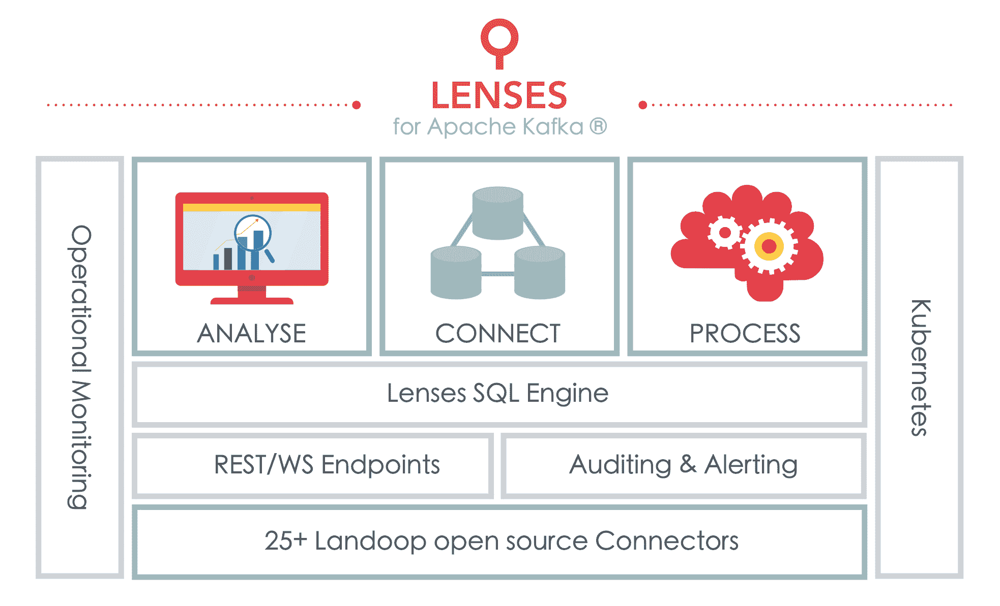

# Landoop 镜头有望简化 Kafka 流的应用程序开发

> 原文：<https://thenewstack.io/landoop-lenses-promises-ease-application-development-kafka-streams/>

快速浏览一下 [Landoop 的](http://www.landoop.com/) [GitHub](https://github.com/Landoop) 账户，你可以很容易地看到该公司的主要关注点:从 [Apache Kafka](https://kafka.apache.org/) 流处理平台获得可供企业使用的数据。该公司由首席执行官 Antonios Chalkiopoulos 和首席产品官 Christina Daskalaki 创立，他们多年来围绕 Apache Kafka 开发附加软件和工具。

这些工具涵盖了一系列企业必备的东西，从提取、转换和加载(ETL)参考架构[流反应器](https://github.com/Landoop/stream-reactor)到[快速数据开发](https://github.com/Landoop/fast-data-dev)，这是一个包括 Zookeeper、Kafka、一个模式注册表和超过 20 个平台连接器的项目。

现在，他们正通过他们的镜头平台将公司带入产品市场。这个商业企业 Kafka 流平台包含了 Landoop 在其独立工具中创造的许多优势。该平台的目标是让开发者和分析师更容易使用 [Kafka Streams](https://kafka.apache.org/documentation/streams/) 进行实时数据分析。

在[lens](http://www.landoop.com/kafka-lenses/)中，这采用了一种基于网络的工具的形式，让用户可以通过拖放和类似 Excel 的方式访问他们所有的 Kafka 流和主题。用户还可以注册 SQL 流处理器，以便在信息传输过程中对其执行 ETL 和其他数据操作。这甚至让商业智能工作者能够直接接触流数据，甚至为他们提供了在 ETL 工作期间进行分析的机会。

“我们很久以前就开始与 Kafka 合作，当时 Kafka 没有现在的能力。几年前，我们开始围绕 Kafka 构建许多开源工具。我们写了 35 个开源组件。Chalkiopoulos 说:“随着时间的推移，我们想出了建造更大更好的东西的想法，以便让许多利益相关者更容易使用。

他补充说，这些利益相关者可以在公司的任何地方，不需要 SQL 以外的知识。“现代数据团队有数据工程师、数据科学家、业务分析师、运营人员，甚至高层管理人员，”Daskalaki 说。“我们看到人们希望看到数据流入他们的浏览器。我们做的第一个组件是为了数据的可视化。它由我们位于该层之上的 SQL 引擎提供支持。这不仅仅是一个 Web 界面，我们还提供了包装 API 的库，开发者也可以访问这些 API。”

12 月，Landoop 发布了 Redux，这是一个用于 Kafka 开发的 JavaScript 库。这源于一个客户的需求。结合对 Kubernetes 和自动缩放的内置支持，Lenses 提供了一种快速且广泛可用的方式来与 Kafka 流进行交互。用户可以浏览数据管道中的主题，甚至可以为这些管道分配转换，从而消除了单独的数据规范化步骤。

Chalkiopoulos 说:“在过去十年中，大数据被引入许多企业的大数据所主导，但这些系统在某些情况下提供的价值值得怀疑。”“我们认为流式数据将是未来的趋势。我们认为这是一个不断发展的领域。除了数据仓库、微服务和移动设备之外，还将出现一个新的数据流垂直领域，人们可以在其中立即获得预期结果。”

镜头的力量还在于它将外部系统与卡夫卡作品联系起来的能力。“我们已经做了大量工作，将 Kafka 与第三方系统连接起来。我们收集了大量的 Kafka 连接器，它们都是开源的。这使得人们只需要配置就可以构建流式 ETL，而不需要编写任何代码。只要代码在，它就理解卡夫卡和目标系统；无论是仓库、NoSQL 还是关系数据库。Chalkiopoulos 说:“这负责 ETL 的第一个和最后一个字母:提取和加载。

Daskalaki 承认，Kafka Streams 上的 SQL 是这些天来的常态，但她说 Landoop 的产品与其他可用产品有很大不同。“您可以在 Kafka 中查看和查询实时数据和批量数据。你可以用小规则创建实时流精度。我们还在连接器中包含了 SQL 引擎的某些方面，因此您可以在摄取时作为 ETL 过程的一部分进行查询和过滤。我们从 2016 年开始开发这个 SQL 引擎，它被广泛采用。此外，最大的因素是它与 Kubernetes 的天然集成。对于 SQL 处理器，它附带了一个 Web 界面，可以可视化 SQL 查询行，以便您可以与节点进行交互。”

帕诺斯·帕帕多普洛斯(Panos Papadopoulos)是[马拉松风险投资](https://marathon.vc)的合伙人，也是 Landoop 的投资者，选择投资这家公司很容易。“对我来说这很自然，”帕帕多普洛斯说，“我之前在 Splunk 担任产品经理。2012 年，没有好的流处理器。我看到一些客户想要移动数据，他们有一个管道，想要将数据发送到另一个系统，如 Splunk 或 Hadoop。”

帕帕多普洛斯认为 Landoop 为这些公司提供了急需的服务。“人们希望创建这种通用的数据管道，但 Kafka 本身是底层基础设施，因此他们必须使用其他工具进行分析。Landoop 是一种可以将运营世界与应用开发或分析世界联系起来的东西。他们的互动令人兴奋。您可以让数据在您的运营和基础架构中流动，这是可供运营部门使用的东西。对于不同的人来说，它们可以是许多东西，而不必使用不同的工具。”

通过 Pixabay 的特征图像。

<svg xmlns:xlink="http://www.w3.org/1999/xlink" viewBox="0 0 68 31" version="1.1"><title>Group</title> <desc>Created with Sketch.</desc></svg>