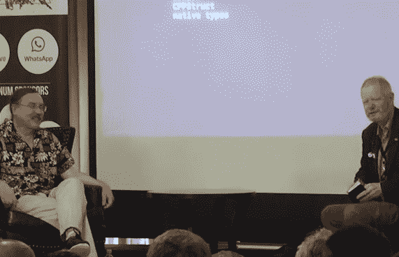

# 拉里·沃尔对百年编程语言的探索

> 原文：<https://thenewstack.io/larry-walls-quest-100-year-programming-language/>

编程语言 [Perl](https://www.perl.org/) 将在两个月后庆祝其 30 周年。2016 年，编程语言 Erlang 迎来了它的 30 周年纪念。因此，看看今年早些时候 Perl 的 63 岁的创造者[拉里·沃尔](http://www.wall.org/~larry/)和 [Erlang](https://www.erlang.org/) 的 66 岁的联合创造者[乔·阿姆斯特朗](https://joearms.github.io/)的谈话，展望未来，以及讨论这是一次多么漫长而又奇怪的旅行，可能会很有启发性。

“这意味着我们在硬件方面经历了相同的世代转变，”Armstong 在 Erlang and Elixir Factory SF Bay Area 2017 年会议上告诉人群，他记得早期计算机的“尺寸”在他的记忆中保持不变。“花了很长时间才打破的一个限制是软盘 1.44MB 的限制。在很长一段时间里，开发增加到 1.44MB，然后就停止了。”

[https://www.youtube.com/embed/SpH9BTMZKXc?feature=oembed](https://www.youtube.com/embed/SpH9BTMZKXc?feature=oembed)

视频

“我的限额比这个小，”沃尔回忆道。“我刚发节目的时候，[新闻组](http://www.usenet.org/)文章只能 32K 字。因此，如果你想发送软件，你必须有一个小程序，将你的程序分割成单独的文件，然后再粘在一起……”

但是，从长远来看，他也分享了自己的 Perl 历史，从他在 2000 年打破向后兼容性的重大决定开始，开发了一种全新的语言，称为 Perl 6——众所周知，它花了 15 年时间才最终发布一个稳定的版本。沃尔说，他最大的灵感之一是计算机科学家保罗·格拉厄姆 2003 年的一篇论文，该论文展望了百年语言那会涉及到什么？

“这与它是否可以扩展，是否可以随着时间的推移优雅地发展有关。”

Wall 是一名训练有素的语言学家，在编写 Perl 时，以及在他对百年语言的探索中，他可能一直在模仿我们人类(或“自然”)语言的表达能力，Wall 得意洋洋地说，拉出了一张幻灯片。

*   语言随着时间而进化。(“有方言没关系……”)
*   没有任意的限制。(“它们自然涵盖了多种范例”)
*   外部对风格的影响。
*   分形维数。
*   容易的事应该容易，难的事应该可能。
*   "而且，你知道，如果你真的很擅长，你甚至可以说计算机科学."

在一个简短的演示中，Wall 展示了 Perl 6 的一些新花样——包括它对所有语言的最基本单元的支持(带有适当的底层映射)。在某一点上，他证明了无穷大实际上可以用 Unicode 符号——边上有一个 8——或者用`Inf`来写。Perl 6 可以将弯引号转换成直引号，甚至是欧式的右引号。它处理上标和下标。虽然 Perl 6 附带了一个特殊的序列识别操作符……它甚至可以识别椭圆的 Unicode 符号。

“如果你碰巧想用藏语写你的数字，那也行。或者楔形文字。这完全不符合 Unicode。我的意思是，他们只提供这个，所以连接起来很简单，真的……”

还有一些对数学语言的关注。(与 Perl 5 不同，您可以将. 1 和. 2 相加得到. 3，因为 Perl 6 将它们视为有理数——一个分数——而不是浮点近似值。)和“因为是有理数，10.0 和 10 可以互换使用”——并非每种语言都是如此。

Wall 希望长寿——这对大多数编程语言来说并不常见。“要么你的语言太脆弱，人们只是发明不同的语言，用不同的语法做同样的事情，要么你的语言太模糊，它只是变得一团糟——有点像某些 Perl 5，除非你训练有素。所以为了避免这些大错误，我们对我们的语言模型非常严格。所以我们认为，从长远来看，这将有助于我们成为保罗·格拉厄姆所说的 100 年语言。”

要了解这一挑战有多艰巨，看看过去半个世纪左右世界发生了多么巨大的变化。阿姆斯特朗告诉观众，他刚开始学习计算机编程时，有三种选择:COBOL、Fortran 或汇编语言。阿姆斯特朗选择了 Fortran，并记得在大型计算机上那些宝贵的空闲时间里，实际运行程序需要三周的周转时间。“第一周，你在编码表上做了，然后你把它寄出去了，然后……”

Wall 对批处理 COBOL 程序有自己的记忆——在一堂课上偷懒，然后在考试前一天晚上通读了整个 IBM COBOL 手册。

但有趣的是，四十多年后，Perl 6 实际上可以将*降入*COBOL——以及其他语言——在需要的时候交换合适的解析器。“所以从语言学上来说非常干净。

“这给我们带来了很大的力量，我们认为这将最终控制所有语言都会出现的差异。”

这是沃尔在他后来的演讲中提到的一点。“真的没有一种真正的语言，”沃尔告诉人群。甚至 Perl 6 也不行，他称之为相互交互的子语言的“辫子”——并且都可以被用户修改。例如，在 Perl 6 中，可以重新定义操作符——自动提供了一个新的对应解析器。程序员也可以采用一种不使用符号来标识变量类型的风格。

“我们已经统一了函数式编程和面向对象编程。它们只是不同调度程序的所有功能。”

1999 年，Wall 将最初的 Perl 描述为“[第一种后现代计算机语言](http://www.wall.org/~larry/pm.html)”——避免单一文化，而是一种折衷的工具组合。“Perl 是谦逊的，”他当时认为。“它并不试图告诉程序员如何编程。它让程序员决定今天什么是规则，什么是糟糕的。”

但是 Perl 6 更进一步。除了“语言上的可塑性”，Wall 还指出 Perl 6 也是“表示上多态的”，其中对象可以用多种编程风格来表示——例如，Python 对象、Ruby 对象，甚至是来自 c 的 struct。“这使得与我们可以交谈的其他语言的互操作变得非常容易。”

在这一点上，乔·阿姆斯特朗想象了一个 300 年后的世界，“当所有这些程序员都必须阅读传统的 Erlang 和 Perl 时……那就像古代的象形文字一样。没有人敢改变它，因为它一切正常。“哦，是哪些可怕的人对我们做了这些，”"

沃尔苦笑着回答说:“幸运的是，到那时我已经死了。”

* * *

## WebReduce

<svg xmlns:xlink="http://www.w3.org/1999/xlink" viewBox="0 0 68 31" version="1.1"><title>Group</title> <desc>Created with Sketch.</desc></svg>