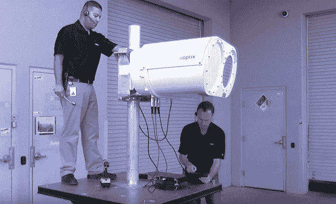
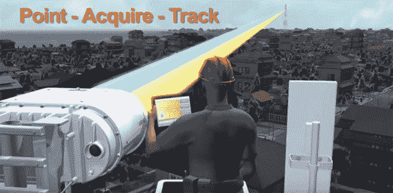

# 激光无线电能在未来的互联网中取代光纤吗？

> 原文：<https://thenewstack.io/laser-radio-replace-fiber-optics-internet-future/>

几年前，移动设备的数量已经超过了人口数量，在全球范围内的广泛扩散正在严峻地考验着互联网基础设施的极限。越来越多的提供商试图通过安装新的光缆来提供更可靠、更快速的服务，以满足需求。然而，这在城市中并不总是可能的，在城市中挖掘地面成本高昂，甚至存在政治争议，而在人口稀少的农村地区更换旧的铜缆网络根本没有经济意义。

## 激光拯救世界

但是一家公司现在正在试验使用激光无线电技术(LRT)来解决这个日益严重的问题。总部位于加利福尼亚州[的 Campbell AOptix](http://www.aoptix.com/)正在以可安装的双眼设备的形式试验这项技术——一只眼睛用于可以穿透空气的红外激光([自由空间光学](https://en.wikipedia.org/wiki/Free-space_optical_communication)或 FSO)，另一只用于定向毫米波[无线电频率](https://en.wikipedia.org/wiki/Radio_frequency) (RF)。然后，这些设备以 10 公里(6.2 英里)的间隔放置，以提供长距离的互联网连接——将可靠且相对快速的互联网接入带到以前可能被视为经济上不可行的地方。

该公司最初是为美国军方开发的，作为允许地面站、战斗机和无人机无缝交换数据的一种方式，该公司认为这项技术对无线服务提供商特别有吸引力。AOptix 系统设计的一个优势是其冗余性。无论是激光还是无线电技术本身都不能可靠地提供连接:激光可能会受到雾天的影响，而"[雨衰](https://en.wikipedia.org/wiki/Rain_fade)"冰雪会对任何无线电传输产生不利影响。

当两者结合在一起时，激光无线电传输能够在几乎任何天气条件下提供相对快速的连接。对于那些对激光束携带的信息持怀疑态度的人来说，人们只需看看美国宇航局最近开发基于激光的通信方法的努力就可以了，这种方法将允许航天器以令人难以置信的速度向地球发送高分辨率图像甚至 3D 视频。一旦皱纹被消除，这种激光通信技术的支持者预见到一个未来，信息将通过一个连接整个太阳系的基于激光的星际网络发送。

## 相对于光纤的成本优势

根据 AOptix 产品和技术高级副总裁 Chandra Pusarla 的说法，激光无线电技术与光纤电缆相比具有明确的成本优势，光纤电缆更可靠，但在时间和劳动力方面安装成本高得多；在纽约市等一些地方，铺设一公里长的新光缆可能要花费 80 万美元以上——更不用说可能随之而来的监管争论了。虽然激光无线电比光纤慢大约 10 倍，提供大约每秒 2gb 的速度，但该公司认为优势超过这一方面，并已经在开发每秒 10gb 的产品。

AOptix 的实时大气校正(RTAC)和主动波束控制(ABS)技术使用“专有算法来合成来自两个频率的原始数据”，以创建一个无误差的无线信号，可以在大多数天气条件下工作。该公司认为激光无线电技术是未来的选择，可以提供改进的低延迟无线接入，强大的可靠性和比传统传输方法更容易部署。

【T2

那么这对互联网的未来意味着什么呢？AOptix 已经与一家墨西哥和三家美国互联网提供商一起参与了该技术的试点项目，根据最近的新闻稿，该技术已经在七个不同的国家用于各种应用，包括“移动回程、光纤扩展、光纤分集和金融市场”如果一切顺利，我们可能会看到互联网的覆盖范围扩展到遥远的、以前服务不足的地区，或者在人口密集的城市改善更好的无线服务。当然，这项技术可能会有意想不到的发展，可能会过渡到外层空间。有一天，由于建立在光束和声波基础上的连接网络，我们对有线世界的概念可能会转变为完全无线的世界。更完尽在 [AOptix](http://www.aoptix.com/) 。

图片: [AOptix](http://www.aoptix.com/) 。

<svg xmlns:xlink="http://www.w3.org/1999/xlink" viewBox="0 0 68 31" version="1.1"><title>Group</title> <desc>Created with Sketch.</desc></svg>