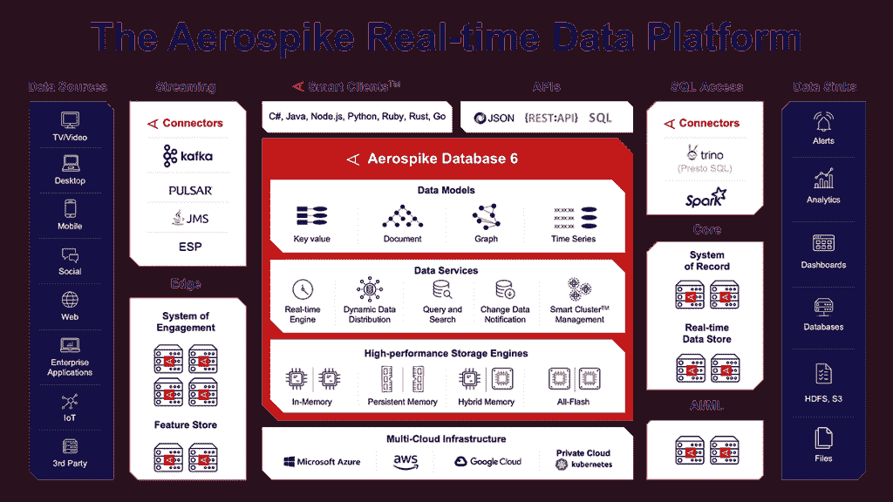

# 最新的 Aerospike 更新支持大规模数据模型

> 原文：<https://thenewstack.io/latest-aerospike-update-supports-large-scale-data-models/>

许多企业需要实时处理[数据](https://thenewstack.io/category/data/)——数字支付、欺诈防护、个性化客户建议和风险分析等操作需要毫不延迟地进行，才能有效并满足客户的期望。

世界已经见证了数据量的爆炸式增长。根据市场研究提供商 Statista Research 的数据，预计到 2025 年，全球数据创建量将超过 180 兆字节，高于 2020 年的 64 兆字节。

[据市场研究公司 IDC 称，到 2025 年](https://www.seagate.com/files/www-content/our-story/trends/files/idc-seagate-dataage-whitepaper.pdf)，30%生成的数据将是实时的，这一增长是由客户对随时随地在任何设备上访问产品或服务的需求增加推动的。

公司需要快速高效地使用这些数据，以防止代价高昂的延迟，并利用时间紧迫的机会。

Constellation Research 的分析师 Doug Henchen 说:“对延迟的期望和要求总是朝着一个方向:更快。

希望利用实时数据的企业通常对他们使用的数据平台有特定的要求。

“一些客户寻求支持特定需求的同类最佳数据平台，如快速交易、大规模分析性能、JSON 文档处理、地理空间分析，或者在这种情况下，超低延迟实时性能，”Henschen 说。

根据为包括 Airtel、Adobe、Experian、Nielsen 和 PayPal 在内的客户提供服务的数据平台公司 Aerospike 的说法，组织必须在当前的经济中工作和竞争，而数据驱动着经济。

随着 Aerospike Database 6 在周三的发布，该公司表示，它可以提供无限规模的亚毫秒级性能，以及包括所有操作的批处理和改进的文档数据库功能的更新。

“我们的团队期待使用 Aerospike Database 6.0 的新批处理和文档存储功能，”it 服务和咨询公司 Hoonartek 的管理顾问 Amit Raj 说。

他补充说，新功能与 Aerospike 的数据摄取、数据一致性、查询和 XDR 复制能力相结合，将促进进一步的业务创新。

## 解决“当下”问题

Constellation Research 副总裁兼首席分析师 Holger Mueller 表示，这些更新为大公司提供了一个帮助它们更有效竞争的工具。

穆勒说:“在当今数字化转型的世界中，有两种类型的公司:一种知道如何在关键时刻获胜，另一种不知道。“这样做的人会意识到 Aerospike Database 6 是他们需要的实时引擎，可以有效地与我们现在在企业中看到的更大、更复杂的数据集竞争。”

顾客通常想要立竿见影的效果，如果一家企业无法提供，他们就会转向别处。

“不是每个企业都需要 Aerospike 承诺的任何规模的亚毫秒级速度，但支持欺诈检测、实时商务和个性化、数字支付和其他超低延迟应用的公司需要这种速度，”Constellation 的 Henschen 说。

JSON 是一种无处不在的数据交换格式，它基于文本，易于阅读和编辑。Aerospike Database 6 提供了对 JSON 文档模型的本机支持，因此业务应用程序可以快速发展，企业可以通过扩展使用的数据量来保持竞争力。

“通过增加对 JSON 的支持，Aerospike 拓宽了它可以支持的数据类型和用例范围，”Henschen 说。

他补充说，最新的升级使公司朝着提供更多实时性能的通用数据库的方向发展。

## 扩展工作负载，减少服务器数量

根据 Aerospike 委托市场研究公司 Forrester 发布的一份报告，传统数据平台无法满足要求实时数据、性能、规模、安全性和集成数据相结合的业务需求。

根据该报告，有了 Aerospike 数据平台，[公司可以减少他们的服务器总数，即使他们在扩展和增加工作负载](https://aerospike.com/lp/ty-forrester-total-economic-impact/)。

关系数据库已经存在了几十年，并且得到了广泛的实现，但是它们存在可伸缩性问题，并且需要昂贵的存储系统。如果客户需要扩展，他们必须购买更昂贵的专有硬件，以及额外的处理能力、存储和内存。

Forrrester 发现，在使用 Aerospike 平台之前，为了满足性能要求，会不断向传统架构添加额外的服务器。但是有了 Aerospike，第一年所需的服务器总数减少了 50%到 70%,到第三年，随着更多的工作负载由 Aerospike 提供支持，服务器减少量增加了 80%。

接受 Forrester 研究采访的组织表示，尽管削减了基础设施成本，但他们体验到了更好的性能，这使他们能够在 Aerospike 的技术上进行更多投资，并向现有用例添加更多数据。

遗留的 NoSQL 系统比关系系统更具可伸缩性和灵活性，但是它们比关系数据库更新，稳定性更差，功能更少。它们还存在与 SQL 指令的兼容性问题，这意味着对工作查询问题的支持更加复杂，会降低速度。

借助 Database 6，Aerospike 现在支持 SQL 作为第三方，通过 Spark 和 Presto/Trino 连接器进行即插即用集成。

## 气塞公司的实时数据平台是如何工作的

Aerospike 使用的内存架构将固态硬盘视为 DRAM。这意味着数据库的索引放在 RAM 中，可以快速访问，数据库的数据放在 SSD 中，SSD 被视为 RAM，也可以快速访问。

Aerospike 是一个多云平台——例如，它可以与微软 Azure、亚马逊网络服务和谷歌云一起使用——它是一个多模型的 Pb 级数据库，支持键值、文档 API、图表和时间序列用例及数据模型。

Aerospike 平台还支持跨数据中心复制:一个集群的内容可以复制到另一个集群，因此相同数据的两个副本可以很容易地获得，并且不受地理位置的限制。

## Aerospike Database 6 的新特性

Aerospike 增加了新功能以响应客户的需求，从而不必针对不同的使用情形使用多个平台。

Database 6 提供的新更新允许现有客户扩展他们使用 Aerospike 平台的方式，并为从其他数据库迁移的客户增加价值:

*   **二级索引查询能力:** Database 6 以一级索引访问的速度跨海量数据集进行复杂、高效的查询，并支持 Spark 和 Presto/Trino 连接器，可横向和纵向扩展到数千个工作人员。
*   **大规模批处理:**可以将对数据库的写操作分批分组，以提高效率，从而减少网络开销。批处理适用于读取、写入、更新和删除，通过改进的可扩展性提高了效率，并且适用于所有工作负载，如读取负载、写入负载、更新负载和混合负载。
*   **JSON 文档存储:** JSON 文档以二进制格式存储。二进制表示具有更好的空间效率，用更少的处理来处理数据，并通过允许不属于 JSON 的数据类型来提供灵活性。
*   **文档查询:**支持使用 JSON 的查询语言 JSONpath 查询文档数据，支持用户从 JSON 文档中选择和提取数据。
*   **文档索引**:该公司表示，Database 6 现在支持顶级字段的索引，并将在下一版本中支持嵌套元素。
*   **数据库 6 符合 FIPS 140-2 标准:**联邦机构可以安全地大规模部署多个应用程序。

Aerospike 创始人兼首席技术官 Srini V. Srinivasan 表示:“所有这些功能都允许人们以非常高的性能持续做事情，并能够使用他们习惯的编程模型。

“这是我们所熟知的一切，但我们已经扩展了这一功能，使客户和潜在客户能够利用更广泛的使用案例和数据模型。”

*2022 年虚拟航空航天峰会定于 5 月 4 日举行。你可以在这里注册。*

<svg xmlns:xlink="http://www.w3.org/1999/xlink" viewBox="0 0 68 31" version="1.1"><title>Group</title> <desc>Created with Sketch.</desc></svg>