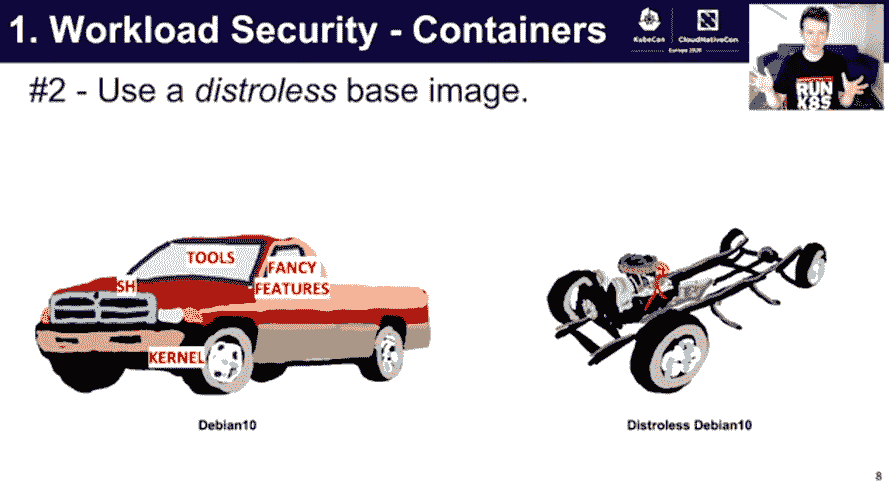
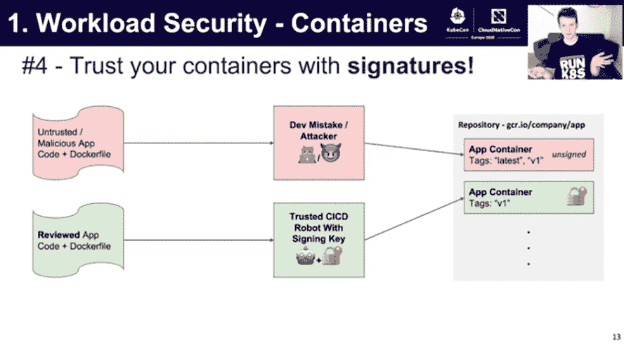

# 为 Kubernetes 跨工作负载、单元和用户的安全性奠定基础

> 原文：<https://thenewstack.io/laying-the-groundwork-for-kubernetes-security-across-workloads-pods-and-users/>

众所周知，Kubernetes 默认是不安全的。它的开源灵活性吸引了成千上万的组织来构建 Kubernetes，但这也是它对锁定的挑战。需要不断更新，需要修补漏洞。默认打开和关闭。

上个月，谷歌软件工程师 [Samuel Davidson](https://www.linkedin.com/in/samuelbdavidson/) 在虚拟的 KubeCon + CloudNativeCon EU 上发表讲话，为系统地降低 Kubernetes 的风险载体奠定了基础。这个演讲主要提供了容器安全的基础知识，但是对于最高级的编排者来说，至少也有一两个技巧。

## **Kubernetes pod 的工作负载安全性**

作为谷歌 Kubernetes 引擎(GKE)安全团队的一员，Davidson 提出了第一条规则:假设你将被拥有——攻击者将在某个时候接管你的系统。

他说，“你必须假设在你的一个依赖项或一个基本映像中有一个尚未被发现的漏洞，它将允许远程代码执行、数据泄漏，[或]你定义的任何可能拥有的东西。”

> 对你来说方便的一切对黑客来说也变得方便了。

这意味着你要确保你的容器内部尽可能的简单，所以如果有人进入容器，他们不会得到太多，他们也不能从那个容器跳到其他容器。

Davidson 的演讲呼应了 Sounil Yu 的关于云原生安全的演讲，他提倡你的容器在高度分布式、不可变和短暂的时候是最安全的。

Davidson 通过推荐您使用发行版基础映像深入探讨了它的实用性。你通常不希望有一个过于复杂的构建——你只需要让你的应用程序运行的基础。

“在很大程度上，您的工作负载不需要 Debian 内置的那套令人惊叹的选项。他们基本上只是作为一个攻击面，当有人拥有他们的集群时，他们可以使用外壳来 ping 你的集群中的各种端点，并给你带来一系列问题，”他说。

他说有些发行版很有效，因为它们的攻击面很小，而且没有软件包管理器。

针对容器的短暂性，Davidson 继续说道，您需要确保您的容器真正易于构建和部署。这不仅仅是因为这样更容易，而是因为依赖关系中内置了太多的漏洞。通过更简单地构建您的容器，可以更容易地删除依赖项、重新部署它们，然后让您的持续集成/持续部署(CI/CD)平台来完成剩下的工作。

Davidson 指出了 CI/CD 平台的另一个好处:签名，也称为二进制授权或签名容器。该平台就像一扇通往仙境的锁，只允许可信的 CI/CD 机器人使用签名密钥。

您还可以在依赖性验证、漏洞扫描和集成测试中利用可信签名管道。最终的输出应用程序容器具有“某种程度上保证我们已经运行了所有这些测试，我们已经运行了所有这些依赖性验证，并且没有出现重大问题”的签名。然后，我们可以获取您的 Kubernetes 集群，并对其进行配置，使其只接纳具有这四个组件的容器。”

接下来，戴维森讲述了 pod 安全的基础知识。他首先建议您不要使用 hostPath。他承认这很方便，因为它为你的容器提供了一个进入节点文件系统的目录，但他称之为特洛伊木马，你不知道它以后会在哪里，也不知道其他 pod 是否能访问它。也许一年后，其他开发者不会知道他们不应该使用这个文件夹。

他说继续，也不要使用 hostNetwork，他称之为“超级危险”对你来说方便的一切对黑客来说也变得方便了。Davidson 说 localhost 被视为可信域，这意味着通过它的 API 请求也被视为可信域。他建议，如果你正在使用它，你应该找到其他的网络选择，并确保不包括 *hostNetwork: true* 。

Davidson 说，接下来，您需要知道每个 pod 都绑定到一个服务帐户(SA ),并且您需要知道是哪个帐户。如果未指定，它将是名为“default”的服务协议默认变成了你的垃圾抽屉，如果攻击者闯入的话，那是非常危险的。他说，您需要有意识地将不同的 SA 名称绑定到您的 pod，或者更好的是，将您的 pod 放在不同的名称空间中，“因为名称空间是一种非常好的安全隔离。”或者您可以通过将*automountserviceaccountoken*设置为“假”来关闭您的 SA 挂载

## **Kubernetes 集群安全**

对于集群的安全性，Davidson 说你需要保持集群的更新，确保错误和漏洞不断得到修复。当然，这听起来很简单，但正如他所说，当事情进展顺利时，一些开发人员不愿意“捣乱”，更新东西可能会令人害怕。

但是，从 1.16.0 开始，在发布时，已经有 [191 个 bugfix pull 请求](https://bit.ly/2OPsoVA) 进入发布分支。最新的补丁版本是 1.16.14。因此，这可能是一个痛苦，但它是必不可少的，所以戴维森说，至少，更新您的集群到最新的补丁版本。他保证这并不困难。

戴维森说，你实际上必须将你的集群与互联网隔离，并把它放在一个像 VPN 一样的私有网络上。任何群集虚拟机都不应有公共 IP。他说你仍然可以通过网络登录你的开发者和机器人。至于您的用户，让他们通过外部负载平衡器或 verse 代理访问，这些代理可以将流量转发到节点。然后，如果您的群集需要互联网访问，如下载映像，请使用仅出口访问，这样您就可以管理允许/拒绝列表等。

戴维森继续推荐使用 [秘密](http://bit.ly/3064n2E) 。机密是有价值的，因为它们存储在内存中，但从不存储在节点的磁盘上。节点不能请求秘密，除非它们的 pod 被安排在其上，并且它们很容易用基于角色的访问控制(RBAC)来设置。是的，秘密很小，每个大约一兆字节，但是它们应该只用于访问密钥、密码和令牌之类的东西。他承诺秘密非常容易使用，而且更加安全。

请注意，秘密在默认情况下是不安全的，但是像 GKE 这样的托管 Kubernetes 产品确实会对静态的 Kubernetes 进行加密。

戴维森解释说，“秘密的真正好处是 Kubernetes 基础设施如何传递它们。你可以对它们设置非常严格授权策略，而且它们很难被访问。”

他继续说，真正的好处来自于针对您的秘密编写一个真正好的授权策略。

## **Kubernetes 用户安全**

您已经采取了所有这些步骤来保护您的容器及其集群，但是现在是时候让其他人——指定的其他人——访问它了。有些方法很简单，比如使用 RBAC，所有这些都与完成工作所需的最低特权角色相关联。在 RBAC，大多数组织都很棒，但当人们离开公司或转换角色时，你会留下一个错综复杂的绑定网络，这可能会导致授权衰减，多年后，前员工仍然拥有未撤销的超级用户访问权限。

这就是为什么你不应该只使用 RBAC，而是将这些角色组织成组。组通常由组织内的主题或更大的功能组织，如站点可靠性工程、工程、CI/CD 和安全组。他说这些需要时间来识别，并且必须始终支持最小特权 的 [原则。然后，您将您的角色与您的组成员联系起来。这些组是有约束力的和永久的，而这些成员资格是有时间限制的和短暂的，这意味着很容易移动和删除它们。](https://en.wikipedia.org/wiki/Principle_of_least_privilege)

最后，戴维森提出了他最感兴趣的部分:政策代理。典型的策略代理是 Kubernetes*admission controller*，它根据规则或策略有选择地允许或拒绝 Kubernetes 的资源请求。他把这比作去机场。首先，你让人检查你是否有身份证和票——有效的证件和继续进行的许可，就像 RBAC 一样。然后你和你的东西通过一个扫描仪，它检查你是否符合某些政策，如政策代理。

他说，这允许在运行时实施上述所有最佳实践，以及审计集群中的现有资源。

因此，没有可能的方法来保证安全性——坦白地说，攻击者比整个安全团队移动得还要快。但是，如果您遵循上面列出的步骤，您已经创建了跨组织容器安全性的坚实基础。

KubeCon + CloudNativeCon 是新堆栈的赞助商。

图片由来自 Pixabay 的 Hans Rohmann 提供。

<svg xmlns:xlink="http://www.w3.org/1999/xlink" viewBox="0 0 68 31" version="1.1"><title>Group</title> <desc>Created with Sketch.</desc></svg>