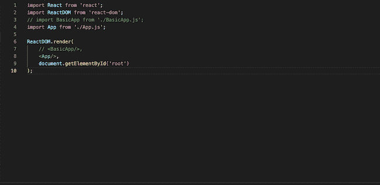
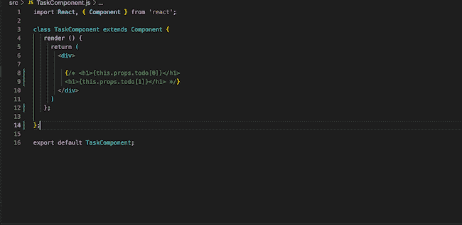
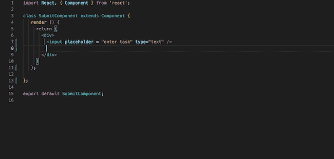
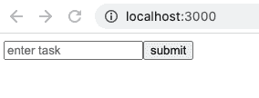
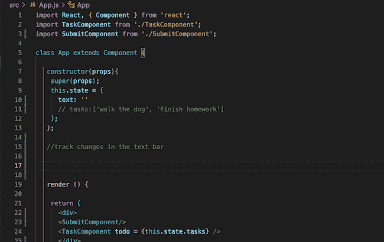
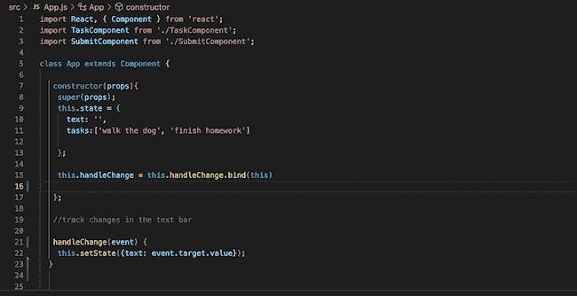
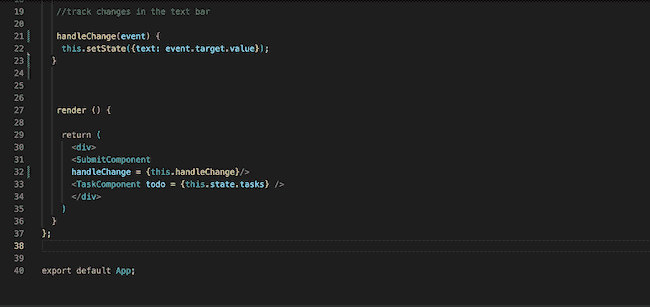
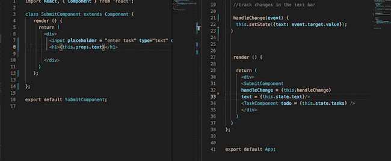

# 学习 React:向组件添加事件功能

> 原文：<https://thenewstack.io/learn-react-add-event-functionality-to-a-component/>

欢迎来到我们 learning React.js 教程系列的第三部分(

[Part 1](https://thenewstack.io/learn-react-start-of-a-frontend-dev-journey/)

), (

[Part 2](https://thenewstack.io/learn-react-build-a-working-file-tree-and-manage-state/)

).这是

[a link to the GitHub Repo](https://github.com/JessicaWachtel/React-To-Do-List-Tutorial)

。这

[ Read Me](https://github.com/JessicaWachtel/React-To-Do-List-Tutorial#readme)

拥有入门所需的所有说明，以及一些对不熟悉 GitHub 的人有用的链接。

React 中有一个概念，即状态是不可变。这并不意味着状态不能改变。这意味着我们不能直接改变状态。我们用外部函数和副本来做。

React 的经验法则是通过 [setState](https://reactjs.org/docs/react-component.html#setstate) 函数修改状态，而不是直接改变状态。例如，我们的状态是一个数组，所以我们的函数看起来会有很大的不同，并使用 setState，而不是像 *this.state.taks.push(在此插入新项)这样写。*

直接用 push 方法更新状态是可能的，我相信在一些用例中它提供了更新功能，但是它会导致组件树中的错误，我不推荐这样做。这里有一些来自 [Kingsley Silas](https://css-tricks.com/understanding-react-setstate/) 和来自 [Geeks for Geeks](https://www.geeksforgeeks.org/reactjs-setstate/) 的优秀资源，可以让你更深入地了解 setState。

在本文中，我们将构建一个新的 [React.js](https://reactjs.org/) 组件，SubmitComponent，并添加事件功能——通过文本栏添加文本。(我们不会深入讨论 JavaScript 事件处理程序本身，所以如果你好奇的话，请查看本文。)

## **为新代码设置我们的应用**

在 index.js(来自 Github 文件夹)中，请确保您的 index.js 如下图所示:

请更新 TaskComponent，使其看起来像这样:

接着是新的代码！

## **提交组件**

React 是由可重用组件构建的，所以让我们从在 *src* 文件夹中建立一个新文件开始。我将把它命名为 SubmitComponent，但是你可以随便叫它什么。

该组件将持有提交元素-文本输入框/文本输入框功能和提交按钮/提交按钮功能。

该组件本身具有与 App 和 TaskComponent 组件相同的框架。不要忘记将元素添加到 app 组件并导入。

设置好之后，为文本框和按钮添加 HTML 元素代码。别担心造型。一旦我们有了完整的功能，我们就可以设计一切。

一旦所有东西都建好了，它应该是这样的。

运行 npm 启动脚本并检查浏览器，查看一切是否正常。

## **添加功能**

在“我的应用程序”组件中编写主要功能。在 *end if* 构造函数和渲染开始之间的空间是你写函数的地方。在 React 中，函数通常以单词 *handle* 开始。

我们要添加的第一个功能是 handleChange。我们在这里跟踪文本框中的变化，并确保在文本框中键入的每个字符都保存在 state 中。以下是步骤:

1.  在 state 中创建新的空字符串变量。
2.  创建保存 setState 的函数。
3.  在构造函数中绑定函数。
4.  将函数作为 App 组件中的道具传递给元素。
5.  将函数作为 prop 添加到 SubmitComponent 的元素中。

要扩展:

**步骤 1:在状态**下创建一个空字符串形式的新变量

因为我们在文本栏中输入一个字符串，所以我们可以将它作为一个字符串添加到 state 中。虽然状态是不可变的，我们不能直接更新它，但这与来自浏览器的更新有关，就硬编码而言，状态可以直接更新。

新的状态应该是这样的。

**第二步:创建新的函数，它将保持设置状态**

这看起来很像传统的事件处理程序，它跟踪更改，但只是针对 React 功能进行了更新。如果你想更深入地了解这一点，那么 [React 文档](https://reactjs.org/docs/forms.html)会很有帮助(如下图第 3 步)。

**第三步:在构造函数中绑定函数**

功能*。bind()* 创建一个新的绑定函数，它包装原始的函数对象，以便函数能够工作。我经常忘记这一部分，直到我的函数没有触发，这就是为什么我把它列为自己的步骤。更多详情请见[此链接](https://codeburst.io/binding-functions-in-react-b168d2d006cb)。

**第四步:将函数作为道具传递给 App 组件中的元素**

这是非常标准的，我们在上一个教程中也做过。在 App 组件的 return 部分的 submit 组件元素中，我定义了一个名为*handle change = { this . handle change }*的变量。由于 handleChange 函数不在状态中，我们不将其称为 *this.state.handle* change，但它仍将作为 submit 组件中的一个道具被调用。

**第五步:将函数作为道具添加到提交组件**

最后一步！在元素特征输入框中，添加*onChange = { this . props . handle change }*。我喜欢用一个 *< h1 >* 标签来跟踪我的变化。否则，我怎么知道我的状态正在更新呢？然后，我必须将 state 中的文本字符串作为变量传递给 submit 组件。

这些步骤非常简单，可以在创建组件和添加功能时使用。你现在可以添加一个提交按钮，当它被点击时有一个新的功能吗？

下周，我们将添加一个提交按钮，将输入文本添加到任务数组中，并通过任务数组进行映射，在页面上显示多个任务。我强烈建议熟悉 JavaScript map 功能和 setState。

GitHub 已更新。你也可以在 GitHub 上查看这些文件。

***下一个教程** : [点击功能和可复用组件](https://thenewstack.io/learn-react-click-functionality-and-reusable-components/)。*

<svg xmlns:xlink="http://www.w3.org/1999/xlink" viewBox="0 0 68 31" version="1.1"><title>Group</title> <desc>Created with Sketch.</desc></svg>