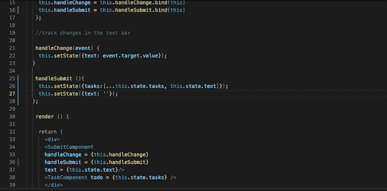
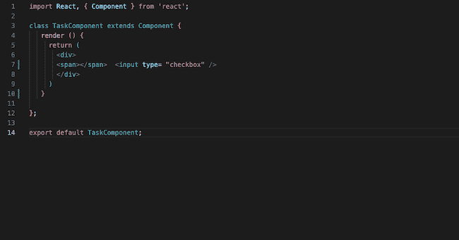
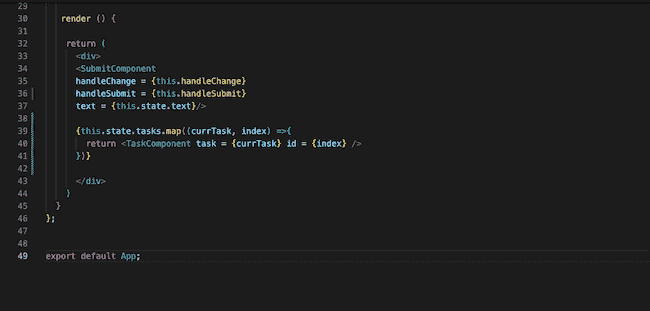
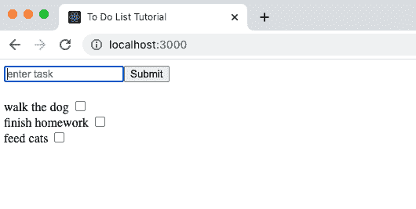

# 学习反应:点击功能和可重用组件

> 原文：<https://thenewstack.io/learn-react-click-functionality-and-reusable-components/>

欢迎来到我们 learning React.js 教程系列的第四部分(

[Part 1](https://thenewstack.io/learn-react-start-of-a-frontend-dev-journey/)

), (

[Part 2](https://thenewstack.io/learn-react-build-a-working-file-tree-and-manage-state/)

) (

[Part 3](https://thenewstack.io/learn-react-add-event-functionality-to-a-component/)

).这是

[a link to the GitHub Repo](https://github.com/JessicaWachtel/React-To-Do-List-Tutorial)

。这

[ Read Me](https://github.com/JessicaWachtel/React-To-Do-List-Tutorial#readme)

拥有入门所需的所有说明，以及一些对不熟悉 GitHub 的人有用的链接。

因为我们是从离开的地方重新开始，所以不需要对代码文件进行任何必要的更新。如果您还没有添加 submit 按钮，这将是今天的第一步，它将直接进入 SubmitComponent。

## **处理提交**

这一个的功能比我们的 handleChange 稍微复杂一点，所以函数本身稍微复杂一点，但不会复杂太多。提交按钮将按以下顺序执行以下任务:

1.  将 *this.state.text* 的字符串值添加到 *this.state.tasks* 中的数组中
2.  将 this.state.text 的值设置回空字符串

我们可以将所有这些保存在同一个 *handleSubmit* 函数中，因为我们总是希望这些操作一起发生。在这个项目中，因为没有条件限制我们什么时候需要或者不需要保留文本变量，所以这是一个非常简单的设置，不需要任何逻辑。*出于本教程的目的，我不打算添加任何逻辑来取消将任何字符串条目添加到状态的资格。*

因为我们不能直接推入状态，所以我选择复制当前状态数组，并用一个数组替换状态数组的整个值，该数组由副本后跟 *this.state.text* 组成。它看起来会像这样:

```
this.setState({tasks:  […this.state.tasks,  this.state.text]})

```

如果你想了解更多关于制作副本的信息，这是一篇关于制作数组浅层副本的很棒的文章。

handleSubmit 函数的下一步是将 *this.state.text* 重置为空字符串。最后，将函数绑定到构造函数中，这就完成了。刷新浏览器，试一试！传递给 SubmitComponent 的 handleSubmit、函数绑定和 props 都显示在下图中。



## **任务组件/可重用组件**

在从浏览器向状态添加任务方面，我们已经启动并运行了。现在是时候回到 TaskComponent 并开始构建我们的可重用组件了。

在此之前，我想简单回顾一下什么是可重用组件。如果你想想 Instagram feed，每张图片都是不同的，但图片在一个盒子里，盒子有可选的标题，你可以喜欢它，评论，分享，书签。用户界面都是一样的，但是数据是不同的。这是一个可重复使用的组件。

> React 倾向于这样一种模式，其中呈现逻辑位于 App 组件中，可重用组件(在本例中为 TaskComponent)包括 HTML 元素及其外观。

现在，我们需要一个地方来呈现拼写任务的文本和一个复选框，因为最终，我们将从页面中删除任务。

如果还没有，删除 TaskComponent 中被注释掉的 *< h1 >* 标记，因为它是该项目的第一次迭代中的占位符文本。

因为还没有任何状态传递给 TaskComponent，所以我将添加 *< span >* 标记，它们之间没有任何内容，以提醒我自己我将在那里添加文本和复选框。



回到 App 组件，我们可以删除 return 部分中的当前 TaskComponent 元素，因为它只是一个占位符，下一步将完全重写它。

React 倾向于这样一种模式，其中呈现逻辑位于 App 组件中，可重用组件(在本例中为 TaskComponent)包括 HTML 元素及其外观。我们不是将 *{this.state.tasks}* 作为数组传递给任务组件，而是将每个任务单独传递给任务组件，但是通过 JavaScript 循环多次传递，或者在本例中，通过数组进行映射。

映射数组的正确位置是在  App 组件的 return 部分。我在 SubmitComponent 元素下面编写了我的函数。我们将整个内容写在花括号内，让 ide 知道 JavaScript 的存在。需要注意的一件重要事情是——为当前任务添加一个索引，因为下周我们添加删除功能时需要一个索引。

下图详细描述了我的地图功能，但如上所述，这不是唯一的方法，因为它也可以通过循环来完成。



回到我的 TaskComponent，我将确保在 *< span >* 标签之间添加 *{this.props.task}* 。刷新浏览器，您会看到任务直接从文本输入框添加到页面上。



当我像这样构建我的第一个项目时，我很难理解为什么状态在传递给 TaskComponent 之前在 App 组件中被映射。我认为，对我来说，它坚持的方式是大多数业务逻辑保持在一起。可重用组件的存在是为了告诉 React 元素放在哪里，在某些情况下，它们看起来是什么样子。

下周我们将讨论删除功能，我发现这是最难的一个。我将更深入地探讨添加功能是如何工作的，删除功能是什么，以及为什么它们有不同的名称。

<svg xmlns:xlink="http://www.w3.org/1999/xlink" viewBox="0 0 68 31" version="1.1"><title>Group</title> <desc>Created with Sketch.</desc></svg>