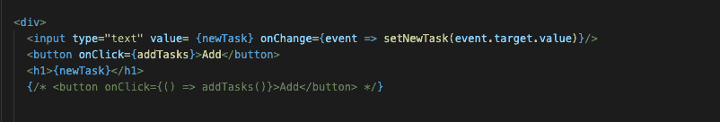

# 学习 React:删除功能和设置状态挂钩

> 原文：<https://thenewstack.io/learn-react-delete-functionality-and-the-set-state-hook/>

欢迎来到我们学习的第五期 [React.js](https://reactjs.org/) 教程系列( [第一部分](https://thenewstack.io/learn-react-start-of-a-frontend-dev-journey/) )、 [第二部分](https://thenewstack.io/learn-react-build-a-working-file-tree-and-manage-state/) )、 [第三部分](https://thenewstack.io/learn-react-add-event-functionality-to-a-component/) )、[第四部分](https://thenewstack.io/learn-react-click-functionality-and-reusable-components/))。下面是 GitHub 回购 的链接。 [Read Me](https://github.com/JessicaWachtel/React-To-Do-List-Tutorial#readme) 有入门所需的所有说明，以及一些对不熟悉 GitHub 的人有用的链接。

这篇文章讲述了两件事:首先，您将学习如何将参数传递到函数中，以及如何直接从文档对象模型中删除状态。您还将学习如何使用功能组件和使用状态挂钩来创建一个全功能的待办事项列表应用程序。

## **构建删除功能**

再一次，我们从离开的地方重新开始，不需要对代码文件进行任何必要的更新。我们要做的第一件事是用 TaskComponent 中的 delete 按钮替换复选框，并通过隔开{this.props.task}和结束的在它们之间添加一些空间。

我们要做的下一件事是处理我们的删除功能。因为删除功能来自于删除一个特定的条目，所以我们需要将 ID 参数传递给这个函数。

这个函数的逻辑非常简单。

1.  制作状态的副本，因为仍然不能在状态中直接添加或删除状态。我们需要进行复制，而不是执行诸如 this.state.tasks.splice(参数，我们要删除的索引数)这样的操作。
2.  拼接。
3.  设置拼接副本的状态。

该函数的最终结果如下所示。

接下来我们要做的是在返回到 App 组件中的 Task 组件时传递函数。

现在一切都已经通过我们的 task 组件传入，所以我们可以返回到 task component 并检查我们的按钮。在按钮中，我们传入我们的 id 和 handleDelete 函数。

最终的 TaskComponent 将如下所示。

## **用钩子重构**

对于这个重构，我们将把 App.js 组件重新构建为一个功能组件，并使用 Set State 钩子。我的建议是启动一个新的代码文件，重新克隆原代码 repo，删除 BasicApp.js、SubmitComponent.js、TaskComponent.js 文件。app 组件可以完全删除，因为需要为功能组件重新构建。不要忘记运行终端命令 npm install！

钩子与类组件不兼容，所以我们需要用功能组件来重建。关于[使用状态钩子](https://reactjs.org/docs/hooks-overview.html)的介绍，这里有一个很好的资源。

## **使用设定状态挂钩**

使用状态挂钩由三部分组成。我是这样想的:

const[传入状态，改变状态的函数] = useState(原始状态)；

顶部的 import 语句需要进行调整，以包含将在页面上使用的钩子的导入。因为我们将不再使用 React 组件，所以我们不需要导入它，但是我们将使用 use state 挂钩，因此我们的导入将如下所示:

接下来，我们将构建组件本身作为一个功能组件。这只是一个函数，也是一个 react 组件。

接下来我们要做的是开始建造我们的钩子。钩子总是存在于 return 语句之外。对于待办事项列表，我们需要两个使用状态挂钩。一个是从任务栏创建一个新的任务变量，另一个是创建我们的状态数组，我们可以添加和删除新的任务。

这些钩子最终会变成这样:

接下来我们要做的是设置文本输入框和按钮。这将非常类似于原始的类组件。一个主要的区别是，将有一个新的特征添加到输入栏，这将是价值。在 JSX 花括号内，newTask 将被添加。

我们还需要添加 OnChange。在输入栏内，添加 value = {newTask}和一个 onChange = { event = > setnew task(event . target . value)}。

就像类组件一样，我们也添加带有 newTask 值的

# 标记，以确保任务栏中的 newTask 保存在变量中。

一旦您刷新页面并开始在文本栏中输入内容，您将能够看到您的第一个钩子功能的实时例子。文本输入从工具条中取出，并通过简单的使用状态钩子实时显示在页面上。

接下来，让我们添加 map 功能，这样我们就可以在设置好助手函数后立即添加和显示数组(这之后的下一步)。这也将看起来几乎与原始文件相同，但因为我们将在应用程序组件中保留所有内容，所以它稍微简单一些。

它的开头看起来像这样:

现在我们需要添加助手函数。助手 addTask 函数将是从任务栏获取新任务和将其添加到数组之间的中间部分。add task 函数的目的是将两个挂钩混合在一起，然后将 newTask 变量返回到其空字符串的原始状态。

就像在类组件中一样，状态不能被直接改变，所以与其做类似 tasks.push(newTask)这样的事情，我们将有一个如下所示的函数:

prevArray 只是一个占位符变量，它将表示前一个状态的副本。它可以被命名为任何东西。我选择将它命名为 prevArray，因为它很容易理解。

一旦创建了函数，我们就可以向按钮添加 onClick 处理程序。我们不需要用钩子捆绑。该函数可以用两种方式之一编写。我用 vs 代码写了这两种方法。一个被注释掉了，一个没有，但是两个都可以。

最后，让我们添加删除功能。对于删除功能，这看起来很像原始待办事项列表的删除功能。首先，我们要复制一个数组，因为同样的规则也适用于状态不能改变的情况。这个函数的下一步是拼接 id，然后我们用状态数组的副本重置状态数组。

最后一部分是向删除栏添加 onClick 功能。删除栏功能需要设置为一个箭头功能，id 作为参数传入，否则它将不起作用。

这是一个非常基本的例子，展示了如何用使用状态钩子来设置待办事项列表。如您所见，这两个应用程序中都没有样式或额外的头或组件。现在，基本的内容已经介绍完毕，我们可以继续了！我将在接下来的几周中讨论的一些其他主题是如何使用样式库来样式化这个应用程序，如何通过 ajax 向 React 应用程序添加第三方 API，以及如何使用本地存储。

<svg xmlns:xlink="http://www.w3.org/1999/xlink" viewBox="0 0 68 31" version="1.1"><title>Group</title> <desc>Created with Sketch.</desc></svg>