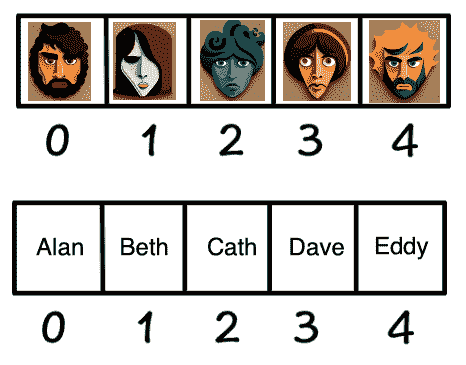

# 用散列函数学习存储和检索

> 原文：<https://thenewstack.io/learning-storage-and-retrieval-with-a-hash-function/>

如果你在伦敦市四处走走，你会很容易找到隐藏在舰队街后面的高夫广场。那里有塞缪尔·约翰逊博士的家，他(除了其他工作以外)编写了第一本英语词典。

字典有一种惊人的魔力。可能只有一个你很熟悉的长序列链，而且已经熟悉很久了:你的字母表。这给了词典几个显著的特点。每个条目只有一个键。并且索引只能单向工作；所以只使用字典，你不可能仅仅知道一个生词的意思就发现它。即使是一个小孩子也可以查找 **Steatopygia，**但是仅仅通过在整本书中搜索“臀部和大腿上有大量组织的状态”来找到这个词可能是一个非常漫长的任务。

计算的一些基础知识有重叠的定义，并因其自身的普遍性而变得模糊。虽然**哈希**有一个简单的定义，但它的不同方面在不同的时间受到关注。在当今世界，人们对散列安全性很感兴趣，但是在本文中，我们将研究用键存储和检索项目的**。我们将使用基本的计算概念，并带有一点数学好奇心。它从第一个哈希表开始。**

> 散列函数是可以用来将任意大小的数据映射到固定大小的值的任何函数。

## 数组和哈希表

从计算的角度来看，英语词典并不十分精彩，因为从来没有必要限制它的大小。英语从来都不是在考虑效率的情况下产生的；如果是，那么字典将以单词“A”开始，以单词“ZZZZ”结束。事实上，如果有效使用，仅仅四个字母就可以代表所有的英语单词(有足够的空间容纳另一种语言)。

对于数字词典，我们感兴趣的是数字键和索引。我们知道最简单的存储形式是固定大小的**数组**。对于我们的例子，我们将使用一个五元素数组来存储我们五个朋友的令人担忧的面部照片:艾伦、贝丝、凯斯、戴夫和艾迪。我们希望仅使用图像的名称来检索图像；最后，删除它们。

现在，我们可以只使用两个数组:一个包含图像数据，另一个包含保存键的匹配索引。数据数组需要足够大的单元格来保存图像数据，而索引数组只需要足够大的单元格来保存小字符串。

在下面的例子中，键数组保存了键“Alan ”,其索引与上面图像数组中略带愤怒的长着深色胡须的面孔相匹配。我想中途是有压力的一天。该系统易于维护，因为条目可以很容易地同步创建和删除。



对于我们的小例子，这似乎很好。但是对于一个大的数组，这个方案的问题是，随着双重条目的增加，为了找到正确的键，您可能需要搜索更长的时间。更糟糕的是，您可能会搜索整个数组来确认这个键不存在。一旦我开始删除条目，我还必须以某种方式跟踪不同的空单元格。换句话说，这个系统不能很好地扩展。

我们想要的是一个介于人类可读密钥和图像索引数组之间的函数。能看着钥匙说“哦，我把你的图像数据放在这里了”的东西。


你也可能从代客泊车中认出这个模型。我把我的车钥匙给了服务员，作为回报，他给了我一张罚单。然后另一个人去停了我的车。后来我给你的票，这符合我的车的细节，我的车被检索。添加和检索需要固定的时间。(至少我认为这个系统是这样运作的；我唯一参考的是《费里斯·布勒的休息日》。)

那么，“哈希函数”里面是什么呢？令人惊讶的是，它或多或少可以是任何东西。只要它能产生有效的索引号。

## 模运算

举例来说，起点总是**模运算**，因为这正好符合要求——它提供一个保证小于给定最大值的数。

> 在计算中，模运算返回一个数被另一个数除后的余数或有符号余数。

因此，如果我们有一个五槽数组的字典，我们将需要输出 0-4 的索引位置。如你所见，模 5 对任何整数值都这样:

```
17  mod  5  =  2
2345  mod  5  =  0
73  mod  5  =  3

```

我相信你找到了模式。我们有了散列函数，对吧？我们应该不需要索引数组——只需要从我们的名称键中获取一个索引！不完全是。

考虑到 17、207 和 2347 都产生相同的取模结果，这不可能单独起作用。即使对于五个随机数，也可能会有一些**冲突**。避免冲突的唯一方法，当然是对于一个简单的算法，是像我们之前做的那样存储密钥。这并不奇怪——对于一个固定大小的数组，如果不记得之前发生了什么，没有算法能够完美地填充我们的索引。这就像代客泊车一样，车的细节和停在哪里都不会被记录下来。所以我们的散列函数实际上是在说“哦，从这里开始寻找你的图像数据。”我所描述的叫做[开放寻址](https://www.geeksforgeeks.org/open-addressing-collision-handling-technique-in-hashing/)。

我希望 keys 是这个人面部照片的名字，比如“Cath”——但这不是一个数字。但是，我可以从一个字符串中得到一个相当唯一的数字。我们可以基于数字的位置编码产生一个值(想想英语字典的顺序，以 26 为基数计数)，但是着眼于我们非常简单的模函数，让我们把字符的所有 [ASCII 值](https://www.w3schools.com/charsets/ref_html_ascii.asp)加在一起。

```
Alan  =  65  +  108  +  97  +  110  =  380

Beth  =  66  +  101  +  116  +  104  =  387

Cath  =  67  +  97  +  116  +  104  =  384

Dave  =  68  +  97  +  118  +  101  =  384

Eddy  =  69  +  100  +  100  +  121  =  390

```

(提示:如果您使用的是 Mac，您可以直接在 Spotlight 搜索栏中进行模运算和其他数学运算。)

## 碰撞

最后，让我们来处理碰撞。如果我们存储这个键，那么我们可以通过简单地把它放在键数组中下一个可用的位置，来实现我们的期望，把信息保存在我们第一次查看的地方。这种方法称为**线性探测。**

所以现在我们有了所有的材料。首先，我们告诉我们的散列算法，我们想要存储“Alan”的图像。它将字符串“Alan”转换为一个整数，然后使用模运算生成一个键数组的索引。然后，它使用相同的索引将数据添加到值数组中。


然后我们用同样的方法加上“贝丝”。这一次，指数是二。


当我们接下来尝试添加 Eddy 时，我们可能会与 Alan 的条目发生冲突。所以我们移动到索引数组中的下一个可用位置:


要检索我们的数据，我们只需再次遵循算法，但这一次要确认索引。当我们搜索“埃迪”时，我们会看到“艾伦”——所以继续搜索。我们没走多远。哈希算法告诉我们从哪里开始寻找它所承诺的。

## 结论

自然，这对于您在实际应用中使用的更大的数组来说更有意义。在现代计算语言中，您不需要指定字典的大小，它们会根据需要调整大小。但现在，我认为约翰逊和他的猫霍奇会为他们对计算机的间接贡献感到高兴。


<svg xmlns:xlink="http://www.w3.org/1999/xlink" viewBox="0 0 68 31" version="1.1"><title>Group</title> <desc>Created with Sketch.</desc></svg>