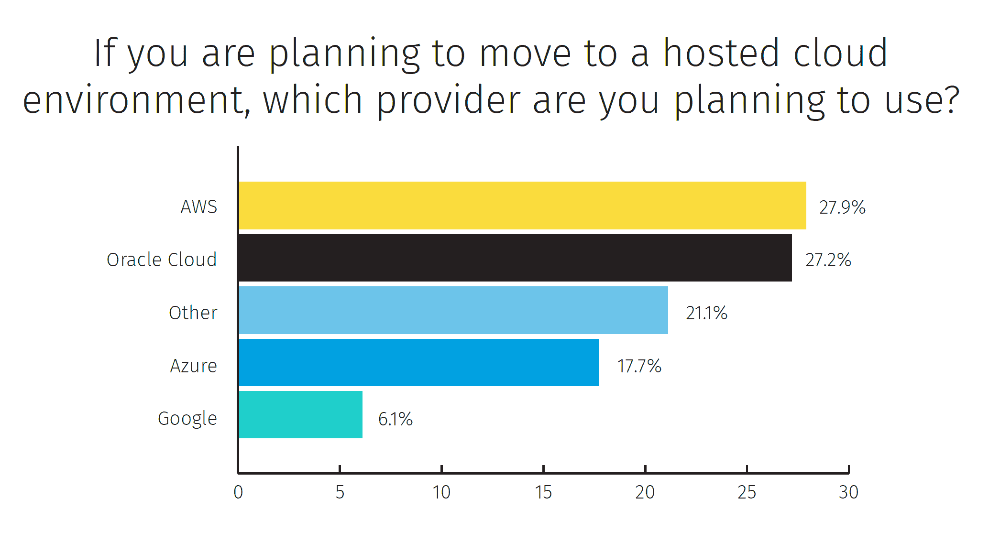

# 传统客户的担忧推动甲骨文转向微软

> 原文：<https://thenewstack.io/legacy-customers-concerns-propel-oracles-move-towards-microsoft/>

甲骨文云并没有因为宣布与微软 Azure 的最新合作而认输。相反，它解决了抑制其增长的特定客户问题。咨询公司最近的两份报告显示，使用 Oracle 的客户在迁移到云时通常会选择留在公司，但这不一定是他们的首选。随着传统客户迁移其工作负载，甲骨文可能会继续获得云市场份额，但这并不意味着它将与 AWS 和 Azure 直接竞争 IaaS 企业支出的最大份额。

App Associates 的“ [Oracle to the Cloud:五大神话，揭穿](https://ebooks.appsassociates.com/Oracle-to-the-Cloud/)”发现，在对大中型企业的 300 多个 Oracle 客户的调查中，79%的客户希望将这些工作负载迁移到云(公共、私有 IaaS)，但觉得迁移到第三方、非 Oracle IaaS 存在太多风险。具体来说，55%的人担心迁移到云会增加他们通过 Oracle 合规性审计的机会，49%的人担心迁移后 Oracle 不会支持他们。

32%的受访者已经迁移到传统的 Oracle 应用程序或数据库云，另有 59%的受访者计划这样做。该报告的作者认为，如果有明确的前进道路，这些公司中的许多都会将 Oracle 应用程序迁移到云。也许微软/甲骨文的公告提供了这条道路。

里米尼街[对 205 名甲骨文客户的调查](https://www.riministreet.com/enterprises-rethinking-oracle-relationship)发现，已经迁移到云的公司略少，其中 26%已经将其甲骨文部署迁移到云托管环境。另有 26%的人计划将 Oracle 部署迁移到云，但只有 27%的人计划使用 Oracle 云。如果这些计划得以实现，我们预计使用 Oracle 云基础设施的企业比例将继续快速增长(参见 2017 年[和 2019 年](https://twitter.com/LawrenceHecht/status/914595930191654912?s=20)[的数据)。在 SaaS 方面，9%的调查对象已经将内部 Oracle 软件(例如 PeopleSoft)迁移到作为服务交付的版本，另有 11%的调查对象正计划这样做。](https://twitter.com/LawrenceHecht/status/1100775892354240513?s=20)

来源:Rimini Street 的《为什么企业在重新思考他们的 Oracle 关系和云战略》图表显示了 26%的 Oracle 客户计划将其内部部署的应用程序迁移到托管环境。

早在 4 月份，甲骨文开发人员关系副总裁 Bob Quillin 写道，开发人员已经决定一个云是不够的。今天，他告诉新的堆栈，“对于任何复杂的分布式应用程序来说，性能和安全性仍然是真正的问题”，他相信这笔交易是“云原生技术成熟的又一步，可以解决多云用例的这些问题。”

微软/甲骨文的合作伙伴关系解决了一些(但肯定不是全部)大型企业对多云和混合云部署的[顾虑](https://www.bmc.com/content/dam/bmc/solutions/ESG-Solution-Showcase-BMC-May-2018.pdf)。对于混合云，该协议促进了两家公司的云之间的快速数据移动，并实现了 Azure 和 Oracle 云之间的统一单点登录体验和自动化用户供应。对于 multicloud 来说，这笔交易进一步保证了对 Oracle 应用程序的支持可以在云(Azure)上运行，即使该公司没有选择 Oracle 作为其主要的云提供商。

甲骨文是新体系的赞助商。

通过 Pixabay 的特征图像。

<svg xmlns:xlink="http://www.w3.org/1999/xlink" viewBox="0 0 68 31" version="1.1"><title>Group</title> <desc>Created with Sketch.</desc></svg>