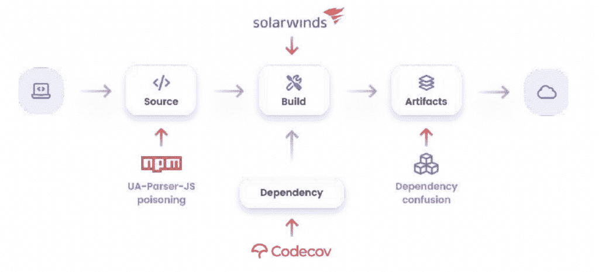

# 从 2021 年软件供应链攻击中吸取的教训

> 原文：<https://thenewstack.io/lessons-learned-from-2021-software-supply-chain-attacks/>

2021 年，世界意识到一种攻击媒介的激增，这种攻击媒介多年来一直是安全风险，安全社区再也不能忽视它:软件供应链攻击。在 2020 年末的网络安全管理软件产品袭击之后，各行各业各种规模的软件公司开始面临越来越多的有针对性和有组织的供应链攻击。这种增强的威胁给全球企业带来了严重的系统停机、金钱损失和声誉损害。

## 随机攻击什么时候成了一种模式？

 [埃兰·奥泽尔

Eran 是 Argon Security 的首席客户和收入官以及创始成员，Argon Security 是 Aqua Security 收购的软件供应链安全领域的领导者。在加入 Argon 之前，他曾在 Check Point Software Technologies 担任多个职位，最近的职位是战略销售和合作伙伴关系全球主管，在此期间，他领导并在 Check Point 主要业务增长引擎的快速增长中发挥了重要作用。Eran 是一位经验丰富的创新型企业领导者，在网络安全和企业软件领域拥有超过 20 年的销售领导和上市运营经验。](https://il.linkedin.com/in/eran-orzel) 

整个 2021 年，供应链攻击的数量和复杂程度都在快速增加。

这代表了攻击者方法的显著转变，现在他们将精力集中在攻击软件供应商上。这使他们能够利用隐含信任的路径，但不太安全，并通过代理建立一种通过一次攻击攻破许多受害者的方法。

软件供应链的高风险部分归因于这样一个事实，即成功的攻击可能会影响大量使用被攻破供应商软件的公司。

网络安全管理软件产品的攻击是供应链攻击潜在危害的一个很好的例子。在这场针对网络工具供应商网络安全管理软件产品的民族国家攻击中，其约 18，000 名客户因使用网络安全管理软件产品被攻破的软件而被暴露。

多达 250 个这些暴露的组织遭受了有针对性的攻击，包括政府机构，如美国五角大楼，以及顶级企业，如微软和 FireEye。

## **软件供应链安全的转折点**

网络安全管理软件产品的攻击被认为是迄今为止最大和最复杂的供应链攻击之一，它体现了供应链攻击的毁灭性潜力。它将攻击者的注意力引向软件供应链在组织中相对较低的安全状态，并引发了随后的供应链攻击浪潮。网络安全管理软件产品的攻击得到了媒体的大量报道，并激发了全球范围内关注降低供应链攻击风险的安全意识和改进计划的浪潮。

同年 2 月，信息安全顾问兼 bug-bounty 黑客 Alex Birsan 测试了企业暴露于供应链攻击技术的情况，该技术使用自动化 DevOps 实践来危害管道。这种策略被称为依赖混淆，导致恶意的公共库被合并到项目中，而不是同名的可信私有库。在这个实验中，Birsan 能够侵入苹果、微软和其他几十家顶级公司，这表明即使是高度重视安全的公司也可能成为软件供应链中隐含缺陷的受害者。

网络安全管理软件产品之后出现了类似的构建时代码操纵攻击，攻击者渗透到 Codecov 产品的软件供应链中，操纵构建过程将恶意代码注入其软件，并使用软件更新机制将恶意软件分发给 Codecov 客户。

不久之后，2021 年 5 月 12 日，拜登总统发布了关于改善国家网络安全的行政命令，首次强调了加强软件供应链安全的必要性。

7 月，对 Kaseya 的袭击提高了人们对供应链袭击的直接和下游影响的认识。在这次攻击中，托管服务提供商软件被用于向托管服务提供商的客户分发 REvil 勒索软件，造成了严重的停机和收入损失。

可视化最大的攻击危及软件供应链的位置

不幸的是，这些例子并不是孤立的案例，此后供应链攻击的数量稳步增加，最流行的方法是软件依赖中毒。仅在 11 月份，我们就看到了针对流行的 npm 包(UA-Parser-JS、COA 和 RC)的三次攻击，每次攻击每月都有数百万次下载。这种恶意策略已被证明非常有效，并进一步强调了安全社区将注意力转移到并解决这种极具破坏性的潜在攻击媒介的必要性。

过去一年的最后一个事件发生在 12 月 9 日，当时 [Log4Shell 漏洞](https://blog.aquasec.com/cve-2021-44228-log4shell-vulnerability-explained)被发现，迫使软件供应商陷入修补狂潮。发现后不久，攻击者就开始利用这个流行的包，并利用这个漏洞发动攻击。

## 【2021 年攻击分析的主要教训

检查 2021 年许多攻击的成功率和随之而来的损害，一个最明显的细节是当前的安全工具和实践不足以防止供应链攻击。传统的应用程序安全测试无法检测供应链攻击，这些攻击通常利用可信的软件工件，而不是这些工具针对的漏洞。

此外，已建立的 Cl/CD 和 DevOps 管道依赖于隐式权限来实现快速提交和部署，在此过程结束时实施安全控制，这对于阻止恶意活动来说为时已晚。

为了保证组织的安全，越来越需要新的保护方法和解决方案来应对供应链攻击的独特特征。

## **供应链攻击媒介仍在等待解决方案**

过去一年攻击的数量和影响凸显了一个事实，即应用程序安全团队面临着一个新的挑战，这需要创新思维。大多数 AppSec 团队缺乏资源、预算和知识来充分应对供应链攻击的风险。这由于需要开发和 DevOps 团队的合作而变得更加复杂。

有关软件供应链安全趋势的更多见解，请浏览完整的 [2021 年软件供应链安全报告](https://info.aquasec.com/argon-supply-chain-attacks-study)。

<svg xmlns:xlink="http://www.w3.org/1999/xlink" viewBox="0 0 68 31" version="1.1"><title>Group</title> <desc>Created with Sketch.</desc></svg>