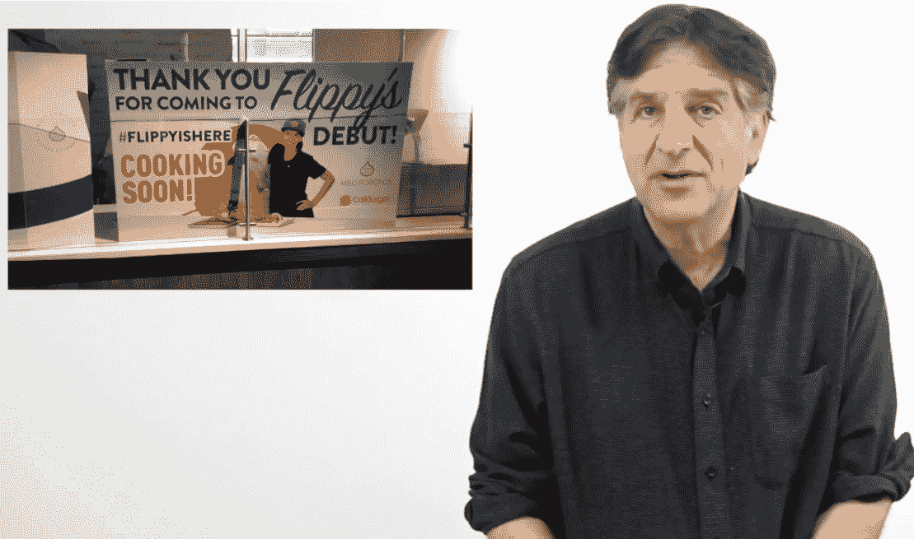

# 从烙牛肉饼机器人 Flippy 的“中断”中吸取的教训

> 原文：<https://thenewstack.io/lessons-learned-hiatus-flippy-burger-flipping-robot/>

当您将基于云的技术与自动化相结合时，有时事情不会按计划进行。这就是发生在一家快餐连锁店身上的事情，该连锁店推出了一款由基于云的自动化平台部分指导的汉堡翻转机器人。这个故事像病毒一样传播开来，引发了数十条关于其对人类影响的新闻报道——随后，当后续报道显示这个备受吹捧的机器人已经被拔掉电源时，人们几乎集体松了一口气。

但是，对于我们的技术现状，还有什么教训可以吸取吗？

当 Flippy 在 CaliBurger 第一天上班时，看起来很有趣。由发那科制造的优雅的无头机器人承诺它一天可以做多达 2000 个汉堡。*《华盛顿邮报》* [将](https://www.washingtonpost.com/news/innovations/wp/2018/03/05/meet-flippy-a-burger-flipping-robot-alternative-to-wage-earning-workers/) Flippy 描述为“一个专门的工业六轴机械臂，用螺栓固定在厨房地板上，使用热和常规视觉以及摄像机来检测生肉何时被放到烤架上，然后在整个烹饪过程中监控每个汉堡。”此外，该设备使用 Miso Robotics 的云连接人工智能平台来帮助烹饪过程。

“这真的是一种深度学习技术，我们可以利用所有的数据和训练 Flippy 来看看烤架上发生了什么，”该公司告诉帕萨迪纳一家报纸。

https://www.youtube.com/watch?v=lMIkWyiJp0k

但那篇文章也指出，肉饼是由人类放在烤架上的——他们也负责将奶酪放在煮熟的肉饼上——最终，这被证明是一个问题。据《今日美国》报道，当这个大日子到来的时候，餐馆发现自己“被更多的兴趣所淹没”——来自食客和潜在的机器人买家。事实上，人太多了，很明显餐馆不能给每个人一个机器人翻转汉堡肉饼。最近的报告发现，该公司的首席技术官与餐厅经理举行会议，讨论如何为一个机器人准备和调味充足的肉饼，这个机器人除了翻转(并最终从烤架上取下)无限供应的汉堡之外什么也不做。

“最重要的是时机，”他告诉《今日美国》。“当你在后面和人们一起工作时，你可以互相交谈。对于 Flippy，你需要根据他的时间表来安排。”

“所以换句话说，”一个工人赔偿博客开玩笑说，“他就像任何喜怒无常的人类餐馆厨师。”

一家帕萨迪纳新闻网站援引 Miso Robotics 的发言人的话说，Flippy 离线是因为他们需要进行测试，“以确保该位置可以满足大量订单。”该广告还暗示，Flippy 可能会在午餐时间倒班。

Caliburger.com 网站上仍然写着“来帕萨迪纳看 Flippy 的行动”——但是现在 Flippy 的日程只是“待宣布”

《今日美国》同情地报道说，弗里皮正在“长时间休息”，而 NPR 写道，弗里皮“正在休息……”当然，情况可能会更糟。《今日美国》报道称，在 Flippy 早期的一次测试中，“当它将汉堡从煎锅中取出放在托盘上冷却时，有几个汉堡没有完全冷却[就掉了下来](https://www.usatoday.com/story/tech/talkingtech/2018/03/05/flippy-robot-now-cooking-up-burgers-near-l/390179002/) …”

Miso Robotics 的 CEO 坚称，这些是很快就会解决的学习难题。

但是作为卡利集团的一部分，卡利伯格一直都是由他们的连锁餐厅和附属科技公司组成的。该公司承诺，它提供餐馆和开创性的“零售软件系统，以增加收入，降低成本，收集数据和改善运营。”一个营销活动包括[集成到背包中的数字显示器](https://d97kb89ytnlph.cloudfront.net/pressrelease/PRCaliGroup10092017.pdf)显示餐馆的特别优惠，餐馆配备了巨大的屏幕，允许[观看电子游戏职业比赛的聚会](https://caliburger.com/games)。该网页解释说，卡利集团“使用其卡利伯格连锁餐厅展示概念证明，并领导其姐妹公司开发的软件产品的商业采用。”

事实上，《今日美国》的记者认为，烙牛肉饼的机器人总是只是一个噱头。他在报纸的科技播客“[谈论科技”中说，“连锁餐厅并没有把 Flippy 藏在厨房里。”](https://www.youtube.com/watch?v=hAyR-hAUJd4)“他们为机器人搭建了一个舞台。他们称之为 Flippy 的厨房…我预测这个机器人会有很多自拍。”

《今日美国》记者杰弗逊·格雷厄姆认为弗利皮的处女作并不引人注目

Flippy 已经帮助 Miso Robotics 获得了[额外的 1000 万美元资金](https://techcrunch.com/2018/02/15/miso-scores-10-million-to-bring-its-hamburger-flipping-robot-to-more-restaurants/)。但是味噌不是唯一的。Momentum Machines 还计划在旧金山时尚的南部市场区开设一家机器人汉堡店，并且已经筹集了 1800 万美元。

## 变化无常的人类

观察人类的反应很有趣。《时尚先生》杂志夸口说，Flippy " [在压力下屈服了](https://www.esquire.com/food-drink/food/a19390339/burger-flipping-robot/)……这个烙牛肉饼的机器人只工作了一天。

但这个故事也提出了(人类)快餐工作者的流动问题。《华盛顿邮报》报道称，一半的快餐业员工在不到一年的时间里离开了公司，这使得快餐业每年要花费 34 亿美元用于招聘和培训。卡利集团的首席执行官约翰·米勒说:“我们训练他们，他们在烤架上工作，他们意识到这并不有趣……所以他们离开并驾驶优步。”

《今日美国》报道称，Flippy 餐厅的经理对于不必继续雇佣和培训汉堡店员工的前景“非常兴奋”。“Flippy 将成为永久雇员，我再也不用担心这个了。”两年前，麦当劳的一位前首席执行官甚至直截了当地坚持说“买一个 35000 美元的机器手臂比雇佣一个效率低下的员工每小时挣 15 美元装薯条要便宜。”

但其他人认为，自动化不一定意味着人类就业的减少。Panera 说，当它安装了自助点餐亭后，它收到了太多的订单，以至于不得不增加厨房员工的工作时间。“排队的人太多了，他们觉得自己正在失去交易，因为他们没有足够的空间在合理的时间内处理订单，”韦德布什证券(Wedbush Securities)餐饮股票研究高级副总裁表示。

在 Reddit 上的某个地方，一个[有远见的人](https://www.reddit.com/r/Libertarian/comments/82l5y1/flippy_the_burger_flipping_robot_is_now_cooking/dvayv30/)甚至似乎已经在思考自己的未来，他发布了“我想成为一名烙牛肉饼的机器人技术员”

卡利集团表示，烙牛肉饼机器人“[不是为了取代劳动力。这是为了增加厨房里的员工。”(甚至《华盛顿邮报》也暗示机器人可以让人类快餐工人免于不愉快的烤箱意外烧伤和偶尔的暴力袭击。)然而，尽管这个故事暗示了人类的未来，一位快餐工人的活动家告诉《今日美国》“在快餐店工作的人并不害怕机器人。](https://www.pasadenastarnews.com/2018/03/05/the-future-is-here-a-robot-will-cook-your-burger-at-caliburger/)

“真正可怕的是工资这么少，我们需要食品券和公共援助来照顾家人。”

一些人认为机器人已经进入了餐饮业。Suzomo 机械公司已经向 70，000 名顾客出售了它的寿司制作机器人。

回到硅谷，Zume 已经在交付由机器人组装的披萨——经常等待烹饪，直到它们出现在配备烤箱的送货卡车上，理论上保证了更新鲜的快餐体验。总部位于雷德伍德城的 Chowbotics 公司出售一种制作沙拉的机器人。

旧金山也有一家素食碗药房，根据 *[《水星报》](https://www.mercurynews.com/2017/09/02/at-gen-korean-bbq-house-in-fremont-robots-enhance-the-dining-experience/)* 的报道，“机器人精确地工作，制作你的藜麦加(在这里插入鸡蛋、咖喱、鹰嘴豆泥、茄子干酪或辣椒)碗”，送到“一个个性化的小房间”《硅谷报》还引用了一家弗里蒙特韩国自助烤肉餐厅，该餐厅配备了机器人，通过传送带将食物直接送到你的餐桌上。当然，Cafe X 的“机器人咖啡吧”出售由“闪亮的白色三菱机器人手臂，看起来很像牙科 x 光设备”准备的美味饮料。

最终，由自由市场来揭示哪些行业对智能、基于云的自动化的需求尚未得到满足——因此，这些企业中的每一个都将面临人类无形之手的无情审判。

# WebReduce

<svg xmlns:xlink="http://www.w3.org/1999/xlink" viewBox="0 0 68 31" version="1.1"><title>Group</title> <desc>Created with Sketch.</desc></svg>