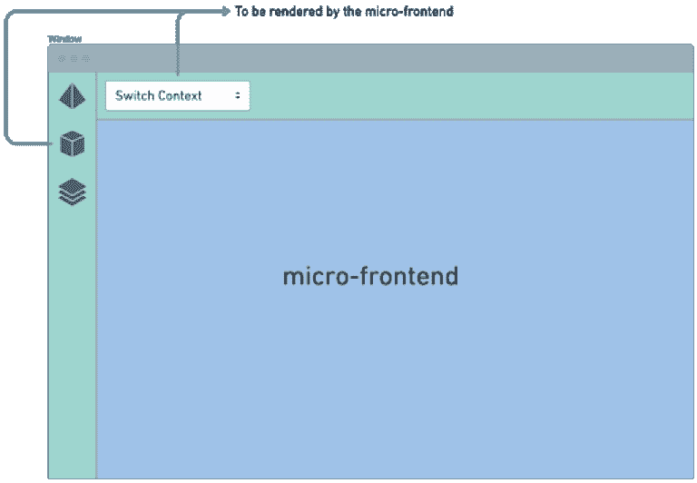

# 实施 CMS 微前端的经验教训

> 原文：<https://thenewstack.io/lessons-learned-implementing-a-cms-microfrontend/>

 [阿比纳夫·帕利瓦尔

阿比纳夫·帕利瓦尔是 Contentstack 的应用工程师，是 API 优先、无头 CMS 技术的先驱。他是一个 JavaScript 极客，喜欢尝试最新的技术和框架。](https://www.linkedin.com/in/abhinav-paliwal-2820b610b/?originalSubdomain=in) 

您可能已经听说过“微服务”[微服务](https://thenewstack.io/category/microservices/)架构是一种开发软件应用程序的方式，它通过部署许多较小的独立服务来协同工作。这种方法为您提供了选择最佳服务的自由以及快速替换它们的灵活性。

在 [Contentstack](https://www.contentstack.com/) ，我们基于这种方法构建了我们的内容管理系统，我们非常清楚它给你的应用带来的诸多优势。

这就是为什么当我们第一次听说微前端时——正如他们所说，这是将微服务的概念扩展到您的前端——我们渴望实现它。

我们尝试在我们的一个试验项目中采用微前端方法，并且在这个过程中我们学到了一些重要的经验。在这篇博文中，我将讨论我们学到的一些经验，以及第一次尝试微前端时需要记住的其他重要事情。

## 我们为什么选择微前端？

只要应用程序不庞大，一个统一的前端就足够了。随着应用程序的增长和您添加更多功能，统一的大型前端开始影响您的交付速度。

我们面临着类似的情况，因为我们的产品被分为多个子域。此外，这些子域名中的每一个都由不同的团队拥有和开发。当我们试图组合不同团队的代码库时，结果并不令人满意。

首先，所有的团队必须比平常更加协调，以便为部署和测试让路。其次，多个版本需要在不同的团队成员之间进行协调。

以上两个原因导致了并发的合并冲突。

当然，我们不能在这种模式上持续太久。除了缩放，在一个结构的祭坛上，它的一个最基本的需求被妥协了。

唯一显而易见的方法是将前端分成小的、可管理的单元。

## 我们的方法

构建微前端有多种方式。然而，首先，我们必须找到一个最适合我们的目的。谢天谢地，我们找到了两个:

*   iframes 方法
*   这里解释[的那个](https://micro-frontends.org/)

最初，我们选择了 iframes 方法。但不幸的是，它并不像我们希望的那样有效。我们面临着与搜索引擎优化、安全性和可用性相关的问题；因此，我们放弃了。然而，iframes 帮助我们创建了一个主缓存，并开始了微前端开发。

我们采用的下一种方法很独特，因为我们使用了定制元素。然而，这里也有一些挑战。

虽然这个方法可以满足我们的需求，但是我们冒了过度杀伤的风险，因为我们没有使用多个框架。仅供参考，我们在大多数项目中使用 ReactJS，很少有超出框架的元素。

似乎我们陷入了一个永无止境的循环，直到我们遇到了一个[源](https://medium.com/better-programming/5-steps-to-turn-a-random-react-application-into-a-micro-frontend-946718c147e7)，它帮助我们用一些方法来实现微前端，就像我们打算使用这个方法一样。

## 实现方法

根据前面提到的来源，我们开始使用动态脚本在页面上加载微前端 JavaScript。

一旦加载，容器调用窗口对象的方法。

加载后，微前端 JavaScript 将一个方法翻转到 browser 对象，容器应用程序使用该方法来呈现微前端。

微前端呈现在容器应用程序提供的 div 上。下图显示了该设置的外观。

绿色区域由容器应用程序渲染，蓝色部分由微前端控制。

## 微前端之外的渲染问题

的确，我们取得了一些初步的成功，这是令人激动的。但遗憾的是，好景不长。

我们又开了一次碰头会，才意识到我们需要稍微调整一下实现过程。

该图显示了微前端需要呈现 DOM 层次结构之外的一些元素。左边的导航栏和标题需要呈现一些图标，按钮和其他元素从微前端安全。

经过几次初步尝试后，我们意识到可以使用 React Portal API 解决这个问题。

这个 API 允许在呈现微前端的 DOM 层次结构之外呈现组件。

虽然我们解决了这个挑战，但我们还有另一个问题需要解决。我们需要一种无缝路由技术。然而，从微前端控制路由具有挑战性。但是用 HTML 5 pushState API 创建单页应用程序(SPA)在这里帮助很大。

利用这一点，我们在初始化历史对象时，将它从容器应用程序传递到微前端应用程序。此外，我们使用了相对路径，从而解决了这个问题。

## 更多挑战和解决方案

虽然独立的微前端有很多好处，但是一个显著的缺点是每个微前端 JavaScript 包的大小。用标准库加载一个普通的 ReactJS 应用程序需要很大的带宽，通过实现微前端，我们只是进一步增加了带宽需求。

需要一个快速的解决方案。

我们意识到像 React 和 Redux 这样的库在所有微前端之间是共享的；每次都下载这些是没有意义的。

相反，我们决定将这些公共库组合在一起，使用 Webpack 的 dII 插件一次性下载它们。这个插件帮助我们减少了 60%的包大小。

## 包扎

一些孵化项目目前有基于这种方法的微前端。不用说，所有这些应用程序都可以无缝运行。因此，现在可以不依赖其他团队而快速推出变更。部署和扩展变得更加易于管理。

尽管我们已经深入讨论了我们的方法，但是你可以参考[我们在 GitHub](https://github.com/contentstack/micro-frontend-example) 上的微前端例子来了解更多。

<svg xmlns:xlink="http://www.w3.org/1999/xlink" viewBox="0 0 68 31" version="1.1"><title>Group</title> <desc>Created with Sketch.</desc></svg>