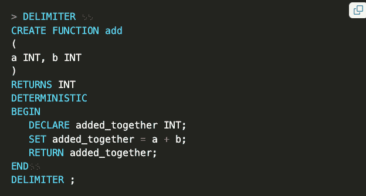

# 让 SQL 做所有的工作:用户定义的函数

> 原文：<https://thenewstack.io/let-sql-do-all-the-heavy-lifting-user-defined-functions/>

SQL 用户定义函数是优化应用程序性能的一种方式，即通过将操作从应用层移动到数据库层。

有许多方法可以优化应用层。对于具有 SQL 数据库层的应用程序，在某些情况下，可以做得更少。当使用 SQL 数据库时，用户定义函数(UDF)是“少做”的选项。这项工作仍然要做，但是数据库层的负担更重了，这最终会优化应用程序的性能， [Charlie Custer](https://www.linkedin.com/search/results/all/?keywords=charlie%20custer%20cockroach&origin=GLOBAL_SEARCH_HEADER&sid=YHX) ，[蟑螂实验室](https://www.cockroachlabs.com/?utm_content=inline-mention)的高级技术内容营销人员在[的一篇关于 UDF 的博客文章](https://www.cockroachlabs.com/blog/author/charlie-custer/)中提到。

SQL UDFs 是为在 SQL 数据库中执行而创建的函数，可以限制各层之间的工作量并优化应用层。UDF 可以有意无意地改变数据。

## **什么是 SQL UDFs？**

UDF 是函数。它们与所有其他编程语言中的函数非常相似，只是它们是由 SQL 数据库软件执行的。它们的特点包括:

*   函数调用所需的名称。
*   函数接受的参数、输入及其类型。
*   输出/返回语句。
*   一种函数体，包括为达到结果而对自变量进行的运算。

一些数据库中的 SQL UDF 创建函数如下所示:

*   CREATE FUNCTION add()让数据库软件知道一个名为 add 的函数正在被创建。
*   a INT，b INT 让数据库软件知道在运行这个函数时会有两个参数，都是整数。
*   RETURNS INT 让数据库软件知道正在返回一个整数。
*   因为“选择 a + b”是在函数体中运行的操作。

调用如下所示:

八是目标产量。

这就是优化开始的地方。UDF 将业务逻辑从应用层移至数据库，这样可以优化应用层，“做得更少”，但仍执行必要的操作。减少应用层之间数据传输的数量和频率也是提高性能的关键。

考虑在数据库中调用 SQL *UDF add()* ，数据库中存在两个值(a = 3，b = 5)，使得只有一个值返回给应用层，即 8。如果没有 UDF，将返回两个值，然后操作将发生在应用层。步骤多，效率低。

但是两个数相加返回一的函数有多大用处呢？不是很喜欢。下面的函数是一个 UDF [，由 CockroachDB 用户 Saquib Ali 创建](https://github.com/saqib-ali/humanize_time_span/blob/main/humanize_time_span.sql)，它获取时间戳数据并转换成一种更加人性化的“x 小时前”格式。

## **副作用**

与其他函数类似，UDF 可能会以意想不到的方式改变 SQL 表中的数据。正因为如此，一些数据库提供空间来提供关于它的易变性的信息，即函数将影响其他数据的程度。

示例:

不可变是指函数不改变任何其他数据，防漏意味着没有副作用。

## **如何在 SQL 中创建 UDFs】**

不同的 SQL 系统有不同的语法，但是 Custer 为各种数据库系统提供了一些示例 UDF:

**PostgreSQL** :

MySQL :

**cocroach db**:

cocroach db 看起来类似于 PostgreSQL，因为 cocroach db 与 [Postgres 有线协议](https://www.cockroachlabs.com/docs/stable/postgresql-compatibility.html)兼容。

## 结论

这只是 SQL UDFs 主题的一点皮毛。它们不仅用于优化应用层，还用于优化数据库层。这里有一些关于 UDF 的很棒的文章，尽管复杂性从这里开始急剧增加。谷歌和微软也有一些帖子([谷歌大查询](https://cloud.google.com/bigquery/docs/reference/standard-sql/user-defined-functions)，[微软 UDF](https://learn.microsoft.com/en-us/sql/relational-databases/user-defined-functions/create-user-defined-functions-database-engine?view=sql-server-ver16) )，其中也包括一些针对他们自己的数据库系统的规范。

<svg xmlns:xlink="http://www.w3.org/1999/xlink" viewBox="0 0 68 31" version="1.1"><title>Group</title> <desc>Created with Sketch.</desc></svg>