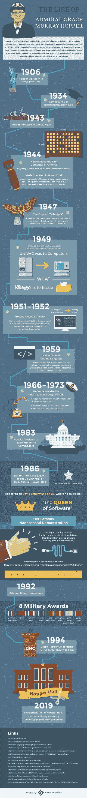
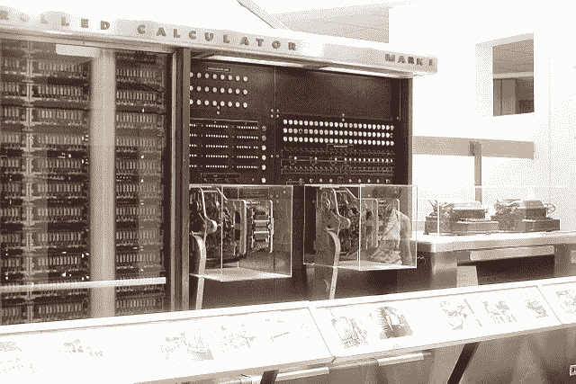
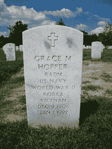

# 让我们对神奇的格蕾丝·赫柏说生日快乐

> 原文：<https://thenewstack.io/lets-say-happy-birthday-amazing-grace/>

程序员不像大多数人。我们对美好时光的想法有时包括整夜不睡，踩死顽固的臭虫——至少，当我们能找到该死的东西的时候。即使实际上东西没有坏，编译器也在嗡嗡作响，我们还是忍不住要修补。让我们的代码更好、更干、更快。给我们足够的时间、专注和红牛，我们可以创造——或破解——任何值得 GitHub 回购的代码。

我们统治着这个世界，或者至少统治着依赖计算机的 97%的世界。我们在很大程度上要感谢格蕾丝·赫柏让这个由书呆子统治的世界成为可能。早在红牛、GitHub 和极客流行之前——远在互联网出现之前，也只是在“计算机器”出现后不久——格蕾丝·赫柏是第一个看到这些房间大小的电路堡垒不仅仅可以做重复的数学计算的人。

格蕾丝·赫柏教计算机如何说英语，以及如何做数学以外的事情。多亏了她，一个全新的计算世界开启了。

即便如此，你可能从未听说过格蕾丝·赫柏的名字。我们的女孩极客女神 Grace 对现代计算的贡献仍然相对默默无闻，尽管有一艘美国海军战舰——美国海军阿利·伯克级导弹驱逐舰 USS Hopper(DDG-70)——以她的名字命名。就在上个月，巴拉克·欧巴马总统授予格蕾丝·赫柏总统自由勋章，尽管她已于 1992 年去世。她是为数不多的出现在莱特曼节目上的电脑极客之一。

[https://www.youtube.com/embed/QA33wW5LaNY?start=6](https://www.youtube.com/embed/QA33wW5LaNY?start=6)

视频

**莱特曼**:“那你怎么知道这么多关于电脑的知识？”

**漏斗**:“我没有。这是第一个。”

多厉害啊。

所以今天我们在这里祝格蕾丝 110 岁生日快乐。这里有一个小背景故事，所以我们都可以给奇异恩典她的属性。

信息图由 Storagepipe 提供

格蕾丝·默里·霍珀 1906 年 12 月 9 日出生于纽约市一个富裕的上流社会家庭。她是一个天生的修补匠，从小就对事物如何运作表现出强烈的好奇心。有一个故事，讲的是七岁时，格蕾丝想知道闹钟是如何工作的。她把自己的拆了，但却无法重新组装好让它工作。她毫不气馁，又拆了六个家里的钟——直到她妈妈发现了格蕾丝的计划，除了一个以外，其他的都拿走了。

这个故事既说明了我们的女主人公的求知欲和解决她感兴趣的问题的决心，也说明了她的家庭是如何支持它的。在那个时代，很少有女孩能上完小学，人们普遍认为女人的“最高使命”是做一个全职太太和母亲，默里夫妇推崇格蕾丝的探索智慧。她的父母不仅鼓励女儿接受高等教育，还鼓励她追随自己在数学和物理方面的“非女性”兴趣。

这种鼓励至少部分是出于务实的原因:格雷斯的父亲沃尔特·默里患有动脉疾病，不得不切除双腿，这是一个世纪前唯一可用的治疗方式。他希望比他的孩子早死，坚持认为格蕾丝和她的妹妹玛丽应该受到良好的教育，以便在需要的时候能够养活自己。毕竟，如果她的父亲能把袜子钉在他的桃花心木胫骨上并继续前进，那么对他的孩子来说就没有太难克服的障碍了。当然，这种敢做敢为的态度在生活中很好地服务了格雷斯，给了她追求职业道路的进取心——高等数学，现代计算的诞生——在一个女性根本没有“职业”的时代，很少有女性试图达到

格蕾丝进入了瓦萨学院，并于 1928 年毕业，获得了物理学和数学双学士学位。她随后去了耶鲁大学，在 1934 年先后获得了数学硕士和博士学位。她加入了瓦萨大学，教授有限差分、运筹学和概率博弈论等课程，这些知识为她未来的计算之路铺平了道路。她还利用了瓦萨学院的政策，允许教师旁听该学院提供的所有课程，每学期都要旁听两门课程。通过这种方式，格蕾丝学到了天文学、生物学、地质学、建筑学以及更多的基础知识。

后来，她将自己在计算领域的前瞻性创新归功于这一广泛的基础。她发现每一门学科都有自己的语言和符号，这很有趣——这种魅力直接导致了她在开创性的计算机编译器、语言和其他软件方面的成功。

1930 年，在读研究生时，格蕾丝·默里还和文森特·霍珀结婚了。他们没有孩子，并于 1945 年离婚，随后他立即与她最好的朋友之一结婚(哎哟)。格蕾丝在她以后的生活中一直使用她婚后的名字，并且从来没有说起过离婚的事情，在那个时代离婚是非常耻辱的。此外，她从未怀疑过广为流传(不亚于《纽约时报》)的故事，即她在二战期间成了寡妇。

但是让我们来看看好东西。第二次世界大战确实到来了，格蕾丝·赫柏急切地离开学术界，加入了海军女子预备役。她的数学博士学位让她被送到哈佛大学的 Cruft 实验室，在那里，海军的船舶计算项目局刚刚征用了 Mark I 计算机，作为自动顺序控制计算器，供战时使用。格蕾丝加入了以霍华德·h·艾肯为首的编程团队，在世界上最早的一台计算机上直接学习计算机编程——这台计算机的最大存储容量为 72 个字。

战争结束后，她继续在海军预备役服役。霍普拒绝了瓦萨大学的正教授职位，转而在哈佛大学担任海军合同下的研究员，在那里她是建造马克 2 号计算机团队的一员。在晚年接受采访时，格蕾丝说她“真的是和马克 2 号一起长大的”,它花了两年时间建造，用了 20 辆拖车将它运到海军水面武器中心的最终安装地点。马克 2 号是关于格蕾丝·赫柏的一个最持久的神话的来源:她发明了术语“调试”

事实上，她当时正在马克 2 号工作，在一栋破旧的大楼里，纱窗破烂不堪。1945 年的夏天很暖和，窗户总是开着的。一天，这个庞然大物的电脑出现了故障，研究小组终于找到了原因:马克 2 号的一个继电器里有一只飞蛾。一名操作员小心翼翼地用镊子把它取出来，用胶带粘在日志本上，并写下“发现的第一个真正的 bug。”这本日志和这个 bug 现在都被珍藏在史密森尼博物馆，但实际上“计算机 bug”这个术语在这个时候已经在使用了，当代报纸关于蛾事件的报道没有提到 Hopper 创作了这个术语。然而，她是团队中的一员，绝对创造了“调试”这个术语和实践(她很有可能是；几率非常大，因为那时全世界只有四台电脑)。

> Hopper 的突破性设想:计算机可以作为它们自己操作的主要工具，而不是每次程序运行时都需要一系列详细的指令。

然而，正是格蕾丝·赫柏走向了民用商业计算的世界，在那里她做出了最大的贡献。1949 年，还在海军预备役服役的霍普加入了埃克特-毛奇利计算机公司(后来成为兰德公司)，成为开发 UNIVAC I 的团队成员。格蕾丝解释说，开发团队有一个约定。“如果 UNIVAC 失败了，我们会把它扔出大楼的一边，那里有一个垃圾场，然后我们会从另一边的一个窗户跳出去，那里有一个墓地。”

然而，UNIVAC 成功了，也正是在这里，在 20 世纪 50 年代初，她最初的编译工作完成了。她称之为“A 编译器”；第一个版本是 A-0。虽然格蕾丝·赫柏没有亲自发明术语“bug ”,但她确实创造了术语“编译器”——在她写第一个的时候。

她的突破性愿景是:计算机可以作为它们自身操作的主要工具，而不是每次程序运行时都需要一系列详细的指令——通常每次都是相同的指令集。到那时，大多数程序使用相同的短指令集来处理各种各样的问题和结果。这意味着每项工作都需要手写一页又一页的重复代码，然后输入机器。

格蕾丝·赫柏是第一批认识到这些指令可以被奉为“子程序”的人之一——这是她创造的另一个术语——并保存在计算机中，以便在需要时被调用和汇编成适当的程序。她设计了一个经常使用的子程序系统，给它们分配了三个字母的呼号，计算机可以用它从存储磁带库中检索指令。以前需要一个月的手工编码现在可以在五分钟内完成。

Mark I Image:维基百科(CC BY-SA 3.0)

此外，这意味着计算机现在可以说英语了。作为将口语指令翻译成目标计算机语言的中间程序，编译器将程序员从学习和使用繁琐的“机器语言”的需要中解放出来。格蕾丝·赫柏的编译器是现代计算骨骼的基础:子程序、公式翻译、相对寻址、链接加载器、代码优化，甚至符号操作。

她创造了“编译器”这个术语。因为人们去图书馆从各种书籍中编译研究信息，计算机从它的子程序库中编译自己的信息。到 1952 年，格蕾丝·赫柏已经有了实用的编译器。“没人相信，”她说。“我有一个正在运行的编译器，没人会碰它。他们告诉我计算机只能做算术。”然而，她的老板们很快意识到了她的发明的价值，编译器成为了所谓“自动编程”的基础。或者，你知道，我们今天还在做的事情。

[https://www.youtube.com/embed/i2jszS1j_OE?feature=oembed](https://www.youtube.com/embed/i2jszS1j_OE?feature=oembed)

视频

在她漫长而多产的职业生涯中，格蕾丝·赫柏还创造了许多其他的第一:她直接参与了 COBOL 的创建，COBOL 基于她编写的两种开创性的基于编译器的编程语言 MATH-MATIC 和 FLOW-MATIC。在 20 世纪 70 年代，Grace 还在说服军方从大型中央计算系统转移到小型计算机的分布式网络的价值方面发挥了作用，在分布式网络中，任何节点上的任何用户都可以访问公共数据库。这在当时是一个革命性的想法，一旦军方和政府接受它，它就很快被商业计算行业所复制——这导致了编程语言标准化的增加。

格蕾丝·赫柏最终被晋升为少将下半部军衔(这意味着她是两级军衔中的第一级，而不是只有下半部才能成为海军上将)，并且是美国海军历史上服役时间最长的现役军官之一。她实际上退役了几次，但每次海军都在她退伍文件上的墨水完全干透之前叫她回来工作。她终于在 1986 年 8 月 14 日永远退休了，享年 79 岁——直接去数字设备公司做高级顾问，从没错过一天，直到她 1992 年去世(自然死亡)。

## 让我们现在做感恩祷告

格蕾丝·赫柏以最高军事荣誉被安葬在阿灵顿国家公墓。尽管她对现代计算的深远贡献并没有让她成为一个家喻户晓的名字，甚至在软件极客中也是如此，但她已经获得了一些非常酷的荣誉。这些包括前面提到的总统自由勋章和以她的名字命名的战舰，以及她自己在 2013 年的谷歌涂鸦——一个 Grace 坐在 UNIVAC 的动画，当一只蛾子飞出电脑时，用 COBOL 打印出她的年龄(当时是 107 岁)( et tu，Google？).马里兰大学拥有一台昵称为“Grace”的克雷 XC-30 超级计算机，格蕾丝·赫柏计算界女性庆典是一年一度的会议，旨在促进女性在计算领域的贡献和研究。

最后，格蕾丝·赫柏是我个人的灵感来源。不到一年前，我决定离开印刷新闻业，重新接受网络开发职业培训。这是一次令人生畏的向未知领域的飞跃，但当我研究我的新职业时，我发现了格蕾丝·赫柏，以及她作为一名女性在男性占主导地位的编码界做出的开创性贡献。我在便利贴上写下了她的一句话，贴在我的屏幕上，每当我努力编写的 JavaScript 代码片段再次失败时就引用这句话:“停泊在港口的船是安全的，但那不是船建造的目的。扬帆出海，做新的事情。”

生日快乐，格蕾丝！并且，代表各地超负荷工作的编码人员，谢谢你们。

来自[存储管道](http://www.storagepipe.com/who-is-grace-hopper/)的信息图。

<svg xmlns:xlink="http://www.w3.org/1999/xlink" viewBox="0 0 68 31" version="1.1"><title>Group</title> <desc>Created with Sketch.</desc></svg>