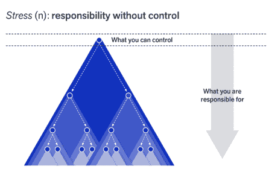

# 让我们将关于微服务的对话提升到一个新的高度

> 原文：<https://thenewstack.io/lets-take-our-conversations-about-microservices-to-the-next-level/>

[Eran Levy](https://medium.com/@levyeran)

[Eran Levy 在 Cyren 做软件架构师。工程师，问题解决者，呼吸分布式系统，热爱技术，并与任何对他的博客感兴趣的人分享他的知识。](https://medium.com/@levyeran)

阅读最近围绕“走向”架构方法以及您的服务规模应该是什么(应该是纳米服务、微服务、宏服务、适当规模的服务还是整体服务)的讨论非常有趣。关于这些不同的建筑方法已经写了很多。

我们已经支持这种“好”与“坏”讨论的比较。这是换一种方式的好时机，我真的相信这种对话应该完全改变。我们应该进一步讨论这些方法会带来什么，并且不管您选择什么，**如果您构建得正确**您总是可以改变、选择一种方法或混合使用它们。

如果你密切关注这个话题，你会听到更多的行业领导者谈论“宏服务”，因为公司开始意识到采用“微服务”可能听起来很棒，但它会带来他们在构建系统时没有考虑到的成本。在微服务架构中构建系统有很多优势，但它并不总是适合任何类型的组织。这取决于很多因素，这就是为什么你会听到更多的团队开始在决策上保守，并整合他们的服务。

我没那么老，但回顾过去，指出任何时间框架，看看我们行业的趋势是如何变化的，这很有趣。这些天来，谈论科技巨头实施的酷的时髦东西变得非常流行。他们周围的“嗡嗡声”让你陷入一种思维定势，认为选择这样的架构方法将解决你所有的问题，最终如果谷歌选择了他们，你为什么不应该呢？

这种感觉很可能会让你犯错**——你觉得这是“圣杯”和你一直梦想的东西——你将很容易扩展，有弹性，部署更快等等。显然，作为工程师，我们喜欢站在前沿，实施新的东西。现实却大相径庭。**

最后，这些天为我们工程师带来了一个惊人的机会。随着我们开发越来越多的云原生应用程序，我们获得了大量的权力—您可以轻松地启动您构建的任何服务，自行部署，使用您梦想的任何尖端基础架构，但这总是有代价的—“**强大的权力也必然伴随着巨大的责任。**

我参加了 [QCon London 2020](https://qconlondon.com/) —顺便说一句，令人难以置信的是，这并不遥远，今天我们处于一个完全不同的世界，面临着新冠肺炎带来的许多挑战—很高兴看到行业是如何成长的，并且有许多围绕云原生“经验教训”的讲座“[构建微服务](https://www.goodreads.com/book/show/22512931-building-microservices)”作者[萨姆·纽曼](https://samnewman.io/)做了一个鼓舞人心的演讲。“微服务大师警告开发者，时髦的架构不应该成为每个应用的默认设置，而是‘最后的手段’，”这是 Register [对它的总结](https://www.theregister.co.uk/2020/03/04/microservices_last_resort/)，老实说，我不能说得比这更好了。

纽曼还写道，微服务是“一种架构方法，而不是架构方法。”如果你密切关注这个话题，你可能会注意到最近行业内一些技术领导者之间围绕它进行的辩论——其中之一是 [Kesley Hightower 和 Ben Sigelman](https://thenewstack.io/kelsey-hightower-and-ben-sigelman-debate-microservices-vs-monoliths/) 在新的 Stack Context 播客上的辩论。

最后，我很高兴地看到，随着我们的成长，以及这些方法在构建我们的云原生应用程序方面的成熟，对话也在发生变化。

如果我能影响对话，我希望看到我们如何更加关注以下内容:

*   **每种方法带来的成本**以及贵公司是否真的准备好在开发产品以向客户提供价值时支付该成本。正如我们选择的一切(至少在技术方面)，总会有成本，你应该考虑它是否符合你的目标。有许多帖子比较了微服务与单片，以及如何从单片迁移到微服务，甚至有帖子声称，您应该构建纳米服务，因为伟大的技术公司会这样做(随便说出一个，您可能会找到一个关于这方面的帖子)。问题是，很少有人谈论微服务架构带来的挑战及其经验教训。无论你在纳米到单色或“混合”的范围内选择什么架构方法，你都应该确保你的软件是以这样一种方式设计的，它总是可维护的，**当你扩展时，它可以与你一起成长。**
*   **服务结构:**你的服务规模大小并不重要，但你应该问自己(诚实地说):它构建得好吗？您的服务是围绕一个[定义明确的领域](https://www.amazon.com/Domain-Driven-Design-Tackling-Complexity-Software/dp/0321125215)构建的吗，它真的[与其自身的逻辑](https://martinfowler.com/articles/microservices.html)解耦，并且可以随着您的业务发展而快速为您的客户带来价值吗？如果你阅读了马丁·福勒和埃里克·埃文斯的文章，这显然是探索这些领域的好时机。

信用:轻步

举个例子，如果我们选择了您的一个服务，为了成功完成您的请求，它必须进行什么样的调用链？添加新功能需要什么，是需要重构整个模块还是只开发一个附加层就大功告成了？在选择下一个架构方法时，应该充分考虑所有这些问题。这是我们在做决定时可能需要讨论的问题，如果这对我们真的有用的话，要诚实。我们真的能交付更好的软件吗？还是我们要付出更多来解决我们所面临的挑战？正如你很快可以得到的，你选择什么样的架构方法并不重要，它首先取决于你的软件是如何构建的，然后你总是可以选择正确的方法，并在你成长和面对新的挑战时改变它。

*   **实现回顾**:您目前的痛点是什么？如果您已经实现了一种或多种架构方法，随着产品的成熟，您在扩展时会学到什么？你做了哪些改变来适应你的公司，最重要的是哪些改变不适合你？有时，公司选择其中一种方法，因为他们认为这将解决他们所有的问题。随着他们开始扩大规模，公司很快意识到有许多新问题是他们在选择这种方法时没有考虑到的，并且在他们现在的情况下很难解决，例如，团队没有必要的技能。他们可能意识到的新挑战之一是如何对云原生应用程序进行故障排除，这可能会对软件交付流程产生负面影响。还有许多其他有趣的问题需要讨论，例如:您如何解决团队的依赖性，它如何影响您的 SLA，谁维护端到端的服务？这些问题直接把我们带到了我认为我们应该探索的最后一个领域。
*   **你的公司结构能支持这些工程决策吗？**您是一家小型创业公司(只有一个工程团队)还是有许多团队在开发某项功能或修复某个 bug 时会互相接触代码？你建立了合适的环境来支持你的工程师独立吗？诸如此类。所有这些问题都需要进一步讨论，如前所述，机构群体应该为这些讨论做出贡献，以防止其他公司犯他们犯过的错误，或者至少了解他们在这一过程中成功遵循的最佳实践。

非常重要的一点是，我们围绕开发云原生应用的不同架构方法的对话将从强调优势转变为富有洞察力的讨论，但也会向**展示哪些没有奏效**。我只是在这里提出了一些值得探索的领域。

我真的相信微服务会带来很多好处。我们也在自己的公司中构建微服务，但我们会花时间思考这一新功能是否真的值得另一项服务，或者它是否可以很好地适应围绕该领域已经构建的某项服务。对我们来说，花时间思考很重要，因为我们了解新服务带来的挑战。

让我们将关于这个主题的对话提升到一个新的层次，以便为这些云原生架构方法的发展做出贡献。

编码快乐！

**<svg xmlns:xlink="http://www.w3.org/1999/xlink" viewBox="0 0 68 31" version="1.1"><title>Group</title> <desc>Created with Sketch.</desc></svg>**