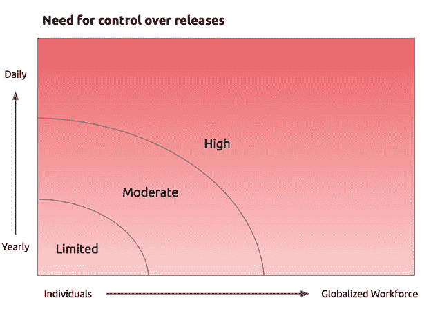

# 什么级别的特性管理适合您的团队？

> 原文：<https://thenewstack.io/level-feature-management-right-team/>

***Editor’s Note**:**  Previously in The New Stack, [we’ve discussed the subject of feature flagging](https://thenewstack.io/from-monolith-to-microservices/) — a way for development teams to restrict the dissemination of new features and capabilities in code.  Such a system can enable a more carefully marshalled migration from a monolithic architecture to a microservices environment.  In the following contributed feature, Jonathan Anderson, who manages strategy and revenue operations for [Oakland, California-based LaunchDarkly](https://launchdarkly.com/), reveals his company’s strategy behind managing software features in a distributed system — especially when that system scales up to thousands of concurrent microservices.*

我要说的可能听起来有点异端，但请听我说:不是每个人都需要像 T2 这样高度复杂的功能管理系统。虽然我们强烈认为每个人都应该使用功能标志来管理发布风险，但我们知道许多团队可以成功地做到这一点，使用一个自己开发的或开源的系统，该系统只包含 launch crystally 提供的功能的一个子集。

你是否需要一个更复杂的系统取决于两个因素:你的工程团队的人数和你发布代码到产品的频率。

构建他们自己的特征标记系统的团队通常是我们最聪明的客户，他们是我们最好的拥护者。他们知道一个构建良好的功能管理系统能做什么:通过早期用户反馈、金丝雀启动和终止开关的方式，通过“消除”发布过程的风险来提高团队的速度和生产力。

这些人已经感受到了构建和维护像 launch blackly([问问微软](https://blogs.msdn.microsoft.com/buckh/2016/09/30/controlling-exposure-through-feature-flags-in-vs-team-services/))这样的系统的痛苦。如果你曾经不得不求助于一个仍然记得哪些标志你“绝对不应该碰”的开发人员，我们知道我们会相处得很好。

如果你准备尝试构建自己的库，但还不知道从哪里开始，你可以在这里找到一些我们最喜欢的开源库。但是，如果你准备更深入地研究特征管理系统，我们将展示这些系统的不同层次，从最基本的示意图开始，逐步增加复杂性。在此过程中，我们打算回答三个主要问题:

1.  与更复杂的特性管理系统相比，简单的特性管理系统有什么特点？
2.  在每一个层面上，各有什么利弊？
3.  您如何知道您当前的功能管理解决方案是否已经无法满足您的需求？

## 级别 0:配置文件

众所周知，任何声称提供特性管理的系统都需要在应用程序配置文件中存储基本的标志。

 [乔纳森·安德森

乔纳森管理战略和总部设在奥克兰的 launch blackly RevOps。此前，他在波士顿的 SaaS 销售分析初创公司 InsightSquared 成立了定制开发团队；在此之前，我是贝恩公司的分析师。Jonathan 拥有斯坦福大学的自然科学学士学位和工程硕士学位。](http://blog.launchdarkly.com/author/jonathan/) 

乍一看，配置文件似乎是存储所有类型设置的一个传统的、合理的地方。无论如何，您都有可能使用配置文件进行全局应用程序设置。但是配置文件支持的特性标志的主要限制是它们不是上下文敏感的，这意味着标志对于所有用户要么是“开”要么是“关”。

一旦需要更新标志，在配置文件中存储标志的另一个限制就变得很明显。在大多数情况下，为了让您的应用程序跟上任何变化，需要重新部署或重新启动它，这在规模上可能很麻烦。

配置文件通常也没有很好的文档记录，变更管理(审计日志、版本控制)通常充其量也只是初级的。我们最喜欢的轶事之一是关于一个开发人员，当他试图清理一个非常长的配置文件时，意外地删除了一个关键标志，导致整个系统崩溃。由于配置没有粒度控制，任何有访问权限的人都可以更改任何值。

为什么会起作用？这是一种存储简单特性标志的简单方法。

**有什么问题？**

*   配置文件缺少用户定位的上下文。
*   获取更改需要重新部署或重新启动。
*   配置文件很难更新和维护。
*   任何有权限的人都可以更改任何值。

**什么时候是继续前进的时候？**只要你需要比全局开/关开关更精细的东西。

## 级别 1:数据库

将标志从配置文件转移到数据库看起来是一个小变化，但是在负责任的特性管理领域，这是一个巨大的飞跃。实际上，这通常是通过在用户模型中存储单独的特性标志值来实现的。例如，每个用户可能有一个布尔标志值表示“可以上传”，或者一个短整数表示“首选语言”作为数据库值，对这些标志进行类型检查，因此它们不容易出现用户错误，比如打字错误。

将标志移动到数据库的主要好处是，您可以针对特定用户使用功能。最重要的是，您可以更新用户定位，而无需重启或重新部署服务。因此，在决定谁将成为特定功能的测试客户时，您不太可能关闭系统。

此外，将您的标志放在数据库中可以将访问控制分散到整个开发团队。因此，您不再需要向团队中唯一有经验且愿意摆弄配置文件的开发人员乞求时间。

在*理论*中，这意味着任何人，从产品经理到商业用户，都可以为个人用户打开标志。然而，我们发现，如果没有直观的用户界面，进行这些更改需要数据库连接和熟练使用数据库查询。这最终限制了谁能真正做出改变。通常情况下，请求变更的业务用户必须打开一个票据。然后，管理员将需要进入数据库更新一个标志，触发小更新积压。

我们的客户首先询问的事情之一是如何控制功能发布，以便收集早期用户反馈——并在功能不工作时限制后果。金丝雀测试新功能的一种便捷方法是使用[控制百分比](http://blog.launchdarkly.com/tag/percentage-rollouts/)展示，用户被随机分配访问新功能的权限。使用数据库方法，您仍然需要编写额外的工具来处理*分桶*(例如，基于百分比展开将用户分配到变量)。

使用数据库方法，清理标志变成了一件苦差事。除了从代码中删除它们之外，还有一个额外的步骤来修改生产数据库——例如，通过脚本。在规模上，这可能成为一个棘手的问题。

**为什么有效？**通过数据库标志，您可以更新哪些最终用户可以访问，而无需重新部署。

**有哪些问题？**

*   数据库标志限制了用户分段和释放功能。
*   只有您信任的数据库访问人员才能更改分段。

**什么时候是继续前进的时候？**一旦你需要百分比展开，或者有太多的特征标志塞满你的数据库。

## 级别 2:一个开源特性标记系统

你准备好发布新功能了吗？您希望在流程的早期获得用户反馈吗？你只是想要一个功能终止开关吗？你可能已经准备好接受开源解决方案了。

一般来说，开源解决方案允许简单的用户细分和受控的功能部署。他们甚至有简单的用户界面，这样，一旦配置，非技术用户可以访问它们。从功能管理的角度来看，现在我们正在讨论。

然而，就像几乎所有受保护的资产一样，开放访问可能会产生意想不到的后果。开源解决方案往往缺乏基于角色的访问控制(RBAC)。你不能限制谁能做什么，所以结果是，没有办法限制团队中最初级的成员能改变什么。

此外，开源解决方案没有配备审计跟踪，因此变更管理和跟踪可能是一个挑战。有些时候(最有可能是凌晨 3 点左右，在一个发布已经偏离轨道之后)，能够准确地关注发生了什么变化变得非常重要。

最后，开源解决方案通常是特定于语言或堆栈的。因此，如果你使用多种语言(例如 PHP 和 Android)或多种平台(手机、网络)，你将需要多个系统，每个系统的操作可能会有所不同。

为什么会起作用？这些解决方案支持受控百分比部署，并通过简单的用户界面开放访问。

**有什么问题？**

*   没有限制访问或记录标志更改的方法。
*   开源解决方案通常是特定于语言的。

**什么时候是继续前进的时候？**一旦您需要额外的版本或访问控制或跨语言平台。

## 级别 3:复杂的功能管理解决方案

当人们最初跳过前三个级别，去寻求一个更复杂的解决方案，比如 launch crystally，这是因为他们要么有高级用例，要么他们需要对发布过程有更大的控制。两个常见的高级案例包括[基于用户属性的目标规则](http://docs.launchdarkly.com/v2.0/docs/targeting-users)(例如，建立一个 beta 测试组)和试验[代码驱动的 A/B 测试](http://docs.launchdarkly.com/v2.0/docs/running-ab-tests)。

至于更好的控制，像 LaunchDarkly 这样的系统是为了与工程团队一起扩展而构建的。更复杂的解决方案将包括[基于角色的访问控制](http://docs.launchdarkly.com/v2.0/docs/custom-roles)以及针对单个标志和贡献者的[审计日志](http://docs.launchdarkly.com/v2.0/docs/the-audit-log)。审计日志不仅在发布危机时非常有用，而且在试图弄清楚队友可能试图用标志做什么时也非常有用。

我们发现我们的客户越来越有能力，也越来越适应将特性管理扩展到开发团队之外。通过直观的用户界面，即使是产品经理、销售和营销人员等非技术用户也可以安全地控制谁可以在何时看到哪些功能。

最后，launch crystally 拥有 11 种语言的完善的 SDK，包括 iOS 和 Android，因此工程团队可以有一个集中的系统来创建和修改标志，识别和锁定用户，以及执行功能部署。

**为什么有效？**

*   复杂的解决方案提供了更好的控制和直观的前端，因此非技术用户可以管理代码。
*   跨语言支持带来了集中化的功能管理。
*   对于用户组划分和 A/B 测试等高级用例是必需的。

**有哪些问题？**

*   它可能比单个开发者需要的马力更大。

什么时候是继续前进的时候？绝不，我们希望！

特色图片:经验丰富的男女装配线工人为 A-20 攻击轰炸机的[生产做出了贡献，现在已经公开。](https://en.wikipedia.org/wiki/Assembly_line)

<svg xmlns:xlink="http://www.w3.org/1999/xlink" viewBox="0 0 68 31" version="1.1"><title>Group</title> <desc>Created with Sketch.</desc></svg>