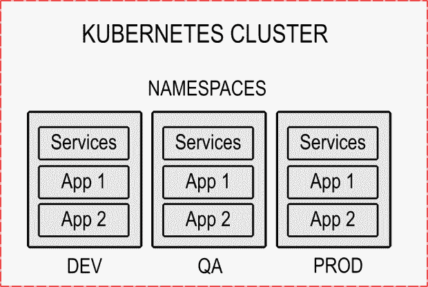

# 通过 Kubernetes 利用名称空间实现成本优化

> 原文：<https://thenewstack.io/leveraging-namespaces-for-cost-optimization-with-kubernetes/>

Kubernetes 是一个强大的容器编排系统，对组织来说很有吸引力，包括其自动扩展容器化工作负载和自动部署的能力。然而，如果管理不当，部署和扩展云应用程序的便利性可能会导致费用飙升。因此，在运行 Kubernetes 集群时，成本优化是一个重要的考虑因素。

您可以通过多种方式管理与 Kubernetes 集群相关的成本，例如，使用低成本的节点硬件、低成本的存储选项或低成本的网络解决方案。但是，这些成本节约措施不可避免地会影响 Kubernetes 集群的性能。因此，在降级您的基础设施之前，值得探索一种不同的替代方案。利用名称空间在 Kubernetes 中组织和管理资源的能力是帮助组织节省成本的一种选择。

在本文中，您将了解以下内容:

*   从成本优化的角度看 Kubernetes 名称空间及其作用。
*   识别命名空间中的资源使用情况。
*   资源配额和限制范围。
*   在 Kubernetes 中设置资源配额和限制范围。
*   具有内置成本优化功能的 x 即服务(XaaS)解决方案的优势。

## **Kubernetes 名称空间:它们是什么，为什么它们对成本优化有用**

您可以将名称空间看作是将 Kubernetes 集群分成多个虚拟集群的一种方式，每个集群都有自己的一组资源。这允许您将同一个集群用于多个团队，例如开发、测试、质量保证或阶段。



Kubernetes 名称空间被实现为集群中对象的一组标签。创建命名空间时，您可以指定一个标识它的名称和一组标签来选择属于它的对象。

您可以使用名称空间来控制对集群的访问。例如，您可以允许开发人员访问开发命名空间，但不能访问生产命名空间。这可以通过创建一个可以访问开发名称空间的角色并将开发人员添加到该角色中来实现。

您还可以使用命名空间来控制运行在其上的应用程序可用的资源。这是通过资源配额和限制范围实现的，这两个对象将在本文后面讨论。设置这样的资源限制在成本优化方面是非常宝贵的，因为它防止了资源浪费，从而节省了资金。此外，通过适当的监控，可以检测不活动的或未充分使用的名称空间，并在必要时将其关闭，以节省更多的资源。

简而言之，您可以使用 Kubernetes 名称空间来设置资源请求和限制，以确保您的 Kubernetes 集群有足够的资源来获得最佳性能。这将最大限度地减少应用程序的过度配置或配置不足。

## **识别名称空间资源使用**

在调整应用程序的规模之前，必须首先确定命名空间资源的使用情况。

在本节中，您将学习如何使用`kubectl`命令行工具检查 Kubernetes 名称空间。继续之前，您需要以下内容:

*   在您的本地机器上安装和配置 kubectl 。
*   访问安装了[度量服务器](https://github.com/kubernetes-sigs/metrics-server)的 Kubernetes 集群。Kubernetes 度量服务器对于收集度量和使用`kubectl top`命令是必不可少的。
*   [这个库](https://github.com/Damaso-DD/namespaces-for-cost-optimization)被克隆到本地机器上合适的位置。

## **使用 kubectl 检查名称空间资源**

首先创建一个名为`ns1` :
的名称空间

```
```
kubectl create namespace ns1
namespace/ns1 created
```

```

接下来，导航到您刚刚克隆的存储库的根目录，并在`ns1`名称空间中部署`app1`应用程序，如下所示:

```
```
kubectl apply  -f  app1.yaml  -n  ns1
deployment.apps/app created
service/app created
```

```

`app1`是一个简单的 php-apache 服务器，基于`registry.k8s.io/hpa-example`图像:

```
```yaml
apiVersion:  apps/v1
kind:  Deployment
metadata:
  name:  app1
  labels:
    app:  app1
spec:
  replicas:  5
  selector:
    matchLabels:
      app:  app1
  template:
    metadata:
      name:  app1
      labels:
        app:  app1
    spec:
      containers:
      -  name:  app1
        image:  registry.k8s.io/hpa-example
        ports:
        -  containerPort:  80
        resources:
          limits:
            cpu:  500m
          requests:
            cpu:  200m
            memory:  8Mi
---
apiVersion:  v1
kind:  Service
metadata:
  name:  app1
  labels:
    app:  app1
spec:
  ports:
  -  port:  80
  selector:
    app:  app1
```

```

如您所见，它部署了应用程序的五个副本，通过一个名为`app1`的服务监听端口 80。

现在，在`ns1`名称空间:
中部署`app2`应用程序

```
```
kubectl apply  -f  app2.yaml  -n  ns1
deployment.apps/idle-app created
```

```

`app2`是一个虚拟应用程序，它启动一个基于 BusyBox 的应用程序，该应用程序将永远等待:

```
```yaml
apiVersion:  apps/v1
kind:  Deployment
metadata:
  name:  app2
spec:
  replicas:  1
  selector:
    matchLabels:
      app:  app2
  template:
    metadata:
      labels:
        app:  app2
    spec:
      containers:
        -  name:  busybox
          image:  busybox
          command:
            -  /bin/sh
            -  -c
            -  "while true; do sleep 30; done"
```

```

您现在可以使用命令`kubectl get all`来检查`ns1`名称空间使用的所有资源，如下所示:

```
```
kubectl get all  -n  ns1
NAME                        READY STATUS    RESTARTS AGE
pod/app1-785668c957-95kmv 1/1 Running 0          9s
pod/app1-785668c957-bnlvz 1/1 Running 0          9s
pod/app1-785668c957-d6mxt 1/1 Running 0          9s
pod/app1-785668c957-gbfvv 1/1 Running 0          9s
pod/app1-785668c957-pgrjv 1/1 Running 0          9s
pod/app2-77bd8884d6-tmplz 1/1 Running 0          5s

NAME TYPE        CLUSTER-IP      EXTERNAL-IP PORT(S) AGE
service/app1 ClusterIP 10.245.27.210 <none>        80/TCP    9s

NAME READY UP-TO-DATE AVAILABLE AGE
deployment.apps/app1 5/5 5            5 9s
deployment.apps/app2 1/1 1            1 9s

NAME                              DESIRED CURRENT READY AGE
replicaset.apps/app1-785668c957 5 5 5 9s
replicaset.apps/app2-77bd8884d6 1 1 1 8s
```

Since you have Metrics Server installed,  you can also use the  `top pods`  command to check the resource consumption of pods in the  `ns1`  namespace,  as shown below:

```
kubectl top pods  -n  ns1
NAME                    CPU(cores) MEMORY(bytes) 
app1-785668c957-95kmv 1m 8Mi 
app1-785668c957-bnlvz 1m 8Mi 
app1-785668c957-d6mxt 1m 8Mi 
app1-785668c957-gbfvv 1m 8Mi 
app1-785668c957-pgrjv 1m 8Mi
app2-77bd8884d6-tmplz 1m 0Mi        
```

```

如您所见，通过使用`kubectl`命令行工具，您可以快速查看名称空间内的活动，列出所使用的资源，并了解 pods 的 CPU 内核和内存开销。此外，您可以使用命令`kubectl api-resources --verbs=list --namespaced -o name | xargs -n 1 kubectl get --show-kind --ignore-not-found -n <namespace>`来了解名称空间中资源的使用频率:

```
```
kubectl api-resources  --verbs=list  --namespaced  -o  name  \
  |  xargs  -n  1  kubectl get  --show-kind  --ignore-not-found  -n  ns1
NAME DATA AGE
configmap/kube-root-ca.crt 1      22h
NAME ENDPOINTS AGE
endpoints/app1 10.244.0.11:80,10.244.0.110:80,10.244.0.19:80  +  2  more... 63m
...output omitted...

41m Normal    ScalingReplicaSet deployment/app2              Scaled up replica set app2-774c558d94  to  1
NAME                        READY STATUS    RESTARTS AGE
pod/app1-788dc7b9bc-2lmc4 1/1 Running 0          63m
pod/app1-788dc7b9bc-6qzl9 1/1 Running 0          63m
pod/app1-788dc7b9bc-c2jwn 1/1 Running 0          63m
pod/app1-788dc7b9bc-pf4ds 1/1 Running 0          63m
pod/app1-788dc7b9bc-wl7xp 1/1 Running 0          63m
pod/app2-774c558d94-pt978 1/1 Running 0          41m
NAME TYPE                                  DATA AGE
secret/default-token-2htgh kubernetes.io/service-account-token 3      22h
NAME SECRETS AGE
serviceaccount/default 1 22h
NAME TYPE        CLUSTER-IP EXTERNAL-IP PORT(S) AGE
service/app1 ClusterIP 10.245.5.183 <none>        80/TCP    64m
NAME READY UP-TO-DATE AVAILABLE AGE
deployment.apps/app1 5/5 5            5 64m
deployment.apps/app2 1/1 1            1 42m
NAME                              DESIRED CURRENT READY AGE
replicaset.apps/app1-788dc7b9bc 5 5 5 64m
replicaset.apps/app2-774c558d94 1 1 1 42m
NAME ENDPOINT ID IDENTITY ID INGRESS ENFORCEMENT EGRESS ENFORCEMENT VISIBILITY POLICY ENDPOINT STATE IPV4 IPV6
ciliumendpoint.cilium.io/app1-788dc7b9bc-2lmc4 2723          22306                                                                        ...output omitted...
                                                              ready            10.244.0.87    
NAME                                        ADDRESSTYPE PORTS ENDPOINTS                                          AGE
endpointslice.discovery.k8s.io/app1-kbvj9 IPv4          80      10.244.0.110,10.244.0.11,10.244.0.29  +  2  more... 64m
LAST SEEN TYPE      REASON              OBJECT MESSAGE
42m Normal    Scheduled pod/app2-774c558d94-pt978    Successfully assigned  ...output omitted...

46m Warning BackOff pod/app2-85dcc749c7-dmm2n    Back-off restarting failed container
54m Normal    Pulled              pod/app2-85dcc749c7-dmm2n    Successfully pulled image  "busybox"  in  621.668342ms
52m Normal    Pulled              pod/app2-85dcc749c7-dmm2n    Successfully pulled image  "busybox"  in  200.910627ms
50m Normal    Pulled              pod/app2-85dcc749c7-dmm2n    Successfully pulled image  "busybox"  in  273.989882ms
56m Normal    SuccessfulCreate    replicaset/app2-85dcc749c7 Created pod:  app2-85dcc749c7-dmm2n
56m Normal    ScalingReplicaSet deployment/app2              Scaled up replica set app2-85dcc749c7  to  1
42m Normal    ScalingReplicaSet deployment/app2              Scaled up replica set app2-774c558d94  to  1
NAME                                              CPU      MEMORY WINDOW
podmetrics.metrics.k8s.io/app1-788dc7b9bc-2lmc4 55271n 8952Ki 10.279s
podmetrics.metrics.k8s.io/app1-788dc7b9bc-6qzl9 47321n 8956Ki 16.436s
podmetrics.metrics.k8s.io/app1-788dc7b9bc-c2jwn 53688n 8972Ki 12.29s
podmetrics.metrics.k8s.io/app1-788dc7b9bc-pf4ds 57384n 9016Ki 19.875s
podmetrics.metrics.k8s.io/app1-788dc7b9bc-wl7xp 57195n 8980Ki 18.183s
podmetrics.metrics.k8s.io/app2-774c558d94-pt978 0        316Ki    16.729s
```

```

该命令列出了正在使用的资源以及每个资源的活动时间。它还可以帮助检测一些状态消息，如`Back-off restarting failed container`，这可能表明需要解决的问题。检查端点活动消息对于推断名称空间或工作负载何时长时间处于空闲状态也很有用，从而识别不再使用的资源或名称空间，您可以删除它们。

也就是说，其他情况也会导致资源浪费。让我们回到`kubectl top pods -n ns1`的输出:

```
```
kubectl top pods  -n  ns1
NAME                    CPU(cores) MEMORY(bytes) 
app1-788dc7b9bc-2lmc4 1m 8Mi 
app1-788dc7b9bc-6qzl9 1m 8Mi 
app1-788dc7b9bc-c2jwn 1m 8Mi 
app1-788dc7b9bc-pf4ds 1m 8Mi 
app1-788dc7b9bc-wl7xp 1m 8Mi 
app2-774c558d94-5mk8m 0m 0Mi 
```

```

想象一下，如果`app2`是某个人忘记移除的新特性测试。这似乎不是什么大问题，因为它的 CPU 和内存消耗可以忽略不计；然而，如果无人看管，像这样的吊舱可能会不受控制地堆积起来，并损害控制平面的调度性能。同样的问题也适用于`app1`；它几乎不消耗 CPU，但是由于它没有设置内存限制，如果它开始扩展，它可能会很快消耗资源。

幸运的是，您可以在名称空间中实现资源配额和限制范围，以防止这些和其他潜在的代价高昂的情况。

## **资源配额和限制范围**

本节解释了如何使用两个 Kubernetes 对象，`ResourceQuota`和`LimitRange`，来最小化前面提到的 pod 的负面影响，这些 pod 资源利用率低，但是有可能用名称空间没有使用的请求和资源来填充集群。

根据文档， [ResourceQuota](https://kubernetes.io/docs/concepts/policy/resource-quotas/) 对象“提供了限制每个名称空间的总资源消耗的约束”，而 [LimitRange](https://kubernetes.io/docs/concepts/policy/limit-range/) 对象提供了“一个策略来约束资源分配(限制和请求)，您可以为名称空间中的每个适用对象类型(如 pod 或 PersistentVolumeClaim)指定这些资源分配。”

换句话说，使用这两个对象，您可以在名称空间级别以及 pod 和容器级别限制资源。详细说明:

*   `ResourceQuota`允许您限制名称空间的总资源消耗。例如，您可以创建一个专用于测试的名称空间，并设置 CPU 和内存限制，以确保用户不会超支资源。此外，`ResourceQuota`还允许您设置存储资源限制和某些对象的总数限制，例如配置映射、cron 作业、机密、服务和 PersistentVolumeClaims。
*   `LimitRange`允许您在 pod 和容器级别设置约束，而不是在名称空间级别。这确保了应用程序不会消耗通过`ResourceQuota`分配的所有资源。

理解这些概念的最好方法是将它们付诸实践。

因为`ResourceQuota`和`LimitRange`都只影响部署后创建的 pod，所以首先删除应用程序来清理集群:

```
```
kubectl delete  -f  app1.yaml  -n  ns1  &&  kubectl delete  -f  app2.yaml  -n  ns1
deployment.apps  "app1"  deleted
service  "app1"  deleted
deployment.apps  "app2"  deleted
```

```

接下来，通过部署`LimitRange`资源:
来创建`restrictive-resource-limits`策略

```
```
kubectl apply  -f  restrictive-limitrange.yaml  -n  ns1
limitrange/restrictive-resource-limits created
```

```

上面的命令使用了下面的代码:

```
```yaml
apiVersion:  "v1"
kind:  "LimitRange"
metadata:
  name:  "restrictive-resource-limits"  
spec:
  limits:
    -
      type:  "Container"
      max:
        memory:  "20Mi"
        cpu:  "1"  
      min:
        memory:  "10Mi"
        cpu:  "1m"
```

```

如您所见，在容器级别设置了最大和最小 CPU 和内存使用的限制。您可以使用`kubectl describe`在控制台中查看该策略:

```
```
kubectl describe limitrange restrictive-resource-limits  -n  ns1
Name: restrictive-resource-limits
Namespace:  ns1
Type        Resource  Min  Max Default Request  Default Limit  Max Limit/Request Ratio
----        --------  ---  --- ---------------  -------------  -----------------------
Container cpu 1m 1 1                1              -
Container memory    10Mi  20Mi  20Mi 20Mi -
```

```

现在尝试再次展开`app1`:

```
```
kubectl apply  -f  app1.yaml  -n  ns1
deployment.apps/app1 created
service/app1 created
```

```

然后，检查`ns1`名称空间中的部署:

```
```
kubectl get deployment  -n  ns1
NAME READY UP-TO-DATE AVAILABLE AGE
app1 0/5 0            0 1m
```

```

由`restrictive-resource-limits`实施的策略阻止了 pod 的创建。这是因为该策略要求每个容器至少有 10 兆字节(Mi)的内存，但是`app1`只要求 8 兆字节。虽然这只是一个例子，但是它展示了如何避免用小容器和容器来混淆名称空间。

让我们回顾一下限制范围和资源配额如何相互补充以实现不同级别的资源管理。在继续之前，再次删除所有资源:

```
```
kubectl delete  -f  restrictive-limitrange.yaml  -n  ns1  &&  kubectl delete  -f  app1.yaml  -n  ns1
```

```

接下来，部署`permissive-limitrange.yaml`和`namespace-resource-quota.yaml`资源:

```
```
kubectl apply  -f  permissive-limitrange.yaml  -n  ns1
kubectl apply  -f  namespace-resource-quota.yaml  -n  ns1
limitrange/permissive-resource-limits created
resourcequota/namespace-limits created
```

```

新的资源管理策略应该如下所示:

```
```
kubectl describe limitrange permissive-resource-limits  -n  ns1
kubectl describe resourcequota namespace-limits  -n  ns1
Name: permissive-resource-limits
Namespace:  ns1
Type        Resource  Min  Max Default Request  Default Limit  Max Limit/Request Ratio
----        --------  ---  --- ---------------  -------------  -----------------------
Container memory    6Mi  20Mi  20Mi 20Mi -
Container cpu 1m 1 1                1              -
Name:            namespace-limits
Namespace: ns1
Resource Used  Hard
-------- ----  ----
limits.cpu 0 2
limits.memory    0 2Gi
pods 0 5
requests.cpu 0 1
requests.memory  0 1Gi
```

```

按照`permissive-resource-limits`来说，这次部署`app1`应该没有问题:

```
```
kubectl apply  -f  app1.yaml  -n  ns1
deployment.apps/app1 created
service/app1 created
```

```

检查`ns1`名称空间中的资源:

```
```
kubectl get all  -n  ns1
NAME                        READY STATUS    RESTARTS AGE
pod/app1-5579c6cdb4-5pb2h 1/1 Running 0          11m
pod/app1-5579c6cdb4-cqtrh 1/1 Running 0          11m
pod/app1-5579c6cdb4-fgm8q 1/1 Running 0          11m
pod/app1-5579c6cdb4-s97zk 1/1 Running 0          11m

NAME TYPE        CLUSTER-IP      EXTERNAL-IP PORT(S) AGE
service/app1 ClusterIP 10.245.197.52 <none>        80/TCP    11m

NAME READY UP-TO-DATE AVAILABLE AGE
deployment.apps/app1 4/5 4            4 11m

NAME                              DESIRED CURRENT READY AGE
replicaset.apps/app1-5579c6cdb4 5 4 4 11m
```

```

你可能想知道为什么五个吊舱中只有四个被部署。答案在于资源配额的 CPU 限制。每个容器请求 500 个 CPU 毫核，命名空间限制是两个核。换句话说，该策略只允许您创建四个总计 2000 毫核(两个核心)的 pod。

用于防止名称空间过度供应的相同原理可以用于防止供应不足。

## **资源管理中的限制范围和资源配额**

您已经看到了如何在名称空间中使用分段以及`LimitRange`和`ResourceQuota`策略来优化成本。本节讨论硬币的另一面——这些政策的局限性和利弊。

## **limit range 和 ResourceQuota 的限制**

当涉及到`LimitRange`和`ResourceQuota`的范围时，Kubernetes 文档非常清楚。

[限制范围](https://kubernetes.io/docs/concepts/policy/limit-range/)策略旨在为资源设置界限，例如:

*   容器和窗格，您可以在其中设置每个名称空间的内存和 CPU 的最小、最大和默认请求值。
*   PersistentVolumeClaims，您可以在其中设置每个名称空间的最小和最大存储请求值。

此外，根据文档，您可以“对名称空间中的资源强制实施请求和限制之间的比率。”

另一方面， [ResourceQuota](https://kubernetes.io/docs/concepts/policy/resource-quotas/) 也允许您设置最小和最大计算资源值，但是是在名称空间的上下文中。此外，它还允许您在名称空间级别实施其他方面，例如:

*   命名空间中可以存在的 PersistentVolumeClaims 的总数。
*   命名空间中用于 PersistentVolumeClaims 和临时存储请求的总空间。
*   命名空间中可以存在的 pod、配置映射、复制控制器、`ResourceQuota`对象、负载平衡器、机密、部署和 cron 作业的总数。

如您所见，`LimitRange`和`ResourceQuota`策略有助于控制大量资源。也就是说，探索使用这种资源使用策略的局限性是明智的。

## **限制范围和资源配额:利弊**

尽管`LimitRange`和`ResourceQuota`政策既有力又灵活，但它们也有一定的局限性。下面从成本优化的角度总结了这些对象的优缺点:

赞成的意见

*   您不必安装第三方解决方案来强制实施合理的资源使用。
*   如果您明智地定义您的策略，您可以最大限度地减少 CPU 不足、pod 驱逐或内存或存储不足等问题的发生。
*   强制实施资源限制有助于降低集群运营成本。

骗局

Kubernetes 缺乏监控资源使用的内置机制。因此，无论您喜欢与否，您都必须在某个时候使用第三方解决方案来帮助您的团队了解工作负载行为并做出相应的计划。

*   使用`LimitRange`和`ResourceQuota`实现的策略是静态的。也就是说，你可能需要不时地对它们进行微调。
*   `LimitRange`和`ResourceQuota`不能在每种情况下都帮你避免资源浪费。它们不会帮助那些在创建时符合策略的服务和应用程序，但是过一段时间后它们就变得不活动了。
*   识别非活动名称空间是一个手动且耗时的过程。

鉴于这些限制，值得考虑通过向 Kubernetes 添加新功能来优化资源使用，从而解决这些限制的选项。

## **使用放样进行成本优化**

[Loft](https://loft.sh/) 是一个先进的托管自助服务平台，为 Kubernetes 提供访问控制、多租户和集群管理等领域的解决方案。此外，Loft 还提供先进的成本优化功能，如睡眠模式和自动删除:

*   **睡眠模式**:这个强大的特性监控一个名称空间内的工作负载的活动，并在一段时间不活动后自动让它们进入睡眠状态。换句话说，只有正在使用的名称空间保持活动状态，其余的都处于休眠状态。
*   **自动删除**:当名称空间处于非活动状态时，睡眠模式包括缩小到零个单元，自动删除则更进一步，永久删除在一定时间内不活动的名称空间。自动删除对于最小化由于长时间闲置的演示环境和项目造成的资源浪费特别有用。

休眠模式和自动删除都是完全可配置的，使开发运维团队能够完全控制何时将命名空间置于休眠状态或删除。

## **结论**

Kubernetes 允许您使用`LimitRange`和`ResourceQuota`策略来提高名称空间中资源的使用效率，从而节省成本。也就是说，在生产环境中估计资源需求具有挑战性，这就是为什么将名称空间和资源使用策略提供的灵活性与 Loft 等最先进的成本优化解决方案相结合是一个好主意。

睡眠模式和自动删除等功能有助于保持集群整洁，可为您的组织节省高达 70%的成本。

<svg xmlns:xlink="http://www.w3.org/1999/xlink" viewBox="0 0 68 31" version="1.1"><title>Group</title> <desc>Created with Sketch.</desc></svg>