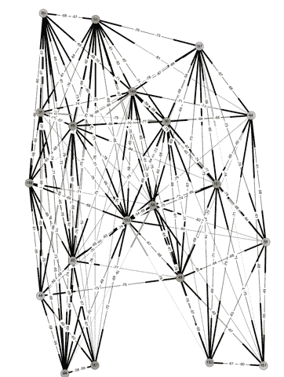
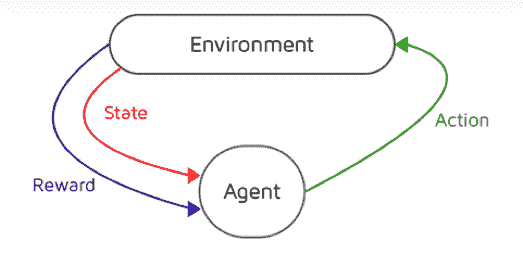
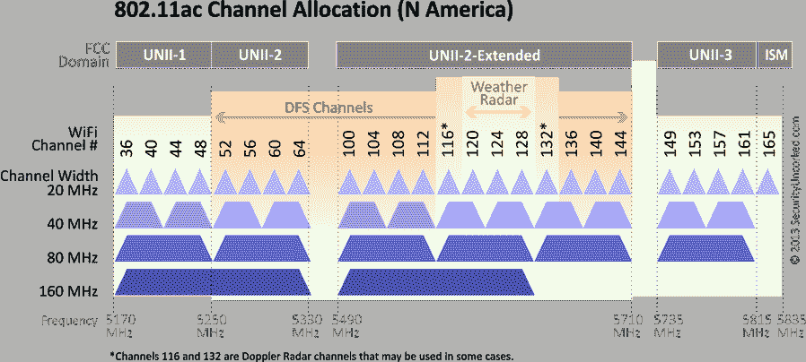

# 利用强化学习优化 Wi-Fi

> 原文：<https://thenewstack.io/leveraging-reinforcement-learning-to-optimize-wi-fi/>

在不断变化的射频(RF)环境中优化 Wi-Fi 的古老无线网络问题，或者业内称为无线电资源管理(RRM)，是人工智能和机器学习的完美用例。这些技术可以为今天的 RRM 提供巨大的价值，同时让我们更接近部署自动驾驶网络的最终目标。

根据目前的趋势，很明显，支持数量激增的移动和物联网设备将面临越来越大的挑战，许多报告预测到 2020 年将有超过 60 亿台移动设备和[超过 200 亿台物联网设备联网](https://www.gartner.com/imagesrv/books/iot/iotEbook_digital.pdf)。公司无法雇佣和培训足够的帮助台和网络专家来支持这种天文数字的增长。数据科学、人工智能和机器学习将成为适应这种规模的关键工具，首先是通过虚拟网络助理来增加服务台人员，然后是通过自我优化的网络来识别问题并自动解决问题，以便 IT 团队可以专注于战略项目，而不是日常的被动故障排除。

## 无线电资源管理

 [苏德尔·马塔

Sudheer Matta 是 Mist 的产品副总裁，负责产品战略和业务发展。在此之前，Sudheer 负责美国公共部门的思科无线销售。在此之前，Sudheer 是思科全球企业网络销售总监，负责思科企业有线和无线网络产品的销售。此前，Sudheer 是 Juniper 园区和分支产品线 WLAN 系统的产品管理高级总监。Sudheer 在 IEEE 和 Wi-Fi 联盟呆了 10 年；最近，他是 Wi-Fi 联盟医疗保健任务组的主席和 Wi-Fi 联盟网络管理任务组的副主席。他是 Trapeze Networks 和 Cisco 的无线标准负责人。](https://www.mist.com/) 

为什么迄今为止 RRM 一直是一个如此大的挑战？它源于这样一个事实，即大多数 RRM 算法缺乏了解哪些 Wi-Fi 信道可能会受到动态频率选择( [DFS](http://www.ieee802.org/18/Meeting_documents/2007_Nov/WFA-DFS-Best%20Practices.pdf) )雷达干扰的能力，这种干扰随后被用来确定无线接入点(AP)应该操作哪些信道。如今，RRM 做出糟糕决策的现象相当普遍，因为所分析的干扰和信道数据是在网络空闲的夜间获取的。当用户第二天出现时，这并不总是导致最佳决策，从而导致现实世界使用中的次优体验。如果没有一个反馈回路来纠正不准确的决策，以及基于真实数据持续优化性能的能力，RRM 的优势将永远无法实现。

图:描述 AP 邻居交互的样本 RRM 图

为了了解复杂性，下图描述了一个 Wi-Fi 网络的信道分配示例，其中的点是 AP(带有分配的信道)。这些线条描述了相邻 AP 的干扰水平(RSSI 的信号强度，数字越大表示干扰越大)。正如您所看到的，该图具有较高的连接性，这为优化信道分配带来了挑战，尤其是当您还考虑到外部影响时，例如非 Wi-Fi 干扰或您所在大楼中拥有自己的 Wi-Fi 网络的其他租户不受您的控制。

## 强化学习

人工智能可以与 RRM 一起提供更好的用户体验(和整体运营效率)。发生这种情况的核心要素之一被称为“强化学习”，它的工作原理是，一个代理人采取一种行动，根据结果惩罚或奖励，以强化最佳行为。这类似于初学走路的孩子和机器人如何学习走路，由此摔倒的惩罚会驱动适当的行为——例如，小步走和注意平衡。图 2 显示了强化学习所需的核心元素——行动、状态和奖励。

图 2:强化学习

在 Wi-Fi 网络中，动作将是信道和/或发射功率的改变。状态由衡量服务水平预期(SLE)的关键领域分类器确定，如容量、覆盖范围和 DFS 雷达事件发生率。回报将是容量和/或覆盖范围的提高或降低。随着时间的推移，系统应该最终优化 SLEs，从而优化用户体验，因为它的学习被加强以选择最佳动作。

例如，系统应该了解哪些 Wi-Fi 信道与公共雷达频率重叠，并且可以被动态禁用。然后，它应该降低这些频道的选择权重，以最大限度地减少可能影响用户体验的 DFS 中断。下图显示了 5GHz 频段的北美信道，其中 DFS 信道的范围受到潜在雷达事件的影响。

5 GHz 信道可用于 WiFi

此外，系统应该开始学习跨位置的非 Wi-Fi 干扰的时间行为并避免它。例如，了解到在午餐时间自助餐厅将有微波干扰，让系统选择在这些时间不重叠的频道。

## 实现人工智能驱动的 RRM 需要什么？

为了使上述方法有效，需要大量的数据。需要在 24 小时窗口内连续收集数据，以便在执行通道优化时不会丢失历史记录。这就是具有弹性计算和存储规模的现代云的力量被证明具有巨大优势的地方。

此外，还需要能够将这些数据分类到服务水平协议中，以便在系统启动新的射频计划之前和之后确定性能基准。这是接收持续反馈循环的唯一方式，以便随着时间的推移优化结果。

此外，参考学习应该与异常检测相结合，以即时检测问题，并随着时间的推移不断适应不断变化的条件，以提供最佳的最终用户体验。

人工智能驱动的 RRM 的最终前景非常有吸引力——即一个自动驾驶网络，用使用机器学习的自动化洞察力和行动取代复杂的数据密集型任务。其结果是更好的用户体验，以及更高的运营效率，因为 IT 可以专注于战略业务目标，而不是被动的日常任务。虽然这是 RRM 十多年来的承诺，但随着新的人工智能驱动平台的出现，它终于成为了现实。

通过 Pixabay 的特征图像。

<svg xmlns:xlink="http://www.w3.org/1999/xlink" viewBox="0 0 68 31" version="1.1"><title>Group</title> <desc>Created with Sketch.</desc></svg>