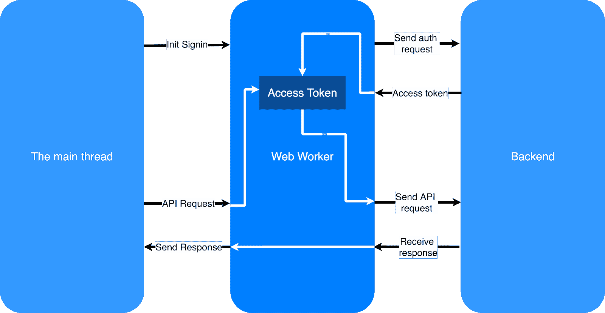

# 利用 Web 工作者安全地存储访问令牌

> 原文：<https://thenewstack.io/leveraging-web-workers-to-safely-store-access-tokens/>

Web workers 用于将资源密集型任务卸载到 Web 应用程序中的后台线程。但是，您知道我们还可以使用它们来安全地存储访问令牌吗？这篇文章解释了如何做到这一点以及这样做的好处。

访问令牌广泛用于授权用户访问受限资源，如 API 端点。然而，在单页应用程序中，安全地存储访问令牌成为一个巨大的挑战。

## **常见做法**

 [Theviyanthan Krishnamohan

Theviyanthan 是 WSO2 的软件工程师，在 React 开发方面经验丰富。他喜欢在机器学习、人工智能、进化计算和物联网领域闲逛。](https://lk.linkedin.com/in/krishnamohan-theviyanthan) 

通常的做法是将访问令牌存储在浏览器的会话存储或本地存储中。这是因为我们需要在页面重新加载时保持访问令牌，以避免每次重新加载时都需要重新验证。这提供了更好的用户体验。然而，这些方法[容易受到跨站点脚本攻击](https://github.com/OWASP/CheatSheetSeries/blob/master/cheatsheets/HTML5_Security_Cheat_Sheet.md#local-storage)和[恶意第三方库可以轻松访问这些令牌](https://tools.ietf.org/html/draft-ietf-oauth-browser-based-apps-03#page-13)。

尽管大多数准则建议不要在会话或本地存储中存储访问令牌，但还是推荐使用会话 cookies。但是，我们只能对设置 cookie 的域使用会话 cookie。

另一个流行的建议是将访问令牌存储在浏览器的内存中。这是一种比在浏览器存储中存储访问令牌更安全的方法，也比使用会话 cookies 更方便。JavaScript 闭包用于确保存储在内存中的令牌不能被第三方库和跨站点脚本攻击访问。

然而，有一个警告。即使第三方库不能直接访问访问令牌，它们也可以拦截 HTTP 请求，并从标头中提取令牌。还存在开发人员因泄漏访问令牌而犯下疏忽错误的风险。

## **使用 Web Workers 存储访问令牌**

我们可以通过简单地在 web workers 中存储访问令牌来解决大部分问题。那么，什么是网络工作者呢？**Web worker 本质上是后台线程**。它们运行在不同于主线程的上下文中。这意味着运行在主线程上的代码不能访问运行在 web worker 上的代码，反之亦然。web worker 和主线程能够通信的唯一方式是通过交换消息。

开发人员负责设计主线程和 web 工作人员如何通信。它们可以通过简单的请求-响应模型进行通信。因此，通过确保 web worker 不会发送访问令牌作为响应，我们可以防止第三方库和跨站点脚本攻击获得访问令牌。

## 为什么不使用服务工作者或 iframe？

服务工作者和 iframes 都提供不同的浏览上下文。与 web workers 不同，service workers 和 iframes 有一个全局引用。这意味着代码可以从任何地方访问它们。

相比之下，我们可以使用 JavaScript closure 保持对 web worker 的私有引用。这通过阻止第三方代码试图与 web workers 通信而增加了一层额外的保护。

此外，一个站点在不同的选项卡上共享服务人员。这意味着，在给定时间内，只能有一个用户登录。与此相反，web worker 专用于一个选项卡，这允许多个用户同时登录。

除了防止第三方代码访问访问令牌之外，web workers 还防止 HTTP 请求拦截。由于第三方代码运行在主线程上，它们不能拦截 web workers 发起的请求。是的，当我们在 web workers 中存储访问令牌时，需要这些访问令牌的 API 请求也应该从 web workers 发起。

## **解决方案的架构**

图 1:解决方案架构

现在，让我们讨论一下这种存储机制的架构是什么样子的。为了确保 web worker 收到访问令牌，应该由 web worker 发出令牌请求。然而，登录请求必须来自主线程。

因此，一旦用户点击应用程序的登录页面，就应该向 web 工作者发送一条 post 消息(post message)。收到该消息后，web worker 可以启动身份验证流程。一旦我们收到令牌，它就可以安全地存储在 web worker 中。

当要发送 API 请求时，应该再一次从主线程向 web worker 发送一条包含必要细节的消息。然后，web worker 可以发起一个请求，将访问令牌附加到头部。一旦我们收到响应，我们将不得不把它作为另一个消息传递回主线程。

然而，这为攻击开辟了新的战线。攻击者可以向他们控制的 URL 发起请求。由于 web worker 将访问令牌附加到请求上，攻击者将能够在请求端接收访问令牌。

我们可以通过在初始化阶段将允许的 URL 传递给 web worker 来防止这种情况。然后，web worker 可以在分派请求之前检查发送请求的 URL 是否与允许的 URL 之一匹配。

## **使用网络工作者的另一面**

web workers 的一个问题是，每次我们重新加载页面时，都会丢失登录会话。这是因为，对于 web workers，我们将访问令牌存储在浏览器内存中。每次我们重新加载一个页面，浏览器都会重置内存。这意味着用户可能不得不再次经历登录流程。

大多数 OAuth2/OIDC 提供商都有解决这个问题的方法。例如，有些人使用会话 cookies 来识别登录的用户。因此，这些提供者将直接返回访问令牌，而不需要用户输入他们的登录凭证。因此，尽管必须在页面重新加载时通过身份验证流程，用户体验并没有改变。

在 web worker 中使用第三方库的需求带来了另一个挑战。例如，要从 web worker 发送 API 请求，您可能必须使用某些库。这些库将在 web workers 环境中运行。因此，这些库可以访问存储的令牌。然而，通过将 web worker 中使用的第三方库限制到最低限度，并且只使用可信的库，我们可以在很大程度上缓解这些问题。

## **总结**

在浏览器中存储访问令牌是一个挑战。当比较所有可用的方法时，网络工作者似乎提供了最安全和最方便的选择。使用 web workers，我们可以减少跨站点脚本攻击和恶意第三方库窃取访问令牌。

此外，我们还可以防止恶意代码拦截网络请求并访问令牌。然而，你需要小心你在 web worker 中使用的库，并且你应该尽量把它保留给少数可信的人。通过使用 web workers 发送和接收网络请求，我们实际上减少了主线程的负载。

通过 Pixabay 的特征图像。

<svg xmlns:xlink="http://www.w3.org/1999/xlink" viewBox="0 0 68 31" version="1.1"><title>Group</title> <desc>Created with Sketch.</desc></svg>