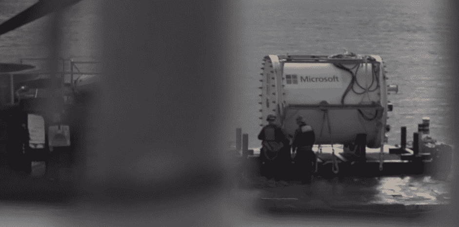
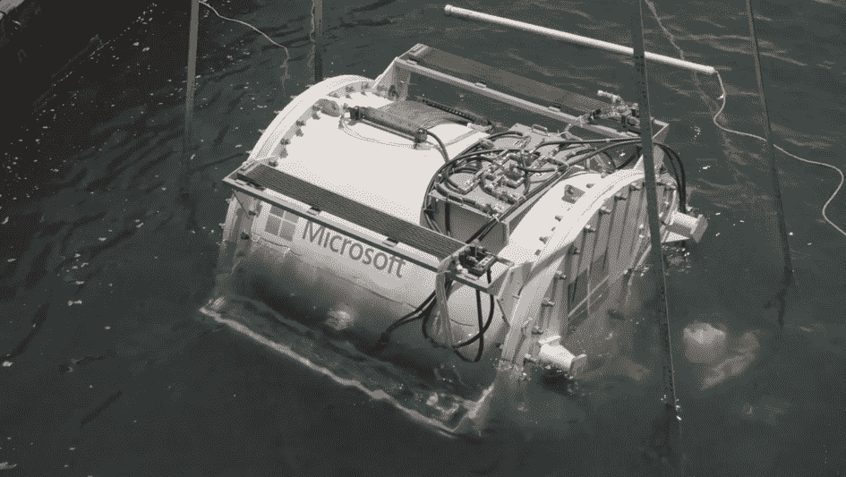

# 微软实验性水下数据中心的水生生物

> 原文：<https://thenewstack.io/life-aquatic-microsofts-experimental-submersible-data-centers/>

原来，戴维·琼斯的储物柜里可能还有一点空间。

微软研究院正在测试将数据中心沉入海底的可能性，设计并部署水下数据中心“纳蒂克项目”。

微软推断，世界上一半的人口生活在离海洋 125 英里的范围内，那么将他们产生的所有数据保存在海洋本身内难道不是有意义的吗？

8 月至 11 月间，纳蒂克一直淹没在加州距离圣路易斯奥比斯波海岸约半英里的地方，位于旧金山和洛杉矶之间。

但在整个试验过程中，数据中心是从微软位于华盛顿州雷蒙德市的办公室远程控制的。

纳蒂克公司首次成功测试海底数据中心，似乎抓住了世界的想象力。上周，从[《财富》](http://fortune.com/2016/01/31/microsoft-underwater-data-center/)和 [VentureBeat](http://venturebeat.com/2016/01/31/microsofts-project-natick-brings-data-centers-underwater/) 到 [PC World](http://www.pcworld.com/article/3027934/data-center-cloud/microsofts-project-natick-wants-to-submerge-your-data-in-the-oceans.html) 和[科普](http://www.popsci.com/microsoft-is-putting-data-servers-in-cool-new-place-ocean)都有关于这个实验的新文章。周一，微软的研究部门向他们的 YouTube 频道上传了一段新视频。

结果呢？没发生什么不好的事。据《纽约时报》报道，微软将试用期延长至 105 天，甚至运行了一些 Azure 数据处理项目。现在，微软正在开发一个三倍大的系统，他们预计在 2017 年进行测试。“基本上，我们正在做的是采用绿色数据中心，并将其部署在海岸附近的海洋中，”本·卡特勒在该项目的网站上的一段视频中解释道。

“我们的总体目标是在 90 天内从决策到启动，在全球任何地方大规模部署数据中心。”

这些海底数据中心的快速部署可能是有用的——例如，如果发生自然灾害或世界杯足球赛。但根据该项目的网站，还有一些其他潜在的优势。他们希望这些数据中心能够“显著”减少延迟并提高响应速度。微软还引用了他们的一些客户可能有的“可持续性要求”，指出这些数据中心将能够使用本地生产的绿色能源。

“与离岸可再生能源位于同一地点的纳蒂克数据中心可能是真正的零排放:没有废物排放到环境中，无论是由于发电、计算机还是人类维护人员，”该公司解释道。

事实上，根据该项目的网站，它们甚至将由回收材料制成*，当它们最终退役时也会被回收。由于这些海底机架中的计算机预计可以使用五年，这也将是每个数据中心的预期寿命，但“在每个五年部署周期之后，数据中心将被收回，重新装载新的计算机，并重新部署。”数据中心本身预计将持续 20 年。*

 *具有讽刺意味的是，潜水式数据中心不消耗任何水——甚至不用于冷却。

微软的网站警告说，这仍然是一个“研究阶段”的项目。“现在评估这个概念是否能被微软和其他云服务提供商采纳还为时尚早。”

但从他们在微软视频中的反应来看，该团队似乎仍然对他们的早期成功感到兴奋。该项目的研究工程师之一斯潘塞·福尔斯说:“从某种意义上说，这不像登月，它只是一些稀奇古怪的东西。”。“这实际上是我们可以制造的可行产品。”

微软似乎也乐在其中。这个豆荚被命名为利昂娜·菲尔波特，一个在微软光环宇宙中某处提到的[模糊角色](http://halo.wikia.com/wiki/Leona_Philpot)。在 2004 年名为*我爱蜜蜂*的预发行营销活动中，两个角色想起了一个女孩，她在高中跳入游泳池时摔断了脖子，成为了返校节皇后。一位评论者[在 Reddit](https://www.reddit.com/r/HaloStory/comments/43yocp/microsoft_named_the_first_undersea_computer_after/czmo5mw) 上开玩笑说:“他们从《光环》宇宙中选择了一个可能有过最糟糕用水经历的角色来命名他们的项目。”。"

微软的庆祝视频显示鹈鹕和海鸥在海浪上盘旋，但就在水面下潜伏着一些严肃的科学。“水下系统配备了 100 个不同的传感器，用来测量压力、湿度、运动和其他条件，”泰晤士报报道，“以更好地了解在不可能在半夜派遣修理工的环境中工作是什么样的。”最后的结果呢？没有打扰附近的海底野生动物，“在系统旁边游动的虾的咔哒声淹没了容器产生的任何噪音。”

最终，“当地附近的海洋生物很快适应了船只的存在，”微软在项目网站上报道。利昂娜·菲尔波特呢？

整个海底数据中心被送回微软园区，现在部分被藤壶覆盖。

图片来自微软。

<svg xmlns:xlink="http://www.w3.org/1999/xlink" viewBox="0 0 68 31" version="1.1"><title>Group</title> <desc>Created with Sketch.</desc></svg>*