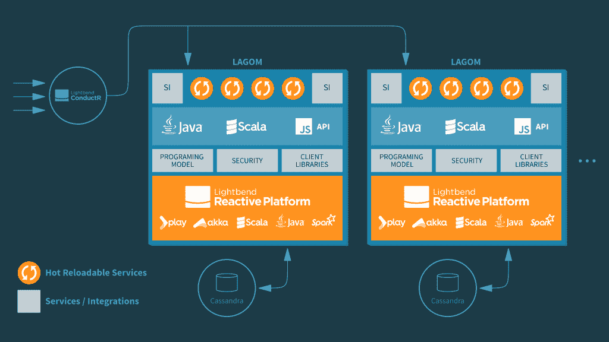
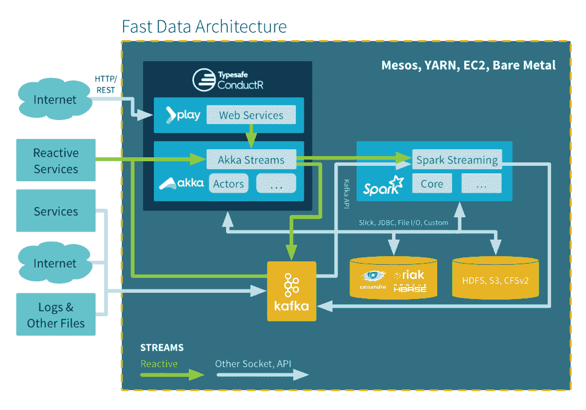

# Lightbend 的 Lagom 将大规模运行基于 Java 的微服务

> 原文：<https://thenewstack.io/lightbends-lagom-offers-microservice-framework-java-developers/>

说到对[微服务](https://thenewstack.io/microservices-changed-matter/)的抢购，Java 开发者可能会觉得有点捉襟见肘。

一些工具，比如 T2 Spring Boot T3，会有所帮助。Spring Boot [在企业 Java 生态系统之上添加了一个微服务框架](https://thenewstack.io/video-quickly-spin-apps-cloud-foundrys-spring-boot/)，使其成为构建个人微服务的可行选择。

但是，建立一个大规模部署的微服务车队怎么样呢？这里出现了一系列新的问题。

light bend——以前的 type safe——看到了解决开发人员在创建大量微服务时面临的这些和其他棘手问题的机会。

“微服务只有作为系统才有意义，它们本质上是协作的，最有趣和最具挑战性的事情发生在各个服务之间。Lightbend 的营销副总裁 Kathleen Hayes 说:“我们现在进入了分布式系统的世界，与 monoliths 和个人服务本身相比，这是一个非常不同的世界。

Lightbend 正在开发一个名为 [Lagom](https://www.lightbend.com/lagom) 的新 Java 框架，它希望提供一种整体的微服务方法，而不管项目的规模如何。该公司承诺，开发人员将能够使用 Lagom 将他们的企业 Java 单片软件分解为一组可扩展的微服务。

## 反应式、集成式和异步式

同时运行数百或数千个服务需要可伸缩的弹性配置。Hayes 强调[反应宣言](http://www.reactivemanifesto.org/)是从 Lagom 和其他微服务框架中获得最大收益的关键焦点。反应性原则遵循四个要点来构建一个更强大的系统架构:它们必须是响应性的、有弹性的、有弹性的和消息驱动的。

特别是在构建微服务时，Hayes 指出，重要的是微服务不要依赖于静态位置，因为这些位置可能会产生更容易发生故障的单点。

该解决方案必须认识到服务可能在启动时不可用，或者可能在系统处理期间移动。服务发现对于交付弹性解决方案至关重要，”Hayes 说。

内部建筑:Lagom

默认情况下，Lightbend 设计的 Lagom 侧重于异步服务。利用同步 REST 会出现耦合等问题。Lagom 还为开发人员提供了一个用 Java 构建微服务的现代框架，包括基于事件的持久性、现成的命令和查询责任分离( [CQRS](https://msdn.microsoft.com/en-us/library/dn568103.aspx) )。正如 Lagom 项目负责人 James Roper 所说，“你使用的异步通信越多，你的系统就越有弹性和可伸缩性。”

Typesafe/Lightbend 最近的[调查](https://www.lightbend.com/blog/going-reactive-2016-microservices-fast-data-driving-adoption)声称，Play 用户更有可能拥有基于微服务架构的系统。注意:这个样本过多地代表了类型安全/游戏客户，他们可能定义“微服务架构”与其他开发人员不同(LH)。

当今可用的许多微服务框架需要开发人员手动运行脚本来启动他们的服务，或者添加自动化的基础设施。Lagom 意识到开发人员需要能够利用他们已经习惯的工具，例如热代码重载，而不必为了测试应用程序而在本地安装新的工具集。Lagom 允许开发人员从命令行管理数百个服务。从那里，用户能够执行测试，通过热代码修复更新服务，等等。

## 为零件提供动力

Lagom 依赖于许多其他技术，包括 Lightbend 自己的[游戏框架](https://www.playframework.com/)、 [Akka](http://akka.io/) 、Akka Streams、Akka Clustering 和[conduct tr](https://www.lightbend.com/products/conductr)用于弹性和自动缩放。通过利用 Netty、REST 和 WebSockets 与需要访问其服务的应用程序或设备进行通信，Lagom 确保了高性能。最后，Lagom 利用 [Cassandra](http://cassandra.apache.org/) 作为其持久性存储。

Lightbend 反应式平台快速数据架构

对于那些希望抢先一步使用 Lagom 的人来说，请注意产品发布要到 2016 年 3 月初才可用。也就是说，公司可以检查 Lightbend 的[反应平台](http://www.lightbend.com/products/lightbend-reactive-platform)来将他们现有的任何单块应用分解为微服务，或者创建新的微服务。

Hayes 说:“我们观察到，虽然这些公司中有许多拥有无限的工程资源和人才，但更多的 Java 开发人员需要一个更有主见的框架——特别是针对 Java——以支持构建在 JVM 上运行和扩展的微服务。这就是 Lightbend 选择首先为 Lagom 创建 Java API，然后是 Scala API 的原因。

随着 Lagom 的全面发布，Java 社区可能会有一个强大的新工具来创建、管理和扩展微服务，以满足当今应用程序的严格要求。

<svg xmlns:xlink="http://www.w3.org/1999/xlink" viewBox="0 0 68 31" version="1.1"><title>Group</title> <desc>Created with Sketch.</desc></svg>