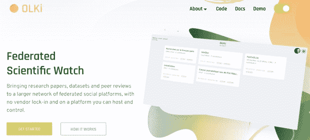

# 在社交媒体下点燃篝火:Devs 和 ActivityPub

> 原文：<https://thenewstack.io/lighting-a-bonfire-under-social-media-devs-and-activitypub/>

随着开发人员开始[脱离后马斯克时代的 Twitter](https://thenewstack.io/devs-are-excited-by-activitypub-open-protocol-for-mastodon/) 并考虑在联合社交媒体协议上构建应用程序，许多人都在问自己:我能利用[的关键开放协议【ActivityPub 做什么？](https://thenewstack.io/the-fediverse-points-to-our-social-media-future-post-musk/)

ActivityPub 使不同的应用程序能够在它们之间联合内容，这既支持又鼓励了开放 web。来自万维网联盟(W3C)的[规范](https://www.w3.org/TR/activitypub/)很全面，有很好的解释材料，但是甚至它的一个作者也承认一开始很难理解。

“很长一段时间没有人理解 ActivityPub，”该规范的联合编辑克里斯汀·莱默-韦伯在《乳齿象邮报》上说。“我会解释，解释，解释，这样很难取得进展。直到人们触摸它超过几秒钟后，才会反应说他们“明白了”。

## 针对开发人员的第 101 节活动

我们将很快讨论 ActivityPub 的几个实现。但首先，尽管 Lemmer-Webber 提出了警告，但重要的是至少要理解这项技术如何工作的高层次细节。

关于 ActivityPub，首先要理解的是，它使用由 [ActivityStreams 2.0](https://www.w3.org/TR/activitystreams-core/) 定义的数据格式，这是一个先前的 W3C 协议，旨在定义“一种社会数据语法”。例如，ActivityStreams 2.0 定义了一个对象模型，其中包括参与者、内容、链接和活动。“参与者”指的是像乳齿象这样的应用程序的用户。

另一个相关的规范是 [JSON-LD 1.1](https://www.w3.org/TR/json-ld/) (链接数据的 JavaScript 对象表示法)，这是*数据如何传输的。它是流行的 JSON 格式的扩展，这是数据在 web 应用程序之间传输的典型方式。“链接数据”部分仅仅意味着它比普通的 JSON 数据有更多的结构，这使得网站和应用程序更容易彼此联合。*

要获得更深入的开发人员资源，我推荐为新 ActivityPub 实现者添加本[指南。这是一个链接教程和其他参考资料的宝库。](https://socialhub.activitypub.rocks/pub/guide-for-new-activitypub-implementers)

## 篝火:微博的大思考

最流行的 ActivityPub 实现——也是最容易理解的，因为它与 Twitter 很相似——是 Mastodon。像 Twitter 一样，你在 Mastodon(演员)上有一个帐户，你创建帖子(内容对象)，你“喜欢”事物(一种活动类型)，等等。乳齿象已经成为# Twitter 迁移的主要受益者，因为它与 Twitter 共享一个非常相似的数据模型。但是 ActivityPub 允许的网络应用范围要比这广得多。

解释这一点的最佳方式是看一些例子，这些例子以一种不同于我们习惯的方式进行社交媒体。以 [Bonfire](https://bonfirenetworks.org/) 为例，这款应用程序允许你“定制和托管自己的在线空间，并在最精细的层面上控制你的体验。”

粒度是通过用户定义“圈子”来实现的，这样你就不需要把人们分成“二进制盒子”，比如*朋友*或*追随者*。如果这个概念听起来很熟悉，那是因为谷歌试图通过其命运多舛的 Google+产品将“圈子”引入社交网络(现在在[谷歌墓地](https://killedbygoogle.com/)，在山景城的许多其他前产品中)。除了圈子，Bonfire 还有一个被称为“[界限](https://bonfirenetworks.org/posts/introducing_boundaries/)的概念，它允许用户定义他们的联系人如何与他们互动。因此，粒度不仅仅是对你的联系人进行排序，而是控制某些联系人可以看到什么样的内容。

Bonfire 是在今年六月作为测试版[推出](https://bonfirenetworks.org/posts/meet_us_at_the_playground/)。团队称之为“游戏场”，你可以在这个[游戏场实例](https://playground.bonfire.cafe/)中注册一个测试账户。

Bonfire 是由 Ivan Minutillo 和 Mayel de Borniol 创建的，当他们发布测试版时，他们称之为“联合应用工具包”他们的想法不仅仅是创建一个单一的应用程序，如乳齿象，而是允许开发人员为核心的 Bonfire 产品创建“扩展”。一个早期的例子是一个叫做看板的项目，它旨在为 Bonfire 提供“联合项目协调”功能。

当你注册游乐场时，你会注意到与乳齿象和/或 Twitter 的相似之处——关注人们、发帖、喜欢帖子、在时间线中查看最近的帖子的能力，以及“趋势话题”面板。但也有不同之处，正如创作者的另一篇文章中所解释的:

“选择您在主页订阅源中看到的内容、更改界面主题和字体、在多个配置文件之间切换、帖子中的富文本格式、为主题设置标题以及粒度阻止选项是测试版测试人员可能会有的一些新功能。”

## 调整 Web 2.0

到目前为止，在 fediverse 中，许多基于 ActivityPub 构建的应用程序都是流行的 Web 2.0 应用程序的翻版——Bookwyrm 是 Goodreads 的副本，Lemmy 是 Reddit 的副本，PeerTube 是 YouTube 的克隆，PixelFed 是 Flickr 3.0，等等。

虽然 Bonfire 试图超越一个典型的微博平台，但 fediverse 的美妙之处在于，你不需要颠覆已经存在的一切。有时小而重要的调整就足够了。

这是《故乡》背后的哲学，这是由[大流士·卡泽米](https://tinysubversions.com/)创作的乳齿象叉子，他是 Fe variable 的早期采用者。《故乡》的一个主要特色是“仅本地发布”，这给用户提供了*不*联合他们的帖子的选项。当我在 5 月份和卡泽米谈及此事时，他说“家乡”上 70%的帖子都是本地的，他说这鼓励了社区。“本地发帖起到了火上浇油的作用，”他说，“它让人们想发更多帖子。”

“因此，尽管我们只有 30%的帖子发布到世界上，但总的来说，从我们的服务器上发布到世界上的帖子比同等规模的大多数服务器都多，”他补充道。

## 新受众

另一件要注意的事情是为社交网络带来新受众的应用。其中一个引起我注意的是 OLKi，它是为科学家设计的。虽然它希望其他“fediverse 公民”也能使用该网站，但目标是将“研究论文、数据集和同行评论带到一个更大的联合社交平台网络，没有供应商限制，并且在一个你可以托管和控制的平台上。”

鉴于科学论文的门控网站占主导地位，我喜欢 OLKi 背后的想法，并希望它获得牵引力。

奥尔基正在寻找科学迷。

总之，请记住 fediverse 是非常新的，开发人员仍在研究如何使用这些协议。所以要有耐心。尤其令人振奋的是，由于 Fe diversity，人们对开放网络的兴趣又有所回升(这也间接地归功于埃隆·马斯克)。

<svg xmlns:xlink="http://www.w3.org/1999/xlink" viewBox="0 0 68 31" version="1.1"><title>Group</title> <desc>Created with Sketch.</desc></svg>