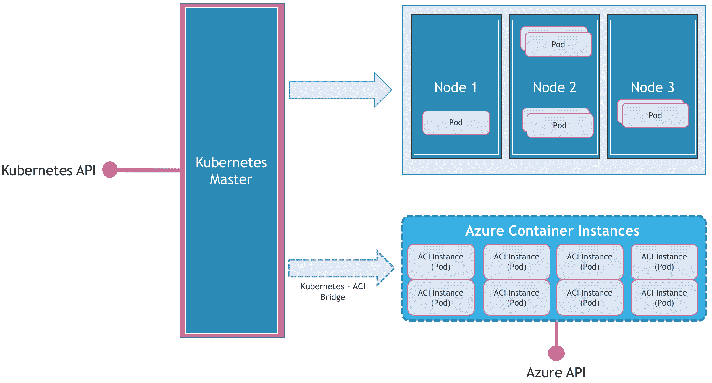

# 借助微软的 Azure 容器实例实现闪电般的快速容器供应

> 原文：<https://thenewstack.io/lightning-fast-container-provisioning-with-microsofts-azure-container-instances/>

几周前，微软[预览了](https://thenewstack.io/azure-container-instances-mean-cheaper-agile-container-tools-way/) Azure Container Instances (ACI)，这是一个无需管理虚拟机就能运行容器的无服务器容器环境。虽然对术语“[无服务器](/category/serverless/)与 ACI 的关联有一些争论，但通过其基于单一命令的超快速容器供应，它是合理的。

无服务器环境通常有三个属性:

1.  基于执行时间的每秒计费
2.  通过基础架构抽象实现透明的资源供应
3.  事件驱动调用

除了事件驱动的调用，ACI 满足前两个属性。第三个属性应该在 near 特征中。

## 闪电般快速的容器供应

公共云中几乎所有的容器环境都需要两步才能开始:供应主机 VM，然后基于指定的映像运行容器。ACI 将这一过程简化为一步，绕过了主机虚拟机的资源调配。

以下两个命令创建一个 Nginx 容器，并在公共互联网上公开它。

```
$  az group create  --name myResourceGroup  --location westus

```

```
$  az container create  --name mycontainer  --image nginx  --resource-group myResourceGroup  --ip-address public

```

上面的命令包括创建虚拟机，从 Docker Hub 中提取容器映像，运行并通过公共 IP 地址公开它。

基于公开 Nginx Web 服务器的用例，我对启动它的三个不同环境的启动时间进行了基准测试 Mac 上的 Docker、Azure 容器实例和 Azure 虚拟机。ACI 和 Azure VM 都在美国西部地区推出。

Mac 上运行的本地 Docker 环境从 Docker Hub 中提取 Nginx 映像，并在 20 秒内运行它。该计时基于带宽和来自 Docker Hub 的响应，Docker Hub 偶尔会经历延迟。

Azure VM 基于 Bitnami 预先配置的 Nginx 映像。我用它来给基准带来平价。我们避免了 Nginx 的安装和配置过程。毫不奇怪，从向 Azure API 发送请求到 web 服务器响应 curl 请求大约需要 5 分钟。将近 30%的时间用于分配公共 IP 地址并将其分配给虚拟机。


最后，ACI instance 花费了 45 秒——仅是 Mac 上 Docker 时间的两倍——来配置容器并通过公共 IP 公开它。需要注意的关键是，45 秒的窗口包括了从配置到分配公共 IP 的所有内容。这是迄今为止任何公共云上最快的容器配置。

如果您对自己运行基准测试感兴趣，可以在 [Github](https://github.com/janakiramm/aci-bench) 上获得这些脚本。

微软对 ACI 虚拟机做了很多优化。由于它们是专门为运行容器而构建的，没有对主机操作系统的 SSH 访问，Azure 计算团队已经调整了所有旋钮以获得最佳的启动时间。我希望看到 Azure IaaS 中的一些学习和优化，这将大大减少虚拟机的启动时间。在 Windows Azure 早期经历了最初的 Web 角色和 Worker 角色供应之后，我必须说 ACI 的启动速度非常快。Azure 无疑取得了长足的进步。

## Kubernetes 连接

Azure 容器实例意味着不同于在传统编排引擎中运行容器的用例。ACI 旨在作为一个增强的功能即服务(FaaS)平台。它介于 Azure 的无服务器环境、 [Azure Functions](https://azure.microsoft.com/en-us/services/functions/) 和容器即服务(CaaS)产品、[Azure Container Services](https://azure.microsoft.com/en-us/services/container-service/)(ACS)之间。

与 CaaS 不同，ACI 缺少协调多个容器实例的控制平面。但这是微软有意做出的决定，将 ACI 的用例与 ACS 分开。微软传达的信息很明确——如果你想运行由多个容器组成的基于[微服务](/category/microservices/)的工作负载，就去 ACS，如果你需要一次性执行有代码和配置的专用容器，就使用 ACI。

有趣的是，ACI 是围绕 Kubernetes Pod 建模的，Kubernetes Pod 旨在运行多个无状态容器，这些容器共享相同的上下文，包括 Linux 名称空间、cgroups 和网络堆栈。Kubernetes Pod 或 ACI 中运行的所有容器都使用标准的进程间通信相互通信。

本着这种设计理念和动机，Azure Compute team 在 Kubernetes 和 ACI 之间搭建了一座桥梁，名为 Kubernetes 的 ACI 连接器。连接器通过将 ACI 注册为具有无限容量的节点，并将 pods 的创建作为 Azure 容器实例中的容器组进行调度，来模拟 kube let——在 Kubernetes 集群中的每个节点上运行的代理。

这是扩展 Kubernetes 功能来处理传统虚拟化基础设施的最佳实验之一。



从技术上来说，ACI 基础设施做开源 [Kubernetes](/category/kubernetes/) 容器编排引擎中的节点所做的事情——拥有 Pod 生命周期。ACI 连接器扩展了这一功能，将 ACI 注册为虚拟节点。当 Pod 定义对 aci-connector 节点有明确的容忍度时，调度程序会将任务委托给 aci，由它接管供应和调度工作。ACI 连接器像集群中的任何其他节点一样更新 Kubernetes 主节点。

这个强大的功能使开发人员和运营人员能够使用 [Kubectl](https://kubernetes.io/docs/user-guide/kubectl-overview/) 来控制 ACI 实例。

下面先睹为快，介绍一下将 ACI 与 Kubernetes 集成的过程。

安装连接器后，ACI 开始显示为 Kubernetes 集群中的一个节点。请注意 ACI 报告的版本中的细微差异。


当我们启动一个具有 nodeName: aci-connector 属性的 Nginx Pod 时，它会像普通 Pod 一样被调度，但是在 aci 环境中。从 kubectl get pods 的标准输出中，我们无法看出这不是一个常规的 Pod。


然而，当我们考察它时，它揭示了一些有趣的事实。下面的屏幕截图显示了 kubectl describes pod 命令的输出:


请注意 Pod 的 IP 地址。这不同于 Kubernetes 网络堆栈分配的常规 IP 地址。它是 Azure 分配给 ACI 实例的公共 IP 地址。当我们用 Azure CLI 检查 ACI 实例时，这一点变得很明显。


最后，在不公开服务来访问 Pod 的情况下，我们可以直接访问 ACI 实例的公共 IP 地址。让我们使用 cURL 向 Nginx 发送一个 GET 请求。


输出确认我们能够直接访问 ACI。我们还可以通过创建一个可以将流量路由到 ACI 的节点端口来采用 Kubernetes 服务的路线。

下周五，我将发布一个分步指南，通过将 ACI 与 Google Container Engine 集成来部署一个多云应用程序。敬请期待！

罗曼·佩利在 [Unsplash](https://unsplash.com/?utm_source=unsplash&utm_medium=referral&utm_content=creditCopyText) 上的专题图片。

<svg xmlns:xlink="http://www.w3.org/1999/xlink" viewBox="0 0 68 31" version="1.1"><title>Group</title> <desc>Created with Sketch.</desc></svg>