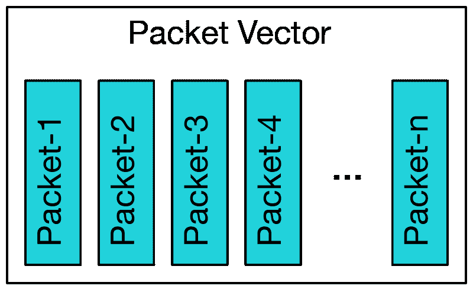
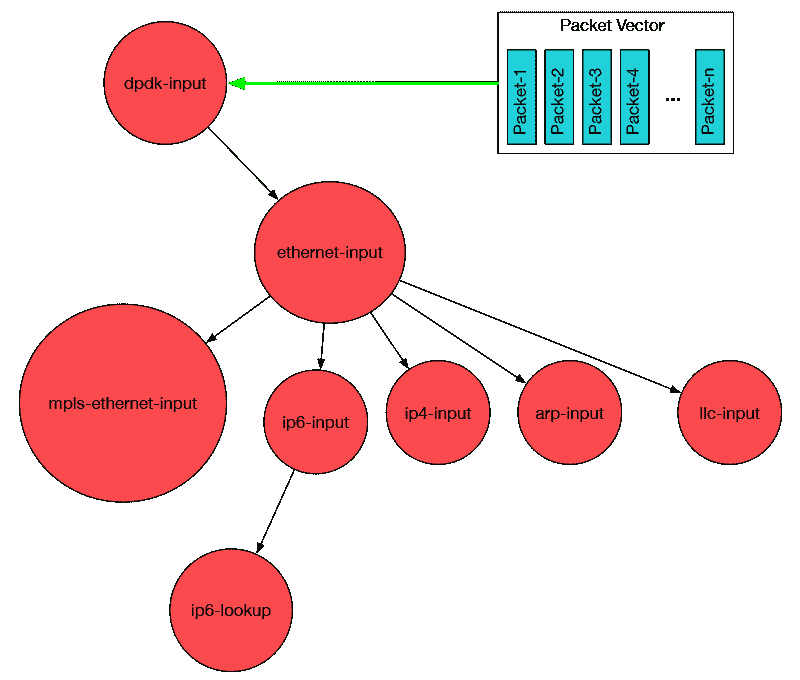
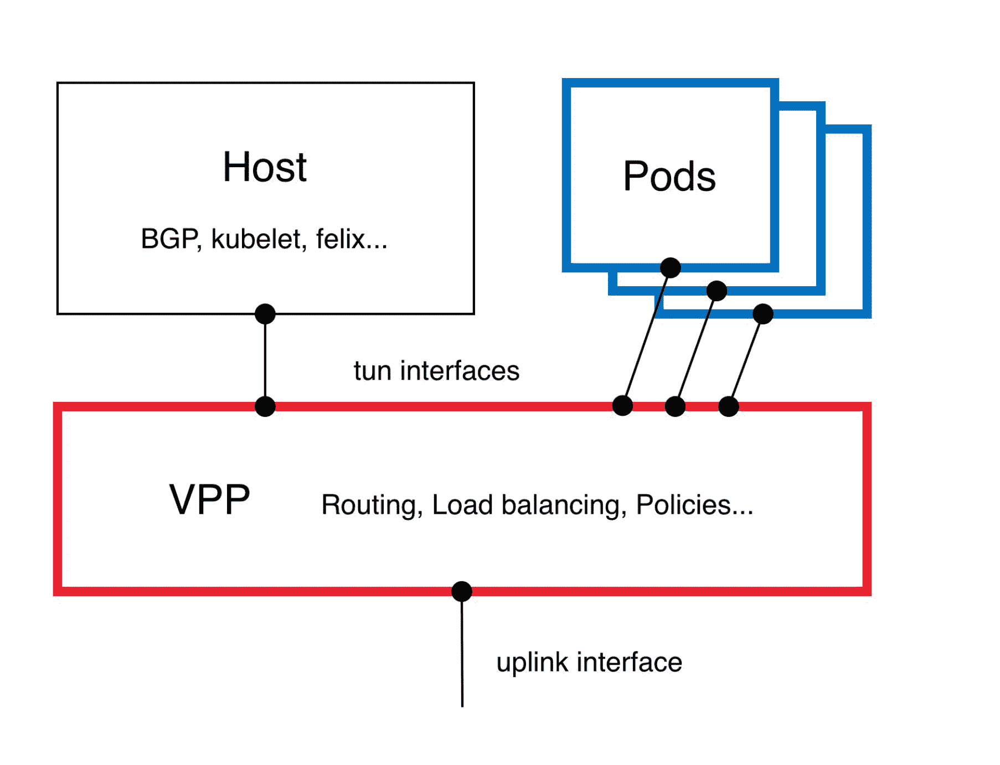
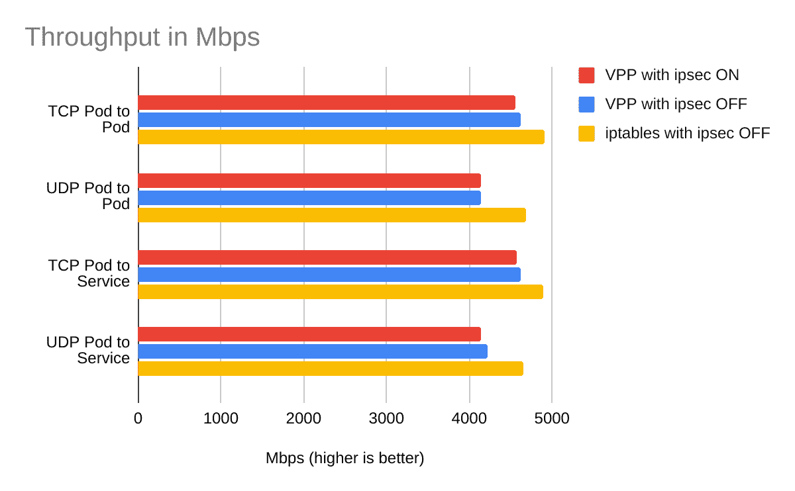
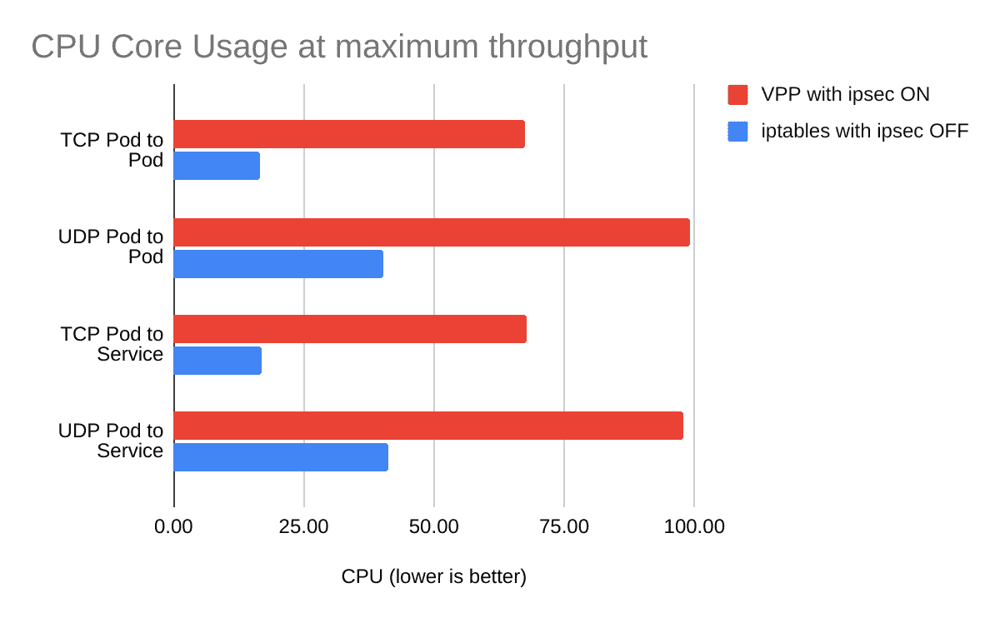

# 快如闪电的 Kubernetes 网络与卡利科和 VPP

> 原文：<https://thenewstack.io/lightning-fast-kubernetes-networking-with-calico-and-vpp/>

[](https://www.linkedin.com/in/rramezanpour/)

[Reza Ramezanpour](https://www.linkedin.com/in/rramezanpour/)

[Reza 是 Tigera 的一名开发人员，致力于促进 Calico 项目的采用。在加入 Tigera 之前，Reza 是一名系统工程师和网络管理员。](https://www.linkedin.com/in/rramezanpour/)

[](https://www.linkedin.com/in/rramezanpour/)[](https://www.linkedin.com/in/rramezanpour/)

直到最近，公共云基础设施和微服务正在推动资源和服务交付的极限，超出人们的想象。为了跟上需求，网络基础设施和网络技术也必须发展。软件定义的网络(SDN)是云网络发展的巅峰。通过使用 SDN，开发人员可以提供优化、灵活的网络体验，以适应客户不断增长的需求。

本文将讨论 Tigera 的新[矢量数据包处理(VPP)数据平面](https://www.tigera.io/event/introducing-a-new-data-plane-for-calico-vpp/)如何适应这种环境，并分享一些关于其性能的基准测试细节。然后，它将演示如何使用 AWS 公共云运行配备 VPP 的集群，并使用互联网协议安全性(IPsec)来保护它。

## 矢量数据包处理简介

[Project Calico](https://www.projectcalico.org/) 是一个开源的网络和安全解决方案。尽管 Calico 专注于保护 Kubernetes 网络，但它也可以用于 OpenStack 和其他工作负载。Calico 使用模块化数据平面，允许灵活的联网方式，为当前和未来的联网需求提供解决方案。

VPP 是一个易于扩展、独立于内核、高度优化且速度极快的开源数据平面项目，在 OSI 模型的第 2 层和第 4 层之间运行。

最初，VPP 启动用户空间网络堆栈进程来处理网络流量。与通用数据平面相比，这允许 VPP 消耗有限的资源，同时仍然提供出色的可见性和性能。

## VPP 是如何工作的？

VPP 使用多种技术来尽快处理数据包。优化和缓存可以说是最重要的技术。

最初，VPP 从输入节点获取最大的可用分组块以形成分组向量。数据包向量是对相似数据包进行分组的一种简单形式。



接下来，VPP 通过数据包处理图处理数据包向量。



然后，VPP 通过一个图节点处理整个数据包向量，然后再移动到下一个节点。从每个向量处理的第一个数据包会创建一个缓存，用于处理后续的数据包。如果 VPP 在数据包处理过程中遇到错误，下次它会尝试形成一个更大的矢量数据包来弥补损失。这使得它能够保持稳定的吞吐量和延迟。

烘焙纸杯蛋糕可以作为解释 VPP 的一个简单类比。想象一下，我们有大量不同大小和类型的纸杯蛋糕准备烘烤。为了开始烘焙，我们可以设置烤箱的温度，将一个纸杯蛋糕放入烤箱，等待它准备好，然后关闭烤箱，取出纸杯蛋糕，最后，为下一个纸杯蛋糕重新设置烤箱温度。

我们可以使用更聪明的方法，根据他们的烹饪要求对他们进行分组，而不是一个接一个地为每个纸杯蛋糕做这个过程。这包括将烤箱设置到每组所需的温度，将每组放入烤箱直到完成，然后对其余的组重复。

由于我们将纸杯蛋糕分组在一起，当我们的计时器停止时，我们将得到许多而不是一个纸杯蛋糕，这可以大大减少我们花费在烘焙上的总时间。

## 印花布集成

[Calico 的 VPP 实现](https://docs.projectcalico.org/getting-started/kubernetes/vpp/getting-started)是一个纯粹的第 3 层数据平面。Pods 使用 TUN 接口将其流量发送到 VPP pods。VPP 处理流量，并做出路由、负载平衡和策略决策。



这种设计允许用户在不修改应用程序的情况下利用 VPP 功能。

## 表演

基准测试是确定一项技术是否能兑现其承诺的理想方法，因为由基准测试生成的数字和度量很容易比较。尽管这些性能数字在不同的环境中可能有所不同，但在大多数情况下，最终结果应该是相似的。

以下基准测试显示了 VPP 如何以近乎线速推送加密和未加密流量的数据。请注意，AWS 对 EC2 实例之间的单个流量有限制，将此类流量限制为 5 Gbps。如果您的场景需要超过 5 Gbps 的吞吐量，请确保将 Calico 封装更改为 VXLAN 模式，以便绕过这一限制。



下图比较了 VPP 和 iptables 数据平面之间的 CPU 利用率。由于 AWS 中 DPDK 驱动程序实施导致的问题，VPP 正在使用轮询模式，即使在没有流量可用时也使用单核 CPU，从而导致这些高数字。这些数字最终会下降，因为 AWS 团队正在积极努力解决这个问题。更多信息可在[这里](https://github.com/amzn/amzn-drivers/issues/168)找到。



## 演示

### 在开始之前

在本演示中，我们将在亚马逊的公共云基础架构中建立一个 EKS 集群，并将其与 Calico VPP 数据平面集成。按照这些步骤，您需要一些必备工具。请确保您的系统上安装并配置了 kubectl、eksctl 和 awscli。

### 集群设置

使用 eksctl 填充 EKS 集群。

```
eksctl create cluster  --name calico-vpp-preview  --without-nodegroup

```

AWS EKS `control-plane`节点带有预装版本的`amazon-vpc-cni-k8s`。在安装印花布 VPP 清单之前，我们需要从集群中删除`amazon-vpc-cni-k8s`。

使用以下命令删除默认的`amazon-vpc-cni-k8s`守护进程。

```
kubectl delete daemonset  -n  kube-system aws-node

```

使用以下清单安装印花布和 VPP 豆荚。

```
kubectl apply  -f  https://raw.githubusercontent.com/projectcalico/vpp-dataplane/master/yaml/generated/calico-vpp-eks-dpdk.yaml

```

现在，我们已经使用之前的清单在我们的 EKS 集群中安装了 Calico 和 VPP 数据平面，是时候向我们的集群添加工作节点了。每个工作节点将托管为我们的客户服务的应用程序单元。

为此，请向群集中添加节点。

```
eksctl create nodegroup  --cluster calico-vpp-preview  --node-type t3.medium  --node-ami auto  --max-pods-per-node  100

```

就这样，我们有了一个配备了 Calico 的 EKS 集群，它使用的是 VPP 数据平面！

### IPsec 设置

IPsec 是一套允许用户通过使用加密隧道建立安全通信的协议。在正常设置中，IPsec 会对通过可用链路传输的数据量产生巨大影响。这导致了可用带宽的巨大浪费。

VPP 的速度提升可以帮助 IPsec 使用所有可用的带宽，而无需对应用程序或 IPsec 源代码进行任何更改。

使用以下命令创建预共享密钥。

```
kubectl  -n  calico-vpp-dataplane create secret generic calicovpp-ipsec-secret  \
--from-literal=psk="$(dd if=/dev/urandom bs=1 count=36 2>/dev/null | base64)"

```

现在我们已经配置了预共享密钥，是时候启用安全隧道了。

使用以下命令打开 IPsec 隧道。

```
kubectl  -n  calico-vpp-dataplane patch daemonset calico-vpp-node  --patch  "$(curl https://raw.githubusercontent.com/projectcalico/vpp-dataplane/master/yaml/patches/ipsec.yaml)"

```

### 确认

VPP 用户空间提供了一组交互式命令来监控和更改数据平面设置。Calico VPP 数据平面项目提供了一个命令行实用程序，为用户提供了一种通过用户空间交互命令与 VPP 数据平面进行交互的简单方法。

注意:以下命令行实用程序需要 bash，如果没有 bash 模拟器，可能无法在 Windows 中运行。

使用以下命令下载该实用程序。

```
curl  -o  calivppctl https://raw.githubusercontent.com/projectcalico/vpp-dataplane/v0.14.0-calicov3.19.0/test/scripts/vppdev.sh
chmod  +x  calivppctl

```

通过使用带有`vppctl`选项的 bash 脚本并提供 worker 节点的名称，我们可以与 VPP 交互会话进行交互，以收集关于我们的 VPP 部署和网络状态的信息。

```
#calivppctl vppctl ip-192-168-12-227.us-east-2.compute.internal

```

以下命令显示了上一步中建立的 IPsec 隧道。

```
vpp# show ipsec tunnel
ipip0 flags:[none]
output-sa:
  [0]  sa  2147483648  (0x80000000)  spi  3658219910  (0xda0c0186)  protocol:esp flags:[esn anti-replay aead ctr  ]
input-sa:
  [1]  sa  3221225472  (0xc0000000)  spi  3207639915  (0xbf30b36b)  protocol:esp flags:[esn anti-replay inbound aead ctr  ]

```

如果您想了解更多关于 vppctl 命令的信息，请访问[此链接](https://wiki.fd.io/view/VPP/Command-line_Interface_(CLI)_Guide#Interface_Commands)。

### 清除

使用以下命令清理在本演示过程中创建的资源。

```
eksctl delete cluster calico-vpp-preview

```

## 结论

VPP 的独特设计显示了加速云计算网络性能的巨大潜力，传统数据平面可能无法满足不断增长的微服务需求。

在本文中，我们探讨了 Calico 的可插拔数据平面设计如何提供一种简单的方法来将 VPP 集成到您的 Kubernetes 集群中，而无需修改您的应用程序。我们还研究了为什么如果您需要提高网络性能，它可以成为您的 Kubernetes 集群的可行替代数据平面。

由于 Calico VPP 正处于技术预览阶段，您的反馈将对其未来发挥巨大作用。请使用我们的 [Slack 频道](https://calicousers.slack.com/archives/C017220EXU1)与 VPP 项目背后的开发商联系，或者与 Project Calico 分享您对 VPP 未来的想法。

你知道你可以成为一个认证印花布运营商吗？在这个免费的、自定进度的认证课程中，使用 Calico 学习 Kubernetes 网络和安全基础知识。

如果你喜欢这个博客，你可能也会喜欢:

<svg xmlns:xlink="http://www.w3.org/1999/xlink" viewBox="0 0 68 31" version="1.1"><title>Group</title> <desc>Created with Sketch.</desc></svg>