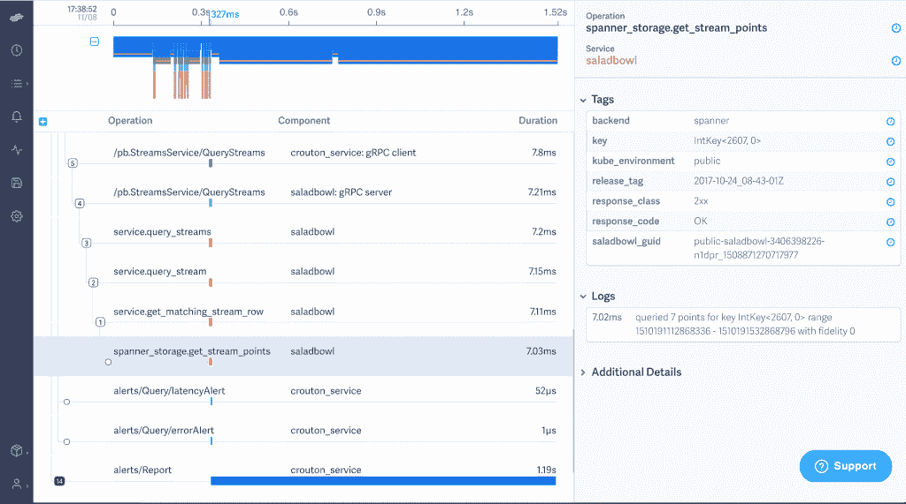

# LightStep 为微服务带来性能管理

> 原文：<https://thenewstack.io/lightstep-brings-performance-management-microservices/>

迁移到[微服务架构](/category/microservices/)的一个副作用是，组织可能会失去对其整个应用程序进行有效故障排除的能力，以及不同部分如何组合在一起的能力。

为了解决这个问题， [LightStep](http://lightstep.com) 成立于 2015 年，今天已经摆脱了隐身模式，它推出了一款新的 SaaS 产品，名为[x]PM，为软件组织提供了一种了解其复杂的横向扩展生产服务行为的方式。[x]PM 已经与 Lyft、Yext 和 Twilio 等公司进行了测试。

联合创始人兼首席执行官[本·西格曼](https://www.linkedin.com/in/bensigelman/)在一次采访中断言:“Lightstep 的[x]PM 非常适合那些试图理解其复杂的、向外扩展的生产系统的行为的组织。

Sigelman 在创立 LightStep 之前在谷歌设计和部署了全球规模的监控技术，他认为微服务正在软件开发中产生巨大的转变，这是一个“地震和绝对的”这不仅仅是架构或效率的转变。“这是一个不同的框图，”他说。

Sigelman 说，处理太多数据的传统方法是过早地丢弃数据或总结经验。LightStep 正在创造第三种方式。

大多数当前监控整体数据的工具不适用于分布式数据，并且大多数应用程序性能管理(APM)系统仅关注数据去向的有限部分。Sigelman 说，该产品不是专为微服务开发的，因为公司正在运行 monolith、微服务、云以及他们自己的数据中心的组合，所有这些都具有不同的技术代，正在一起工作。

## 数据的广度

这项新服务跟踪交易的所有移动部分，沿途采集数据，并在几秒钟内讲述整个系统发生的事情。数据是从移动应用程序、后端堆栈以及客户端系统中几乎任何接触数据的地方收集的，可以在几秒钟内报告故障。

LightStep 跟踪仪表板

你的普通移动请求会触及几十到几千个不同的移动部件，他说，一个人根本无法跟踪交易并找到故障。

他解释说，LightStep [x]PM 旨在吸收数量级更多的事务数据，比以前认为的可能要多。“有了这些额外的信息和背景，我们可以提供与客户最关键的业务需求更相关的软件见解，从而解决问题，无论是短期火灾还是长期业务问题。”

据 Twilio 平台工程高级副总裁[杰森·胡达克](https://www.linkedin.com/in/jasonhudak/)称，消息巨头 Twilio 通过 LightStep 将事件解决时间[减少了 92%。“LightStep [x]PM 不仅能发现我们的性能问题，还能告诉我们为什么会发生这些问题，”他说。“在运行 LightStep 的一个小时内，我们的计费交易团队就能够发现问题并进行改进，从而将延迟降低了 70%。”](http://www.lightstep.com/customers#twilio)

[x]PM 收集的数据的广度使公司能够在非常精细的级别上查看交易，能够跟踪单个客户的事件和按键。

## 下一关

该服务旨在更灵活地应用它，并从传统上不包括在 APM 中的系统部分吸收数据，提供正在发生的事情的历史背景，并确定某个事件是紧急事件还是在可容忍的范围内。

这项服务的另一个创新点是它能够锁定非常具体的交易。数据的粒度允许公司做一些事情，如监控单个团队的服务水平协议，或在发布时监控特定的软件版本，以查看它如何影响整个系统，并在出现意外影响时回滚。

Sigelman 说，“需要注意的是，我们所说的数据量是无法写入磁盘的。一旦写入磁盘，容量的扩展就会受到限制。”所有这些重要的信息都来自于系统，该系统拥有来自整个系统的所有最近的数据——“最近的；几秒钟后。但是不能存储那么多的数据。时间可以根据客户需要延长。但是即使保存几秒钟的数据也是惊人的。

数据不能通过互联网传输，这一点很重要。他说，光是网络负载就要花费数百万美元。同样值得注意的是，LightStep SaaS 不应该被认为是一个记录系统。

Lightstep 并不是唯一一家满足新兴微服务监控市场需求的公司。蜂巢[于今年早些时候推出](https://thenewstack.io/honeycomb-addresses-flawed-systems/)，借鉴了[脸书水肺](https://research.fb.com/publications/scuba-diving-into-data-at-facebook/)的架构。[云本地计算基金会](https://www.cncf.io/)托管着优步开发的 [Jaegar](https://github.com/jaegertracing/jaeger) ，它和[x]PM 一样，提供基于 CNCF [OpenTracing](http://opentracing.io/) 规范的跟踪功能。

## 定价模型

APM 提供商的定价模式也是独特的。他说，市场非常清楚，它不想为每个虚拟机连接付费，也不想为输入 LightStep 系统的数据量付费。

因此，他们决定采用一种模式，让价格随产品对客户的价值而变化。他们的三层体系只有一个成本，即产品的上线成本。之后，价格取决于 LightStep 中正在进行的分析范围。

他解释说，如果只有几个群体在使用该产品，价格会更低。如果产品跨多个组使用，跨越客户的整个系统，价格会更高。虽然他不能给我具体的数字，但他说这对他们的测试版客户来说非常有价值。

[云本地计算基金会](https://www.cncf.io/)是新堆栈的赞助商。

专题图片:本·西格曼，由 TC Currie 拍摄。

<svg xmlns:xlink="http://www.w3.org/1999/xlink" viewBox="0 0 68 31" version="1.1"><title>Group</title> <desc>Created with Sketch.</desc></svg>