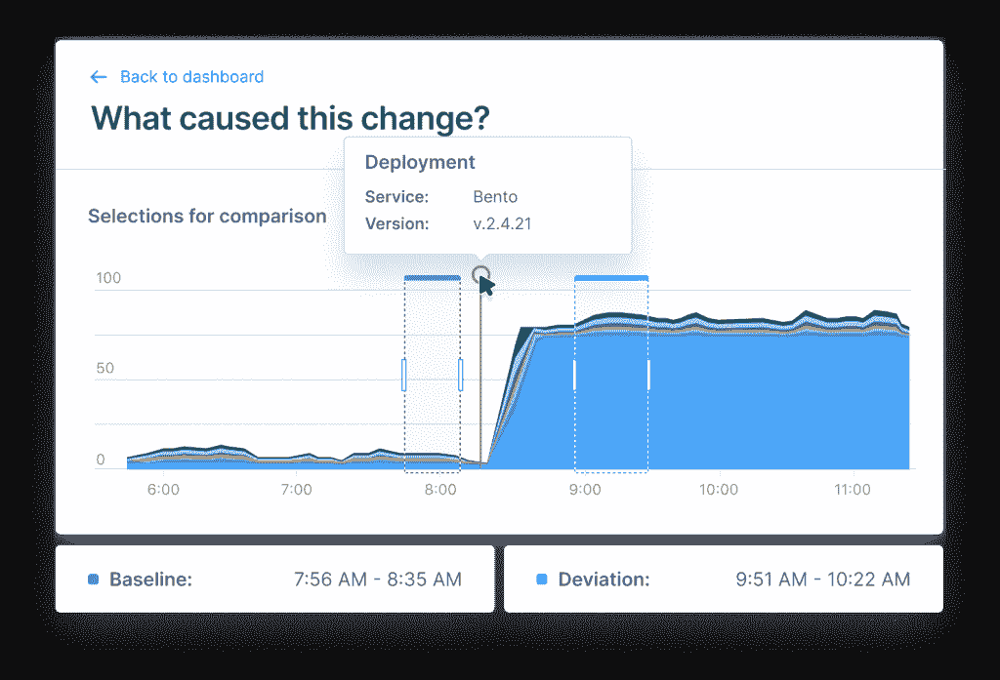
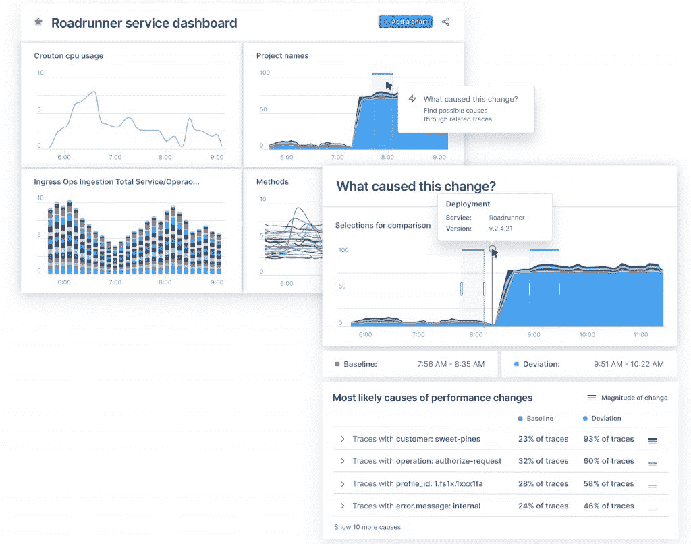

# Lightstep 的“改变智能”承诺更快、更智能的分布式跟踪

> 原文：<https://thenewstack.io/lightsteps-change-intelligence-promises-faster-smarter-distributed-tracing/>

可观察性提供商 Lightstep 升级了其平台引擎，以提供应用性能分析，解决该公司认为可观察性和当前监控工具和流程中存在的严重缺点。

面对日志和数据的爆炸式增长，管理员会发现变更智能功能旨在通过考虑当今 IT 环境中快速变化的变量来收集有意义的见解和可操作的结果。通过这种方式，现在被该公司描述为 [Lightstep](https://lightstep.com/?utm_content=inline-mention) 的可观测性平台的“引擎”的 Change Intelligence 被设计为在引擎盖下运行并执行计算难度极大的任务时提供直观的分析。这些任务很大程度上源于 Lightstep 工程师设计的时序数据库功能(TSDB)，他们中的许多人曾为谷歌设计过 [Monarch](https://monarch.aop.com/) 。

“变化智能专门解决这个问题，这是所有监控和可观察性中最重要的一个问题:是什么导致了变化？“Lightstep 的[本·西格曼](https://www.linkedin.com/in/bensigelman)，首席执行官，联合创始人， [OpenTelemetry](https://opentelemetry.io/) 项目的联合创始人，前谷歌人，告诉新的堆栈。“它将隐藏在遥测数据(包括指标和轨迹)中的洞察力带到任何发生变化的地方。”Sigelman 说，这些变化可能发生在核心监控仪表板和警报、CI/CD 中，或者通过编程 API 和与其他 DevOps 工具的集成来实现。

主要想法是使核心监控可操作，Sigelman 说这是“非常重要的”

“你有没有遇到过因为诊断太难而不得不轻易跳过的异常情况？Sigelman 说:“对于传统的基础设施指标，如 CPU 或堆使用量峰值，情况尤其如此。现在，Change Intelligence 允许您几乎只需点击任何异常，就可以获得对整个分布式应用程序中可能发生的变化的指导性分析，这些变化可以解释这些变化。”。“这强化并真正重新定义了监控能够和应该是什么。与此同时，对于没有时间成为“可观察性专家”的 SREs 和 DevOps 工程师来说，它使可观察性变得更容易获得，也更具情境性。"

如上所述，Change Intelligence 开发的动机是解决 DevOps 团队面临的可观察性和监控问题。DevOps 团队“一直在挣扎”的两个主要原因是因为传统的监控工具，如仪表板和警报，与专用的可观测性工具相分离。因此，“将可观察性的洞察力应用于常规监测所发现的日常问题太困难了，”西格曼说。

“由于 DevOps 工程师无论如何都被困在他们的监控工具中，他们不可避免地试图用他们的传统监控工具来解决‘可观察性问题’，但这不起作用，因为监控工具在揭示关键症状变化时是可以的，但在解释为什么会发生这些变化时却很糟糕，”Sigelman 说。“团队最终拥有数千个仪表盘和数额巨大的监控账单，但他们仍然无法可靠地解释为什么图表会显示突然的偏差，或者为什么会发出警报。”

一个典型的用例场景是当一个工程师在面对用户的错误增加后被呼叫。Sigelman 描述了如果没有 Change Intelligence，工程师可能会开始手动滚动仪表板，寻找其他可疑行为，并搜索日志，试图找到模式。

“Change Intelligence 通过对有错误和没有错误的请求进行全栈分析来自动化这一过程，并使用该分析来查明可能的原因，”Sigelman 说。然后，工程师可以考虑这些原因(以及相关证据)，并回滚部署、横向扩展服务或找到可以提供帮助的专家，无论他们需要做什么来缓解问题

Sigelman 说，关键的一点是“几乎总是有变化会导致这类问题——同样，要么是软件、基础设施或工作负载的变化。“但是每天生产系统中也有成百上千的其他变化发生，所以理解哪些变化很重要对人类来说不是一件容易的事情，”Sigelman 说。“每个组织中通常都有一些专家有足够强的直觉，他们可以做到这一点:我们提供变革智能背后的动机实际上是为了将直觉的好处带给每一个感受到这种痛苦的开发人员。”

[https://www.youtube.com/embed/GGRAvY8_7Ps?feature=oembed](https://www.youtube.com/embed/GGRAvY8_7Ps?feature=oembed)

视频

<svg xmlns:xlink="http://www.w3.org/1999/xlink" viewBox="0 0 68 31" version="1.1"><title>Group</title> <desc>Created with Sketch.</desc></svg>