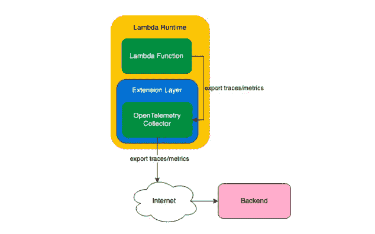

# Lightstep 的 OpenTelemetry 扩展有助于使 Lambda 遥测数据更易于访问

> 原文：<https://thenewstack.io/lightsteps-opentelemetry-extension-helps-make-lambda-telemetry-data-more-accessible/>

分布式跟踪提供者 [Lightstep](https://lightstep.com/) 发布了 OpenTelemetry 项目的扩展，旨在帮助提高 Lambda 无服务器可观测性。

通过 Lightstep 的亚马逊网络服务(AWS) Lambda 扩展到 [OpenTelemetry](https://opentelemetry.io/) 项目，开发人员可以更快、更简单地了解他们的无服务器应用程序的性能，以便检测错误等。

当函数运行时，扩展的二进制文件与 Lambda 运行时并行工作，并嵌入其中。编译完代码后，扩展就可以作为 Lambda 层使用，并且可以立即访问。根据 Lightstep 的说法，遥测数据也可以通过 AWS 工具发布和分发。

“OpenTelemetry 是一套松散耦合的 API、SDK 和基础设施，但与 Lambda 等复杂技术平台的集成需要仔细的编码和努力，”[light step 首席执行官兼联合创始人、OpenTelemetry 项目的联合创始人 Ben Sigelman](https://www.linkedin.com/in/bensigelman) 说。“这一贡献使得任何 Lambda 用户都可以轻松利用 OpenTelemetry 进行无服务器部署，而无需在原始 OpenTelemetry APIs 本身的基础上构建集成。”

该扩展旨在解决的主要挑战之一是如何从超快速和无状态的无服务器功能中收集遥测数据。

根据 Datadog 的[“无服务器状态”](https://www.datadoghq.com/state-of-serverless/)报告，AWS Lambda 功能完成的平均时间为 800 毫秒，而三分之一的功能运行时间为 400 毫秒。根据该报告，Lamda 的超时时间从 1 秒到 15 分钟不等，但 Lambda 超时时间的三分之二不到 1 分钟。

正如经常经历的那样，Lambda 中极短的运行时间极大地限制了遥测数据的传输和访问。Lightstep 的 open telemetry extension for Lambda 的主要功能是使组织能够通过遥测技术以他们以前无法做到的方式收集和处理短暂的数据。

“由于 Lambda 函数是短暂的，因此在它完全消失之前有效地从 Lambda 函数中获取遥测数据是一项挑战。Sigelman 说:“许多供应商都有特殊情况下的 Lambda 仪器，但这些集成是以明确的供应商锁定为代价的。“开发人员希望 Lambda 遥测技术没有开销，也没有供应商限制，有了 Lightstep 的开源 OpenTelemetry 贡献，他们终于实现了这一点:一个与任何 OpenTelemetry 兼容的可观测性提供商兼容的单一集成。”

Lightstep 的 OpenTelemetry 扩展的“厂商中立”方法也很关键，因为由云计算原生计算基金会管理的 OpenTelemetry 项目旨在提供一个框架，帮助组织在采用可观测性工具时避免厂商锁定。通过这种方式，OpenTelemetry 提供了厂商中立的集成，帮助组织获得支持可观测性工具的原材料——“遥测”。OpenTelemetry 由 API、规范、SDK 和基础设施组件组成，还允许后端访问遥测数据，而无需在使用新供应商的工具时安装额外的软件或编写新代码。

OpenTelemetry 框架和 Lightstep 对 Lambda 的扩展的使用，也支持组织可能采用的不同可观测性工具的互操作性。这些可能包括来自 Lightstep 的追踪工具和 Datadog、Honeycomb 和 New Relic 提供的观察平台。

亚马逊网络服务(AWS)、云计算原生计算基金会(CNCF)、蜂巢、Lightstep 和 New Relic 都是新堆栈的赞助商。

通过 Pixabay 的特征图像。

<svg xmlns:xlink="http://www.w3.org/1999/xlink" viewBox="0 0 68 31" version="1.1"><title>Group</title> <desc>Created with Sketch.</desc></svg>