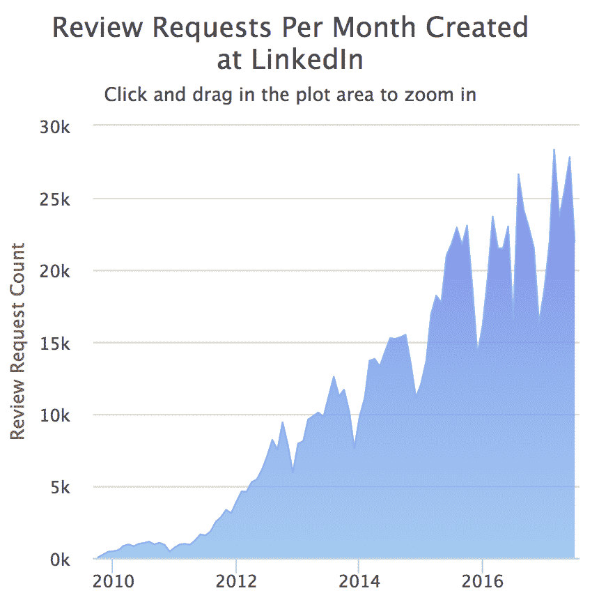

# LinkedIn 关于高效代码审查的提示

> 原文：<https://thenewstack.io/linkedin-code-review/>

[LinkedIn](https://www.linkedin.com/)

最近通过了进行一百万次代码审查的里程碑。社交网络服务工具的负责人分享了一些经验教训。

阅读和审查代码是每个工程师每天都要做的事情。然而，正式的代码审查过程有点不同——它要求在代码投入生产之前，每个代码更改都要由另一个团队成员正式审查。在 LinkedIn，自 2011 年以来，代码审查一直是我们开发流程的一个强制性部分。我们要求代码评审的目标是尽可能平稳地扩展我们快速增长的工程团队。带有有意义的、有用的注释的好的代码评审确实有助于提升整个工程组织。在 LinkedIn，这些评论已经成为质量保证和知识共享的重要组成部分。接受代码评审已经在几个关键方面更好地改变了我们的整个工程文化。

 [Szczepan Faber

自 2015 年以来，Szczepan Faber 一直是 LinkedIn 开发工具的技术负责人，该团队负责确保工程生产力的工具和工作流。从 2011 年到 2015 年，他是领先的构建和自动化框架 Gradle 1.x 和 2.x 的核心工程师。Szczepan 在 2007 年创建了 Mockito framework，这是最流行的 Java 库之一，估计有 200 万用户。](https://www.linkedin.com/in/szczepiq/) 

实现全公司范围的代码审查的最大好处之一是增加了我们开发工作流程的标准化。LinkedIn 的每个团队都使用相同的工具和流程进行代码审查，这意味着任何人都可以帮助审查或为另一个团队的项目贡献代码。这消除了诸如“我可以修复他们代码中的 bug，但是我如何构建代码并提交修复？”反过来，这有助于增加工程组织中不同团队之间的协作。

通过使代码审查成为一个强制性的过程，我们还帮助在公司培养了一种健康的反馈文化:工程师在工作的所有领域都愿意给予和接受反馈，而不仅仅是在编码领域，因为这已经成为工作的一个常规组成部分。我们的工程师不会将代码审查视为批评或负面的，而是将给予和接受代码审查作为专业成长的机会。事实上，高质量的代码审查是 LinkedIn 晋升过程的重要组成部分，因为它们提供了工程技能的客观证据。

这些年来，我们已经积累了一些最佳实践和技巧来给出真正好的评论。下面是一些问题形式的指导方针，我们建议询问这些指导方针，以帮助确保评审者和被评审者从代码评审中获得最大可能的价值。

## 我理解“为什么”吗？

为了促进最好的审查，并帮助您的团队扩展，每一个代码变更提交都应该包括一个设计概述，简要解释变更背后的动机。当基本原理需要从代码变更本身推断出来时，很难提供高质量的代码审查。在尝试代码评审之前，要求并期望提交者解释他们的动机是公平的。这也鼓励提交者在他们的提交消息中有一个解释，增加了代码文档的质量。

## 我是否给出了积极的反馈？

在一个充满聪明人的组织中，干净的代码和整洁的测试覆盖是理所当然的。因此，代码评审反馈往往只关注代码中发现的问题。这是非常不幸的，因为大多数人需要积极的反馈来感受参与和激励——工程师也不例外。当评审者在代码中看到好的东西时，他们应该指出来并给出积极的反馈。这有助于改善团队动态，而且通常这种积极的反馈是有感染力的。和所有代码评审评论一样(下面会有更多)，任何积极的反馈都应该是具体的，解释为什么特定的代码写得很好。

## 我的代码评审注释解释得好吗？

无论反馈是积极的还是消极的，任何代码评审评论都应该是不言自明的。对于评审人员来说似乎显而易见的事情，对于收到解释不清楚的代码评审意见的工程师来说可能是不清楚的。当有疑问时，最好过度解释，而不是提供简洁的反馈，这会产生更多的问题，需要更多的来回沟通。解释可以简单到“减少重复”、“提高覆盖率”或“使代码更容易测试”除了使评审者的评论更加清晰，这些类型的解释也有助于强化团队渴望达到的设计原则。

## 我欣赏提交者的努力吗？

不管结果如何，努力工作总是需要被欣赏的——这培养了强大的、高度激励的团队。一些代码更改不是最高质量的，需要返工。在这种情况下，即使他们的代码需要修改，仍然要承认作者为修改付出的努力，这一点很重要。表达感激的最好方式是通过给出高质量的反馈和得体的解释，承认好的想法(在每一次代码提交中总是有好的东西),来努力进行代码评审。)，并使用“谢谢。”

## 这条评论对我有用吗？

问这个问题是验证代码评审注释是否必要的一种简单而有效的方法。最终，工程师应该将代码评审视为有用的开发工具，而不是不重要的无用功的来源。如果你认为某个评论对你没用，那就删掉它。无用的代码评审注释的一个典型例子是与代码格式相关的注释。代码风格和格式应该由自动化工具来验证，而不是工程师。

## “测试完成”部分是否足够彻底？

在 LinkedIn，每个代码更改提交都有一个强制的“测试完成”部分需要填写。在开源世界，以 GitHub 为例，工程师可以在 pull 请求描述中提交“testing done”信息。“测试完成”中应该包含什么取决于变更的严重性和当前的测试覆盖率水平。如果变更包含新的或变更的条件复杂性，那么期望它被单元测试所覆盖是合理的。如果集成测试覆盖不充分，一些更改可能需要运行手动测试。在这些情况下，“测试完成”应该包括关于测试场景和输出的信息。当变更改变了程序的输出时，在“测试完成”部分包含新的输出是非常有用的。

## 是我复习太迂腐了吗？

一些代码评审有太多的评论，以至于重要的问题——那些真正需要修正的问题——被不太重要的建议淹没了。对于给定的团队来说，过于关注细节的评审会减慢评审周期，并导致评审者和被评审者之间的摩擦。有明确的评审期望、范例评审和积极的、吸引人的评审文化是避免冗长、令人疲惫的评审周期的好方法。

总之，拥有正式的代码评审过程有助于提高代码质量、团队学习和知识共享。当团队中的每个工程师都意识到两件重要的事情时，工作的质量就会提高:其他人会阅读我的代码，所以它最好是好的，我必须处理我收到的任何评审意见，所以我应该尝试在第一次就把我的代码做好，以节省自己以后的努力。当代码评审成为一种日常习惯时，团队每天都练习给予和接受反馈。这是成长和进步的关键。

在 LinkedIn，我们从过去 100 万次代码审查中学到了很多，我们渴望从下一个 100 万次审查中学到更多。投入代码评审的精力越多，团队就越能更好地进行代码评审，签入的代码质量就越高，构建的产品质量也越高。高质量的代码评审是有感染力的！

作者感谢 James Miller、Oscar 博尼拉、Joshua Olson、Andrew Macleod、Scott Meyer 和 Deep Majumder 对本文的深刻反馈。

<svg xmlns:xlink="http://www.w3.org/1999/xlink" viewBox="0 0 68 31" version="1.1"><title>Group</title> <desc>Created with Sketch.</desc></svg>