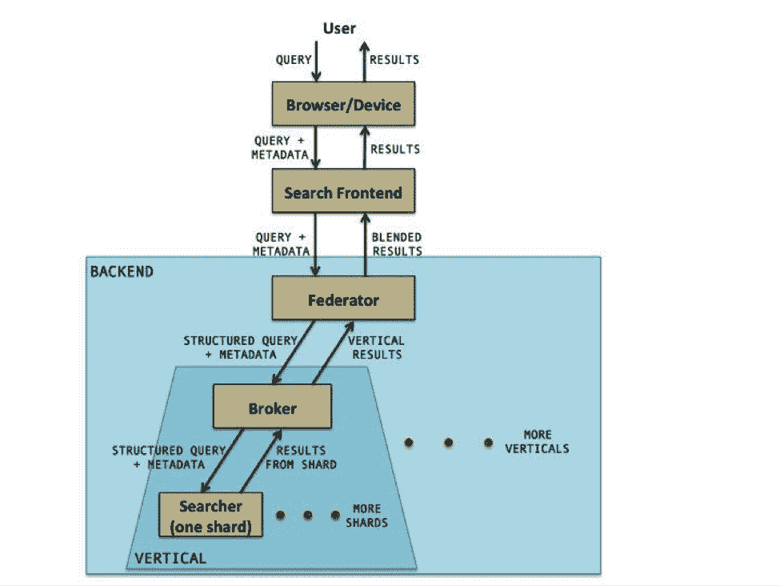

# LinkedIn 完成了新的搜索架构 Galene

> 原文：<https://thenewstack.io/linkedin-finalizes-its-new-search-architecture-galene/>

上周，专业社交网络服务 LinkedIn 将其搜索业务完全转移到一个名为 Galene 的新架构上，这是为其特定用户群定制的。

“我们 100%的搜索流量都来自 Galene 搜索栈，”LinkedIn 搜索和订阅基础设施总监约什·沃克说。这意味着网站上所有 37 个不同的搜索服务现在都由 Galene 提供支持，Galene 是以一个象征平静大海的希腊女神命名的。

“作为一名用户，你每次做搜索都会看到 LinkedIn 的图形特性，”沃克说。例如，搜索一个用户的名字，就会显示出你们两人之间的联系数量。求职者可以使用搜索者的简历来帮助确定最合适的职位。

超过 15 名工程师致力于建造 Galene，公司其他人也提供了大量的投入。总之，超过 50 年的人力[超过两年的时间](https://thenewstack.io/the-open-road-to-galene-linkedins-new-search-architecture/)被投入到这个项目中。

该架构还为 LinkedIn 正在管理的一组相互关联的信息奠定了基础，这些信息被称为[经济图](https://www.linkedin.com/pulse/20121210053039-22330283-the-future-of-linkedin-and-the-economic-graph)。

LinkedIn 是为人们分享专业信息和联系他人而创建的网站。对于像 LinkedIn 这样庞大的用户群来说，这本身就是一个挑战。根据最新统计，LinkedIn 积累了超过 4 亿个账户，其中充满了关于人、工作、公司、学校、团体和其他专业内容的事实。经济图表可以通过聚集这些用户数据并从其他数据源交叉索引来收集大量的附加信息。

LinkedIn 首席执行官杰夫·韦纳在博客[中解释了经济图表](https://www.linkedin.com/pulse/20121210053039-22330283-the-future-of-linkedin-and-the-economic-graph)的概念，他解释说:“有了经济图表的存在，我们可以查看任何给定地区的工作岗位，确定该地区增长最快的工作岗位，获得这些工作岗位所需的技能，那里现有总劳动力的技能，然后量化差距的大小。”。“更重要的是，我们可以将这些数据提供给当地的职业培训机构、初级学院等。因此，他们可以开发一个及时的课程，为当地求职者提供获得现在和将来的工作所需的技能，而不仅仅是曾经的工作。

对于搜索服务，该公司一开始使用的是 Apache Lucene、text search 和 T2 ngine，尽管由于该公司专注于用户认为最有价值的特定搜索，公司工程师在原有 Lucene 的基础上增加了额外的功能层。Walker 说:“Lucene 是核心，但还有更多东西进入平台。”

LinkedIn 搜索基础设施负责人泰-于萍解释说，搜索经济图表与常规的谷歌风格的网络搜索有一系列不同的挑战。首先，该服务必须真正根据人们更新个人资料的频率进行调整，因为许多用户更新个人资料的频率非常高。LinkedIn 还在努力引入第三方信息来源，以自动更新用户资料，至少对那些不太习惯自己更新的用户来说是这样。

伽林建筑。

最初，搜索团队[在扩展 Lucene 时遇到了问题](https://engineering.linkedin.com/search/did-you-mean-galene)。随着用户群的增长，他们越来越多地发现自己要花更多的时间来找出保持系统运行的方法。投入使用的多个现成组件(许多是开源的)不具备所需的灵活性。重建索引非常耗时，而且当时 Lucene 不支持动态索引。更新实体需要删除旧的实体并用新的实体替换它，这是一个计算量很大的过程。

这个想法是让 Galene 作为一个统一的系统工作，而不是作为离散组件的集合。通过这种方式，从事排名和相关性算法工作的工程师不必担心基础设施问题，例如多线程代码或跨系统扩展大量工作负载。Galene 还为工程师提供了开发新型搜索相关功能的灵活性。

“我们并不试图预先假定搜索的是什么实体或数据结构，”沃克说。

地中海的特征图像[通过](https://pixabay.com/en/aphrodite-beach-birthplace-coast-15710/) Pixabay。

<svg xmlns:xlink="http://www.w3.org/1999/xlink" viewBox="0 0 68 31" version="1.1"><title>Group</title> <desc>Created with Sketch.</desc></svg>