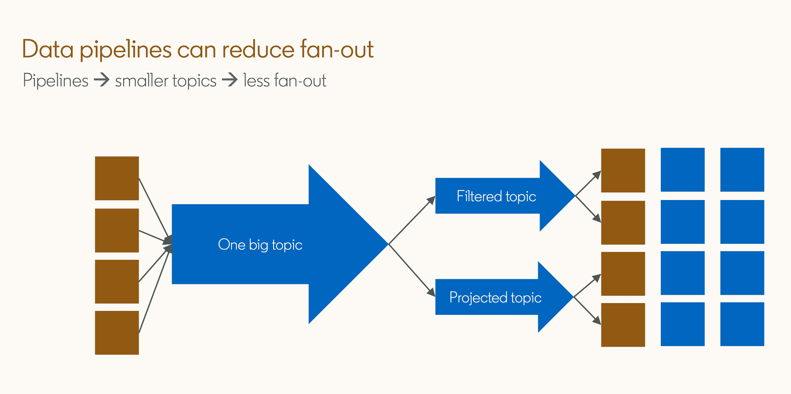

# LinkedIn 分层架构最大限度地减少了 Kafka 扩展问题

> 原文：<https://thenewstack.io/linkedin-layered-architecture-minimizes-kafka-scaling-issues/>

扇入和扇出都是当生产者和消费者都从同一个[卡夫卡经纪人](https://thenewstack.io/how-kafka-and-redis-solve-stream-processing-challenges/)那里争夺资源时出现的问题。但是 LinkedIn 发现有一种方法可以避免这种情况，那就是分层架构。

[Ryanne Dolan](https://www.linkedin.com/in/ryannedolan/) ，LinkedIn 的高级软件工程师，在当前的 2022:下一代 Kafka 峰会上，在他的演讲“Fan-in Flames:Scaling Kafka to million Producers”中提供了这一信息之后，他与新堆栈坐下来进行一对一的面谈，进一步讨论这一信息。

LinkedIn 的架构出于地理复制的目的将生产者和消费者群体分开。数据通过 Brooklin 数据总线在两者之间流动。Dolan 在职业生涯早期有使用 LinkedIn 分层拓扑的经验，后来在与客户合作时注意到了扇入和扇出的问题，并意识到 LinkedIn 的分层方法也解决了扇入扇出问题。资源使用的分离有助于缓解枯竭。

多兰的整个职业生涯都在大型科技公司从事大规模工作，所以当被问及一般规模的公司是否真的经常面临扇入扇出的问题时，他承认，“我总是对自己笑，因为这是一个[大时代](https://www.urbandictionary.com/)的概念，对吗？一个有着显赫头衔或大公司的人到处走。但我喜欢在大型科技公司工作，偶尔我会做一些小规模的演讲，人们会说，‘那对我有什么吸引力呢？’？你知道，这和我们这些不在大型科技行业的绝大多数工程师有什么关系？“为此，让我们介绍……

## **问题**

当太多的制片人让一个卡夫卡经纪人不堪重负时，就会出现粉丝效应的问题。随着应用程序的扩展，这个问题会有机地发生。在极端规模下，扇入可能比吞吐量更重要。

使用许多微服务、主机和容器的应用程序，甚至更常用的应用程序日志、跟踪和分布式跟踪都面临风险，或者已经受到扇入的影响。

> 资源使用的分离有助于缓解枯竭。

当太多的消费者群体压倒一个卡夫卡经纪人时，就会出现扇出现象。扇出是一个吞吐量乘数(IO ∝ Fin + Fin × Fout)，每个生产者1 MBps 通过 100 个生产者和 10 个消费者。这相当于 1.1GBps 的数据。  扇出的有机性较低，往往会通过增加消费群体来实现。

缓存水化或任何类型的广播或广播式架构都是扇出的典型例子。

## **伟大的均衡器**

多兰没有冒险将扇入和扇出的问题与大大小小的开发人员联系起来。  他的演讲包括了一个问题的模拟，只用了 1000 个生产者和最多 10 个消费者群体。这个模拟是在他的家用电脑上使用 Docker Compose 非常有创意地完成的，因为他不能，“只是借用一个数据中心，对吗？仅仅为了一个演讲而在云中旋转成百上千的机器是没有意义的。”

### **控制环境**

**服务器规格:** 800 MHz，8 核，每个代理使用 0.4 核。

### **应用程序**

**应用#1** :传统模式——每个工作负载有 N 个生产者和 M 个消费者。在这个模型中，生产者和消费者共享来自同一个代理的资源。

**应用#2** :镜像(应用#1 的派生)-每个工作负载的 N+1 个生产者和 M + 1 个消费者。这种方法增加了一个新的层，将生产者和消费者分开，这样他们就不会共享同一个代理。

### **测量值**

*   **端到端延迟**:记录重建(发送前)和消费者处理记录(提取后)之间的时间。
*   **发送延迟**:记录创建和写入最后一个代理的磁盘之间的时间(在 ACK 之前)。
*   **获取延迟**:记录被写入最后一个代理的 fin(在 ACK 之前)和被消费者处理(在获取之后)之间的时间。

**工作量:**

(恒定)10k RPS、10kQPS、300kBPS。

## 模拟

**模拟#1 运行了 1，000 个生产者、1 个消费者和 1 个工作负载。**

*以下结果以毫秒为单位。*

端到端延迟

发送延迟

提取延迟

*以毫秒为单位的结果*

端到端和发送有意义。附加层增加了额外的时间。没什么好惊讶的。Fetch 是它开始偏离预期的地方。从获取延迟的角度来看，直接存储和镜像存储有什么区别？那是扇入。在直接场景中，数据由 1，000 个生产者发送，但是在镜像场景中，数据仅由一个生产者(镜像制造者)发送。

在最坏的情况下，1 个消费者的端到端性能要差 13%。镜像使延迟降低了 1.13 倍，但并不像通过两个群集时预期的那样降低了 2 倍。

**模拟#2 使用 1，000 个生产者、10 个消费者、10x 1 工作负载(10 个工作负载)运行。**

*以下结果以毫秒为单位。*

端到端延迟

发送延迟

提取延迟

考虑到这些限制，端到端延迟不出意料地糟糕，但结果令人惊讶的是，镜像延迟现在一直更快。尽管在端到端延迟方面稍快，但镜像提取延迟要快得多。这是生产者和消费者争夺所需资源的所有证据。

扇入可以很快压倒一个代理，甚至在低吞吐量或相对低吞吐量的情况下，  如第一个模拟中所见，扇出为那场比赛加油。镜像减少了 23%的端到端延迟。是的，增加了一跳，但延迟仍然减少了。

虽然这个例子是人为的，但它仍然清楚地说明了生产者和消费者争夺资源。扇入可以很快压倒代理，即使在低吞吐量的情况下。扇出放大了这种效应。**复制是一种扇出分配器。**

## **减少扇出的分层拓扑**

有两种方法可以实现内部复制和镜像。上面的例子中使用了镜像。

**镜像**是一种集群到集群的镜像拓扑。这使用外部拓扑 Mirror Maker，并支持集群到集群。这减少了扇出和扇入(如上例所示)。

**内部复制**是一种代理到代理的复制，已经内置于 Kafka 代理中。这需要使用 KIP-392 从跟随器获取。这增加了耐用性。

**数据管道**减轻 Kafka 经纪人压力的另一种方法是，除了镜像之外，增加数据管道。

上面的模拟向我们展示了这个例子！==最佳扇入输出。

有两种方法可以让我们获得更多想要的结果。我们可以使用数据管道将主主题过滤成较小的主题，并以这种方式划分消费者群体。

第二种方法是创建许多小主题，在将它们发送给消费者群体之前，将它们组合成更大的聚合主题。这种方式优于单独发送小主题，尤其是在执行连接时。

应用程序日志是在一个大主题或划分成小主题之间进行选择的一个很好的例子。一家科技公司希望将其所有日志保存在云中，为开发人员从应用程序的一个部分访问提供一个特定的流，为另一个领域的开发人员提供一个特定的流。

这适用于任何一种图表样式。在第一张图中，所有应用程序将日志事件发送到一个大主题，这个大主题将所有内容发送到云。数据管道根据应用程序 ID、容器 ID 和主机 ID 路由读取。消费者可以处理单个应用程序、容器或主机。

在第二个图中，每个应用程序向自己的主题发送数据，数据管道跨容器和主机聚合数据，并将数据发送到云。

## **减少扇入的分层拓扑**

这里的方法是将读集和写集分开。

Dolan 说，“如果你只在应用程序的一个部分看到这个问题，合理的第一步应该是分成读写代理。”他补充说，读集与写集是“最简单的(拓扑结构)，并且在某种程度上是可行的”。“到一个点”指的是扩展，因为如果数据量相对于群集的大小而言较小，则可能是时候采用新方法了。

这种方法的一个更高级、更复杂的应用是创建一个摄取层。

这包括分散在多个摄食集群中的生产者。

### **分区**

分区有助于减轻扇入，但是循环粘性分区带来了一系列需要准备的挑战。要成功使用循环粘性，请尝试限制每个生产者的代理数量，这样所有生产者就不能向一个代理发送数据，或者测量延迟以避免缓慢的分区。虽然短暂的延迟峰值不是大问题，但它可能会导致下游问题。

### **分片或联合生产商或批量**

以下所有方法，因为它们处理生产者的分离和组合，取决于每个生产者发送的数据量和拓扑的其余部分，但所有这些方法都可能有助于减少扇入。

分片:将工作负载分成不重叠的组。

组合生产者:避免在同一个应用程序中有许多生产者客户机。

批处理:每次请求发送更多记录。

## **LinkedIn 的多层拓扑**

LinkedIn 的拓扑解决了扇入和扇出的问题，因为它将生产者与消费者分开。多兰说，“我通常从地理复制的角度来谈论它。”数据管道的预期目的是将数据从一个数据中心传送到另一个数据中心。

但是这种两层拓扑有一个副作用——减少扇入和扇出。生产者倾向于连接到本地集群，而消费者倾向于连接到聚合集群，他们之间唯一的东西是 LinkedIn 的 [Brooklin 数据总线](https://thenewstack.io/how-linkedin-paypal-each-beat-database-lag-with-home-built-open-source/)。

LinkedIn 只是通过在两层集群之间放置一条管道，并将生产者与消费者分开，避免了任何扇入和扇出问题，而不是真正针对那个问题。

## **结论**

如果应用程序正在努力应对扇入或扇出，那么最好的起点是将读取和写入分开。在扇入、扇出的实例中，如果资源耗尽，添加跳并不总是意味着更长的时间。如果您在公司范围内看到这种情况，那么很可能已经进行了大规模部署，建议使用镜像。扇入和扇出可能会导致延迟问题，但它们不是必须的。分层方法有助于缓解当前的问题或完全避免这些问题。

<svg xmlns:xlink="http://www.w3.org/1999/xlink" viewBox="0 0 68 31" version="1.1"><title>Group</title> <desc>Created with Sketch.</desc></svg>