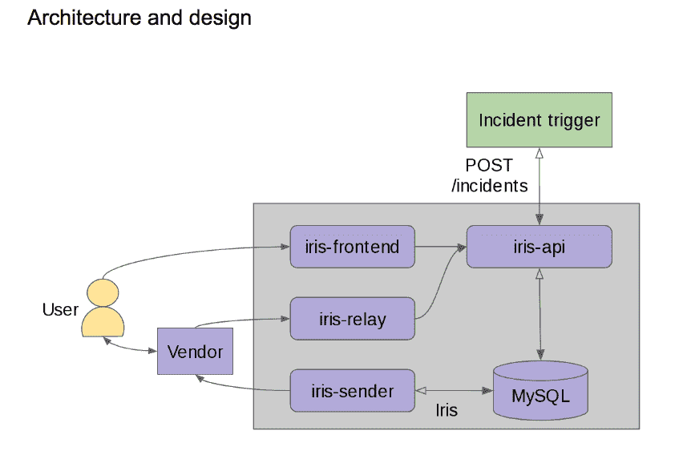

# LinkedIn 开源危机呼叫树工具

> 原文：<https://thenewstack.io/linkedin-open-sources-tools-crisis-call-tree/>

你要给谁打电话？

社交网络服务 [LinkedIn](https://www.linkedin.com/) 已经开源了内部开发的两个工具，用于在服务遇到问题时回答这个问题。

网站可靠性工程师 [Daniel Wang](https://www.linkedin.com/in/daniel-wang-12265888) 在博客文章中解释道[“在 LinkedIn 这样大的公司，服务质量下降与其说是‘如果’不如说是‘何时’的问题。](https://engineering.linkedin.com/blog/2017/06/open-sourcing-iris-and-oncall)

“当事情发生时，我们需要尽快上报，以确保问题得到解决。这通常采取给随叫随到的工程师打电话的形式，但如果这个人不接电话怎么办？”

该公司以前使用手动流程来确定下一个联系人，但发现这在一个快速发展的公司中效果不佳。

2015 年，该公司开始研发自动系统 [Iris](https://github.com/linkedin/iris) ，该系统以希腊信息女神命名。Iris 允许用户定义一个升级计划，一旦发生事故，该计划将自动执行。

计划是逐步制定的。如果 Iris 没有收到第一个联系人的回复，它将继续执行下一步，直到有人回复或不再有已定义的步骤。它定义了优先级，从低到紧急，并允许用户将联系方式映射到这些优先级。它没有规定如何联系每个人，但考虑到了个人偏好:一个人可能会选择垃圾信息而不是电子邮件，而另一个人可能会选择短信。

在博文中的一个例子中，它同时向整个监控基础设施团队发送一条中优先级消息，同时向主要待命人员发送一条高优先级消息。可以配置重复的次数和频率。

Iris 支持自定义角色，使用可插拔的角色查找方法，而不是专门定义要升级的用户。它还可以与多种消息服务配合使用，包括 Slack、Twilio 和 SMS 消息。

LinkedIn 大量使用“团队”、“随叫随到”和“经理”角色，每个角色都是由一个独立的工具动态确定的，这个工具叫做 [Oncall](https://github.com/linkedin/oncall) 。它将 Iris 从跟踪这些细节中解放出来，使其能够专注于消息传递。

Oncall 提供了一个日历来跟踪哪些团队成员在某个特定的班次待命。它支持[全天候](https://en.wikipedia.org/wiki/Follow-the-sun)日程安排，并且它的用户界面使得管理者可以根据需要轻松地做出改变。其他不管理 LinkedIn 中关键应用程序的团队，比如销售，使用 Oncall 作为专门的日历。

Iris 的唯一任务是确保事故得到确认。Twilio 和其他消息供应商处理消息传递，其他系统处理警报。

王解释 Iris 的架构:

*“…应用程序通过向 Iris 的 REST API 发送 POST 请求来触发事件，该 API 在其数据库中跟踪事件。然后，Iris sender 使用这些事件数据根据事件的升级计划生成消息，将通知转发给外部消息供应商，如 Twilio 或 Slack，以便进行交付。然后，用户收到消息，并通过使用 Iris 前端或向供应商发送回复来对其进行响应，以对事故进行索赔。*

如果索赔是通过供应商处理的，那么一个中继会通过公司的防火墙提供对 Iris 内部的访问。

最后，API 接收用户要求索赔新事件的请求，将事件标记为已确认。事故被索赔后，Iris 的工作就完成了；它保证了成功的消息传递，并确认有人正在响应消息，因此它停止进一步升级，”王解释说。

Iris 被设计成模块化的，独立于外部应用程序。

LinkedIn 已经发布了大约 100 个项目作为开源，包括流处理框架 [Samza](http://samza.apache.org/) ，分布式流媒体平台 Kafka，这两个平台现在都在 Apache Software Foundation 之下，并且在 3 月份捐赠了 [Flashback](https://github.com/linkedin/flashback) ，这是一个根据 [BSD 双条款许可证](https://en.wikipedia.org/wiki/BSD_licenses)为开发者测试模拟互联网流量的工具。

LinkedIn 网站可靠性高级经理 Richard Waid 表示，目前还没有向 ASF 捐赠 Iris 和 Oncall 的计划，但是“我们有兴趣与其他开源项目合作和整合，并从开源社区获得关于 Iris 和 OnCall 的反馈。”

特征图片: [**马丁艾比格伦**](https://www.flickr.com/photos/twicepix/) 的[报警](https://www.flickr.com/photos/twicepix/3902796929/in/photolist-6WSRye-Nh2J7-7HBr85-5MiE-9nQhQE-4iHAnz-9jezut-cagS-dRKkmS-2sHHNm-24whQ-6Kti3J-8aqiU-vQhq-58qnqs-4WXJhG-68kmaN-G3uet-9sjC3v-ke7AtH-5ZH94L-9YPeeT-2CLtH7-5peTZ7-5u4z4L-6KuyBd-4Xg6-F3tqq-7KvvDn-a4gnBr-7yC8FT-7HxvyK-95K2x1-52nkoK-a8UrJ-e8VPdw-4uBTTg-uN3PQ-4HSf23-7NYUA3-nvtL7z-Psoma-7cUiMv-6Kpa6p-bybKN4-34rx3B-8VVXmV-tZ1Gg-662sfB-DSGGK)，授权 **[CC BY-SA 2.0](https://creativecommons.org/licenses/by/2.0/)** 。

<svg xmlns:xlink="http://www.w3.org/1999/xlink" viewBox="0 0 68 31" version="1.1"><title>Group</title> <desc>Created with Sketch.</desc></svg>