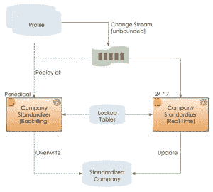
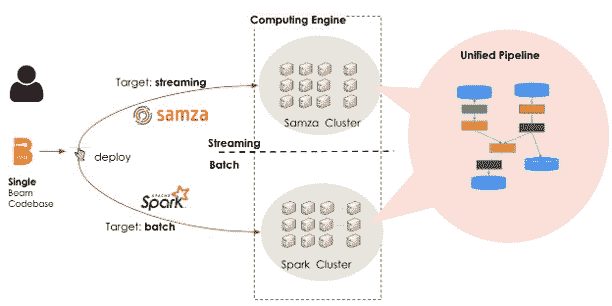
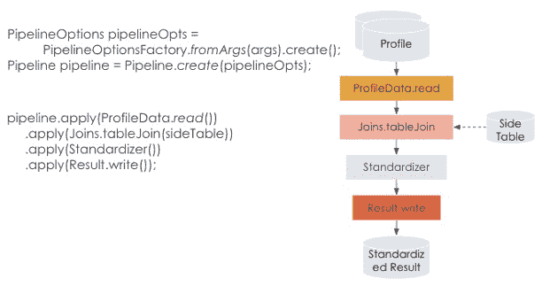
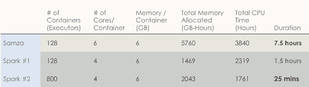

# LinkedIn 用 Apache Beam 统一了流和批处理

> 原文：<https://thenewstack.io/linkedin-unifies-stream-and-batch-processing-with-apache-beam/>

通过迁移到 [Apache Beam](https://beam.apache.org/) ，社交网络服务 LinkedIn 统一了其流媒体和批处理源代码文件，并将数据处理时间减少了 94%。

最初，刷新数据集的工作“回填”最初是作为一组流处理作业来运行的，但作业变得越复杂，问题就越多，多作者 LinkedIn 博客条目[周四发布的解释道。](https://engineering.linkedin.com/blog/2023/unified-streaming-and-batch-pipelines-at-linkedin--reducing-proc)

然后通过 [lambda 架构](https://en.wikipedia.org/wiki/Lambda_architecture)批量处理回填，带来了一系列新问题——现在有两个不同的代码库，伴随着拥有和维护两套源代码而来的所有挑战。lambda 架构被 Beam API 所取代，它只需要一个源代码文件来进行批处理和流式传输。该项目取得了成功，资源使用总量下降了 50%。

思想领袖和流媒体软件公司正在就[实时处理和批处理进行辩论。一方坚定地认为，在流媒体真正成为主流之前，软件必须变得更容易被所有技能水平的开发者所使用。反驳者说，开发人员必须达到构成当前流媒体系统的不一致的技术栈和语言的更高技能水平要求。](https://thenewstack.io/data-streaming-for-when-micro-batching-just-isnt-fast-enough/)

LinkedIn 最近通过使用 Apache Beam 统一其流媒体和批处理管道，将其数据处理时间减少了 94%，这为简化论点赢得了巨大的胜利。

## 回填的挑战

LinkedIn 的标准化过程是用户数据输入字符串(职位、技能、教育背景)到内部 id 的映射。搜索索引和推荐模型需要标准化数据。管道中还使用了更高级的人工智能模型来连接复杂的数据(工作类型和工作经验)，以标准化数据供进一步使用。

标准化要求以两种方式处理数据:实时计算以反映即时更新，以及在引入新模型时定期回填以刷新数据。当实时和回填都作为流处理来处理时，它们通过运行 Beam 管道的 [Apache Samza Runner](https://beam.apache.org/documentation/runners/samza/) 来执行。这种方法一直有效，直到下列问题变得无法解决:

*   回填处理期间，实时作业无法满足时间和资源要求。
*   随着训练模型变得越来越复杂，每个回填作业所需的以 40，000/秒的速率 9 亿个配置文件的目标要求变得无法实现。
*   流式集群没有针对回填的尖峰资源足迹进行优化。

图 1

第一个优化移至批处理回填，并使用 lambda 架构执行逻辑。这是可行的，但不是最佳的，因为 Lambda 架构带来了 Matryoshka 挑战玩偶——第二个代码库。第二个代码库的引入开始要求开发人员用两种不同的语言和堆栈构建、学习和维护两个代码库。

流程的下一次迭代引入了 Apache Beam API。使用 Apache Beam 意味着开发人员可以回到一个源代码文件上工作。

## 解决方案:阿帕奇光束

Apache Beam 是一个开源的统一模型，用于定义批处理和流数据并行处理管道。开发人员可以使用一个开源的 Beam SDKs 构建一个程序来定义管道。然后，管道由 beam 的分布式处理后端之一执行，其中有几个选项，如 Apache Flink、Spark 和 Google Cloud Dataflow。

在这个特定用例中，统一管道由 Beam 的 Samza 和 Spark 后端提供支持。Samza 每天处理两万亿条消息，具有大状态和容错能力。Beam Samza Runner 在本地将波束管道作为 Samza 应用程序执行。Spark 后端通过 LinkedIn 的永恒洗牌服务和模式元数据存储来处理数 Pb 的数据。Beam Apache Spark Runner 使用 Spark 执行射束管道，就像本地 Spark 应用程序一样。

## 它是如何工作的

射束流水线管理处理逻辑的有向非循环图。下图中的管道读取 ProfileData，用侧表连接表，应用名为 Standardizer()的用户定义函数，并通过将标准化结果写入数据库来完成。该代码片段由 Samza 集群和 Spark 集群执行。

即使在 Beam 实例中，当源代码相同时，批处理和流处理作业接受不同的输入并返回不同的输出。流式输入来自无界源，如 Kafka，它们的输出更新数据库，而批量输入来自有界源，如 HDFS，并产生数据集作为输出。

p 变换是射束工作流程中的现成步骤，它从任一来源获取输入，并执行处理功能，然后产生零个或多个输出。LinkedIn 在其统一的 PTransforms 中增加了进一步简化 Beam API 的功能。Unified PTransforms 为流和批处理提供了两个 expand()函数。在运行时检测管道类型，并相应地调用适当的 expand()。

成功指标

作为流处理执行回填的原始方法需要超过 5，000 GB 小时的内存和将近 4，000 小时的 CPU 时间。迁移到 Beam 后，这些数字减少了一半。迁移后，完成工作所需的 7 个小时减少到仅 25 分钟。

总体而言，这相当于节省了 94%的处理时间和 50%的总体资源使用量。根据服务成本分析，运营成本降低了 11 倍。

## 未来作品

这只是迈向真正端到端融合解决方案的第一步。LinkedIn 继续致力于降低流媒体和批处理解决方案的复杂性。虽然只有一个源代码文件，但不同的运行时二进制堆栈(流中的 Beam Samza runner 和批处理中的 Beam Spark runner)仍然会增加复杂性，例如了解如何运行、调整和调试两个集群，两个引擎上运行时的操作和维护成本，以及两个 runner 代码库的维护。

领英高级软件工程师[程育红](https://www.linkedin.com/in/yuhong-cheng-cs/)是领英帖子的主要作者，程育红、张、是共同作者。

<svg xmlns:xlink="http://www.w3.org/1999/xlink" viewBox="0 0 68 31" version="1.1"><title>Group</title> <desc>Created with Sketch.</desc></svg>