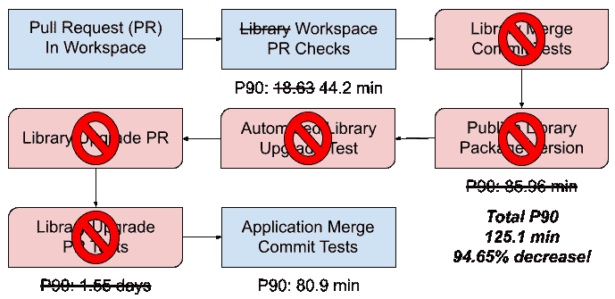
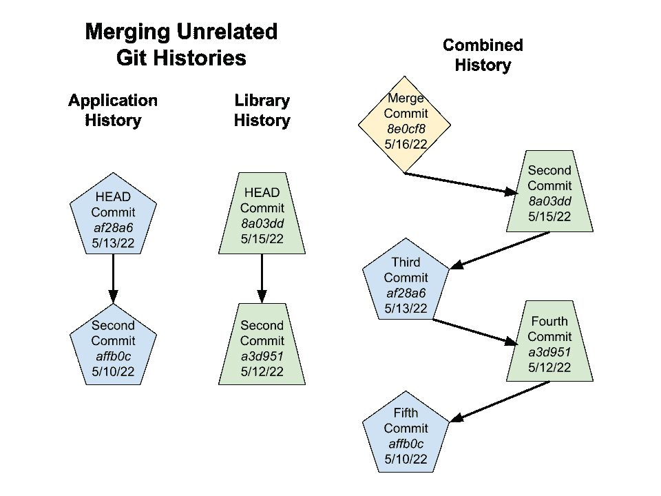

# Yarn Workspaces 如何加速 LinkedIn 代码交付

> 原文：<https://thenewstack.io/linkedin-yarn-workspaces/>

这里有一个熟悉的故事:一个[单片代码库](https://thenewstack.io/has-monolithic-architecture-gotten-a-bad-rap/)不断增长，以满足[对新功能](https://thenewstack.io/what-to-do-when-you-dont-have-time-to-test-your-microservices/)和[扩大用户群](https://thenewstack.io/how-to-support-a-million-users-on-your-website-a-success-story/)的需求。不明确的所有权、增加的构建时间、每个应用程序不成比例的测试数量只是随之而来的一些令人头疼的问题。

因此，这个故事讲述了巨石柱是如何超过其使用寿命的。一个接一个，不相关的产品领域被分离，一个分布式系统被建立在它的位置上。由于不断增长的代码库，LinkedIn Talent Solutions 的团队将网站的前端从整体迁移到分布式系统，然后迁移到 monorepo。根据一篇博客文章，Yarn 工作空间的使用对这一迁移起到了重要作用。

“在过去的几年里，我们一直在关注 workspaces 的潜力，这是一项由包括 npm、pnpm 和 yarn(我们当前选择的包管理器)在内的几个包管理器提供的技术，能够为新型 monorepo 提供一流的支持，”Yarn Staff 前端工程师 Jordan Hawker 写道。

Yarn 工作空间大大减少了发布变更和升级包的时间，然而，提交到发布的时间表又一次加快了。LinkedIn Talent Solutions 最终迁移回了一个分布式系统，同时继续统一 yarn 工作空间，使他们能够节省 97%的时间。

## **不可靠的依赖图**

不可靠的依赖图导致了一些严重的问题。这导致了版本升级和迁移，样板文件的更改重复了多达 70 次，这取决于受影响的包的数量。 [yarn-link](https://classic.yarnpkg.com/lang/en/docs/cli/link/) 是一款流行的开发工具，它连接本地包，使开发人员能够在项目间运行 gore，并进行未合并的更改，有助于开发人员进行端到端测试，但却变得不可靠。

依赖图也对提交到发布的时间线产生了很大的影响，这是拉请求(PRs)到达部署管道所需的时间。一个变化需要整个生态系统中多个紧密耦合的 PRs。特性经历了几个周期的工具管道。部署过程可能需要大约 39 个小时。开发人员需要等待多个工作日才能将变更发布到产品中。

## **进入:Yarn Workspaces 和一种新型的 Monorepo**

与过去的整体不同，工作区容纳了多个不同的项目，这些项目在同一个存储库中相互交叉引用。这消除了对 yarn-link 的需求，同时保持了清晰的代码所有权和构建隔离。应用程序和工作区中的其他使用者可以立即使用包中的所有代码更改。

将他们的存储库转移到工作区后，不再需要独立地版本化或发布，这意味着 LinkedIn 不再需要为每个发布的更改运行测试套件。通过将代码放在同一个存储库中，他们能够在运行应用程序测试的同时运行包测试，从而确保彼此之间的兼容性。这种方法可以将自动升级软件包的时间缩短到不到一天。

## **创建纱线工作区**

LinkedIn 的工程师创建了一个脚本来自动化每个存储库的迁移。使用存储库名称，脚本将其克隆到一个临时目录中，并删除任何不必要的文件(例如 gitignore，。npmignore，yarn.lock)。接下来，它利用 git mv 将 times 移动到新的工作区目的地，并将克隆的目录添加为临时远程目录，然后将外部库合并到应用程序的 git 历史记录中，并带有—allow—related—histories—标志。

通过将新包添加到应用程序存储库的根 *package.json* 中来注册新包，确保声明了先前传递所需的任何附加依赖项。LinkedIn 还采用了在整个工作区同步依赖版本的策略，确保每个库都是根据部署到生产中的供应商捆绑包的相同包来构建和测试的。

## **重新思考他们的构建…再一次**

但这并不是他们故事的结尾，因为代码库还在继续增长。仅仅一年时间，单次测试的时间从大约 45 分钟增长到将近 100 分钟。有了 LinkedIn 工程师们之前的所有经验，工程师们已经知道当前的轨迹是不可持续的。

回到一个分布式系统，他们去了！测试运行是在操作机器上为每个库和应用程序本身产生的，因为每个包都已经支持单独构建和测试。这种方法仍然有一个瓶颈——它总是系统中最慢的单独构建。

在这个特定的系统中，它是应用程序套件。为了减少影响，所有不相关的应用程序构建步骤都被分发。执行时间减少了 50%。即使更多的工作空间被迁移到存储库中，构建持续时间仍然保持一致，甚至随着他们继续增加分布式构建的容量而略有下降。

这个解决方案的第二部分是测试执行方式的改变。迁移包的核心应用程序和测试包含在存储库中。核心应用程序测试在每个构建中执行，但是测试不再在不受变更影响的特定包中运行。测试将在受影响的包以及受该包影响的任何包上运行。

## **今天**

目前，有 28 个存储库被迁移到 Yarn workspace 中，这对开发人员的工作效率产生了相当大的影响。最初被认为是雄心勃勃的代码交付 95%改进的最初目标在六周项目结束时实现了，因为最近应用程序的六周提交到发布 P90 为 70 分钟，这意味着时间缩短了 97%。不再需要每月 2000 次以上的版本升级，这大大减轻了自动化工具的压力。

其他优势包括通过将代码放在一个存储库中来提高代码的可发现性，从而为 code mod 应用程序和跨多个库的同步迁移提供更多机会。由于所有包都与同一版本对齐，因此依赖关系的新鲜度更可靠。LinkedIn 引用工作区和一致的开发人员环境来帮助工程师获得信心和内心的平静。

开发人员满意度调查结果如下图所示。

## **结论**

LinkedIn Talent Solutions 背后的团队将 Yarn Workspaces 的发展归功于他们的应用程序架构，而不必牺牲他们的多回购策略的优势，重新构建他们的测试配置以利用分布式构建，从而在拉请求的测试持续时间方面产生了超过 50%的改进，而在覆盖率方面没有任何倒退，因为他们努力进一步减少所需的测试量。将提交到发布的时间减少了 97%,向他们关注的加速代码交付迈出了一大步。

<svg xmlns:xlink="http://www.w3.org/1999/xlink" viewBox="0 0 68 31" version="1.1"><title>Group</title> <desc>Created with Sketch.</desc></svg>