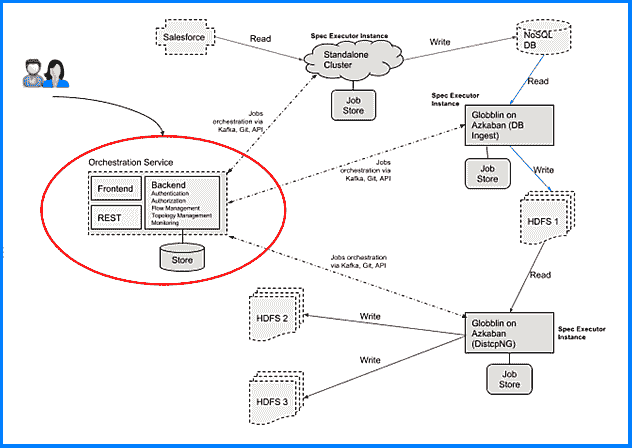

# LinkedIn 的 Gobblin:一个轻松获取大数据的开源框架

> 原文：<https://thenewstack.io/linkedins-gobblin-open-source-framework-gobbling-big-data-ease/>

社交媒体服务 [LinkedIn](https://www.linkedin.com/feed/) 的工程团队在 2014 年首次推出了[goblin](https://gobblin.apache.org/)作为离线大数据的通用数据摄取框架，以 MapReduce 模式在 Hadoop 上运行。随着新功能的加入，该框架能够支持各种执行环境，并可扩展以处理各种数据速度，Gobblin 迅速从单一的数据接收工具发展为强大的数据管理生态系统。Gobblin 于 2015 年年中[开源](https://github.com/apache/incubator-gobblin)，并已发展成为一个分布式数据集成框架，简化了大数据的常见方面，从接收到复制到组织，实现了跨流和批处理环境的完整生命周期管理。

在 Gobblin 的第二个生日后不久，该团队觉得它已经准备好迎接重大时刻了:加入其他 LinkedIn 开源项目有助于 [Apache 软件基础](https://www.apache.org/)，包括 [Helix](https://helix.apache.org/) 集群管理框架和 [Kafka](https://kafka.apache.org/) 分布式流媒体平台。Gobblin 于 2017 年 2 月被 Apache 孵化器项目接受，此后花了一年时间完成内部流程。最后一步，贡献实际代码，最近已经完成，Gobblin 现在已经成为一个正式的 Apache 实体。

在孵化之前，Gobblin 已经被苹果和贝宝等公司在 LinkedIn 之外接受。像 CERN 和 Sandia 国家实验室这样消耗和处理难以想象的数据量的组织也采用 Gobblin 来帮助他们进行研究。

《新堆栈》采访了 LinkedIn 的软件工程师 Abhishek Tiwari，讲述了 Gobblin 的旅程。

**为什么选择 Apache，孵化过程具体涉及什么？**

尽管 Gobblin 已经在外部组织中取得了成功，但我们相信，成为这个星球上最有影响力的开源组织之一的正式项目将确保持久性和自我维持，以及进入更广泛的社区，从而帮助继续发展。自从去年年初开始 Apache 孵化过程以来，我们已经看到了这方面的良好进展。Apache Gobblin 社区成员已经提出、构建并开始引领一些关键的开发，包括 Amazon Web Services 模式增强和自动伸缩性。

这个过程的第一步是 Gobblin 孵化提案，该提案被 Apache 一致接受。然后与导师和拥护者一起工作，建立代码捐赠和许可证，同时与微软法律团队合作，建立 Apache 基础设施……所有这些都是在正式孵化之前。

**是什么因素推动了 Gobblin 的进化？**

Gobblin 最初的想法是减少整个公司在数据摄取方面的重复工程和操作工作，为批处理和流生态系统中的不同数据源构建和维护不同的管道。有一段时间，我们运行超过 15 种不同的管道，每一种都有自己的错误模式、数据质量能力、伸缩性和性能特征。

我们对 Gobblin 的指导愿景是构建一个框架，它可以支持跨流和批处理源和接收器的数据移动，而不需要特定的持久性或存储技术。在 LinkedIn，Gobblin 目前集成了十几个数据源，包括 Salesforce、Google Analytics、Oracle、[、LinkedIn Espresso](http://www.slideshare.net/amywtang/li-espresso-sigmodtalk) 、MySQL、SQL Server、Apache Kafka、专利和出版物源等。

多年来，我们在实现这一愿景方面取得了长足的进步，但也发展到了端到端数据管理等相邻功能，从原始数据接收到多格式存储优化、针对合规性的细粒度删除、配置管理等等。Gobblin 与该领域其他技术的关键区别在于，它有意地与计算和存储环境无关，但它可以在许多环境中本机执行。因此，您不必运行 Hadoop 或 Kafka 来使用 Gobblin，尽管如果您的公司部署了这些技术，它可以利用这些技术。

**goblin 主要适用于需要大量数据的超大型组织，还是适用于不同/较小的实体？**

我们看到了全面的采用。较小的实体通常不太愿意采用这种方式，因为他们忙于让自己的创业公司起步。无论规模如何，共同的主题是业务是数据驱动的，有多个数据源和接收器，并有一个 Lambda 架构——流和批处理生态系统。中小型公司使用 Gobblin 的一些例子有 [Prezi](https://prezi.com/) ，Trivago 和 [Nerdwallet](https://www.nerdwallet.com/) 。

**最近的一项发展是 Gobblin 即服务。这是怎么回事？**

目标是为数据管理构建一个 PaaS(平台即服务),封装并统一服务背后的异构数据移动和处理部署(goblin 或非 goblin)。

随着越来越多的数据管理“瑞士军刀”汇聚到 Gobblin，由于需要人工参与部署、管理和操作跨多集群、多区域部署的管道，挑战变成了漫长的交付周期。这导致中央 Gobblin 开发和运营团队成为推出新管道的瓶颈。我们构建了 goblin-as-a-Service(GaaS ),通过提供一种自助式编程方法来开发、部署和操作数据集成管道，从而解决这些问题。

举例来说，在下图中，红色圆圈内的组件是 GaaS，而其余组件是 GaaS 为执行作业而与之协调的不同部署:

Gobblin 即服务

**微服务和容器化如何与 Gobblin 相契合？**

goblin-as-a-service 利用了容器化的趋势，允许将 goblin 作业容器化，并与其他作业隔离运行。类似地，Gobblin 的核心引擎是为基于微服务的世界中的摄入而构建的，具有优化功能，如远程服务调用的管道化以隐藏延迟，以及连接器中的节流功能以防止在线服务的 DDOS 摄入流量。

**goblin 有哪些真实的使用案例？**

1.  **自助式**:用户可以通过 REST APIs 或任何 Gobblin 部署上的 UI 以编程方式创建作业，让运营团队专注于部署和升级。
2.  **最佳资源使用**:用户可以提交作业，并将其留给 goblin-as-a-Service，以便根据资源和 SLA 约束，以最佳方式选择执行器实例，并将逻辑作业编译为物理作业，作为打包的多租户作业或单租户作业的一部分来执行。
3.  **故障转移和升级**:在故障转移或升级的情况下，执行 GaaS 工作的技术可以透明地换出，而不会影响用户，也不会有用户的干预(例如，运营团队可以用 Gobblin 替换 Camus 部署，而不会影响用户)。
4.  **全球状态**:GaaS 在混合技术部署中的统一因素使运营团队能够轻松监控和管理其组织中数据环境和沿袭的全球状态。

**人们如何才能加入正在戈布林周围成长的社区？**

有各种各样的[方式](https://gobblin.apache.org/get-involved/)参与 Apache Gobblin 社区，包括贡献特性、测试和错误修复、传播想法，或者只是帮助更新文档。此外，1 月 25 日将在 LinkedIn 位于旧金山的办公室举行一次大数据会议，来自 LinkedIn、Prezi 和其他湾区公司的演讲者将谈论数据管理和数据集成领域令人兴奋的新发展和挑战。请加入我们吧！

<svg xmlns:xlink="http://www.w3.org/1999/xlink" viewBox="0 0 68 31" version="1.1"><title>Group</title> <desc>Created with Sketch.</desc></svg>