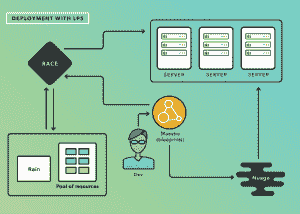
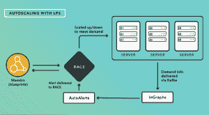

# LinkedIn 建立私有云以加速开发

> 原文：<https://thenewstack.io/linkedins-private-cloud-links-internal-apps/>

希望降低开发和硬件成本，并建立一个管道来加速新功能的开发，LinkedIn 推出了自己的私有云，称为 LPS (LinkedIn 平台即服务)。

“LPS 将整个数据中心作为单一资源池呈现给应用程序开发人员。它允许他们在几分钟内部署自己的应用程序，零票，”LinkedIn 的工程总监 Steven Ihde 在宣布该计划的博客文章[中写道。“这使得开发人员可以专注于构建，而不是浪费时间寻找机器资源或等待部署。”](https://engineering.linkedin.com/blog/2016/04/faster-and-easier-service-deployment-with-lps--our-new-private-c)

Ihde 在后续采访中表示:“我们很高兴能够将自动化提升到一个新的水平。“我们现在正在自动化管理应用程序的整个流程。”

Ihde 指出，LinkedIn 已经在更新软件版本等底层流程方面实现了良好的自动化。就在两个月前，该公司宣布了一条快速发布流水线的[自动化。但像设置新应用程序这样更复杂的操作需要一个基于票证的系统，需要人工干预。](https://thenewstack.io/need-speed-linkedins-rapid-release-pipeline-mobile-app-development/)

“LPS 将整个数据中心作为一个资源池呈现给应用程序开发人员，”Ihde 在宣布发布的博客帖子中写道。“当组成 LPS 的所有系统都完成时，我们的整个托管环境将作为一个整体系统存在，我们的内部用户可以只通过 API 调用在线提供新服务，而不是多个 JIRA 票证。”

那肯定是下一级。

LinkedIn 拥有近千项服务和数十万个服务实例，这些服务使网站得以运行。LPS 取代了许多手动或半自动的流程来分配资源、决定在哪里运行什么以及最有效地利用硬件。

Ihde 写道:“我们一直在探索从更小的硬件空间中获取更多资源的方法，同时通过使我们的软件栈更加面向应用来提高生产率。”“LPS 还将某些工作负载的硬件占用空间减少了 50%或更多。简而言之，这个新的内部平台将使我们的工程师更具生产力、灵活性和创新性，同时为公司节省资金。”

## **开头**

工程师们为他们的新的理想主机环境在实践中需要做的事情制定了标准:

*   使服务所有者和工程师能够管理其服务的生命周期。
*   坚持不懈地优化我们的基础设施，以获得最佳性能，同时保持稳健性和适应性。
*   通过让更多应用程序或资源在线来保持高可用性，自动补偿人为错误和意外事件。
*   没有“黑客”或额外的技术债务，以实现上述要点。

LPS 是一个定制的云解决方案。工程师们从拉动现有的 LinkedIn 服务开始，包括 [Nuage](https://www.linkedin.com/pulse/invisible-infrastructure-alex-vauthey) 、 [inGraphs](https://engineering.linkedin.com/blog/search?q=ingraphs) 和 [AutoAlerts](https://engineering.linkedin.com/blog/search?q=autoalerts) 以“提供自动供应数据存储、提供运营和性能指标以及监控应用程序的功能，以确保新的应用程序实例在需要时启动。”

即使 LPS 是定制的，也尽可能利用开源解决方案。在审查了包括 [Docker](https://www.docker.com/) 和 [LXC](https://linuxcontainers.org/) 在内的几个可能选项后，该公司决定选择 [runC](https://runc.io) ，它最适合 LinkedIn 已经在使用的定制应用程序。

LPS 是多方面的，但 LinkedIn 在发布会上详细介绍了四个部分:Rain，RACE，Orca 和 Maestro。

### **下雨**

Rain”将容器化资源限制与主机分配相结合，以便在主机上安全地运行作业。Rain 知道在哪里运行它以及如何运行它，”Ihde 说。

在他的博客上，他说得更详细，称 Rain 为“LinkedIn 对资源分配和容器化的回答，它直接使用 Linux cgroups 和名称空间，还通过 [runC](https://runc.io/) 利用 libcontainer。”

“它不仅旨在为应用程序提供资源保证和安全隔离，还旨在与我们现有的基础设施无缝集成，”Ihde 写道。“在部署 Rain 之前，部署一项服务有时需要两天以上的时间。下雨后，这个时间减少到 10 分钟，节省了 95%的时间。”

### **种族**

Ihde 说，RACE(资源分配和控制引擎)是一个“套件管理系统”。RACE 将 RAIN 带到了一个新的高度:一个进程可能需要大量的实例，RACE 可以自动管理实例——根据需要添加或减少，确保在任何给定的时间运行正确数量的实例。它还重定向流量以响应故障或需求激增。

### **虎鲸**

Orca 这个名字是对 orchestration 这个术语的一种发挥，这个应用程序专注于编排一次性的工作。Ihde 写道:“工程师们经常要求的一项能力是能够为短期实验和其他工作启动大量主机。”

在使用 Rain 和 RACE 的过程中，工程师们意识到 LPS 已经拥有了创建工作、资源分配、运行工作和记录结果的自动化部件，但是这些系统并没有绑定在一起。

Orca 允许利用暂时可用的资源来运行实验和其他短期项目，预计将进行测试并取代当前的配置短期工作。

目前，Orca 每天提供 2000 个工作岗位，Ihde 估计这一数字到年底将增加到 50000 个。

### 大师

 Maestro 是 LPS symphony 的“指挥”，提供了“LPS 系统的全局视图，使
Maestro 能够“管理我们平台上应用配置的各个方面”，Ihde 写道。

Maestro 是“为一个长期的过程汇集一堆资源，例如，分配一个数据库，或者注册一项新的服务；它将所有部分连接在一起。Maestro 旨在作为“一站式商店”，为支持平台的应用程序维护一个持久的设置和配置库。

持久性存储”为将应用程序部署到 LPS 提供数据、计划和执行模型。蓝图定义了应用程序的理想状态，Maestro 通过采取必要的措施使数据中心的现实与理想相匹配来“实施”…通过为这些系统中的每一个构建控制平面 API，我们可以自动响应需求突然增加或网络中断等事件。”

不是所有的东西都会被转移到 LPS。例如，没有计划移动该公司的 Oracle 数据库。但 Ihde 写道，最终大多数内部应用程序和“目前使用的相关基础设施服务，如卡夫卡和[皮诺](https://github.com/linkedin/pinot)最终都将在这个新平台上找到家。”

## **开源？**

Ihde 计划审查可能向开源社区发布的部分 LP。目前还没有时间表，但他预计它们将是较低层次的片段，从雨或雨的片段开始。

他解释说:“在堆栈的底层，依赖性越少，所以这个过程对其他人就越有用。”RACE，Orca，Maestro 都是用 Rain 来运行 jobs，所以从 Rain 开始最有意义。此外，他建议该公司可以“用 Python 创建 Rain，用 Python 围绕 Docker 和 runc 构建一些东西，这些都是对开源社区有用的例子。”

令 LinkedIn 团队兴奋的是，他们刚刚开始探索有限合伙人的可能性。

一个有趣的潜力是使用 Nuage 有限合伙人可以给在线和离线世界带来合作。通过 LPS 提供的自动化意味着在数据处理作业和在线服务作业之间共享硬件资源。在较慢的流量高峰期间，有限合伙人可以将资源从在线服务重新分配给开发或数据处理工作。对储蓄的影响可能是巨大的。

Docker 是新堆栈的赞助商。

特写图片:大峡谷。照片由 T.C. Currie 拍摄。

<svg xmlns:xlink="http://www.w3.org/1999/xlink" viewBox="0 0 68 31" version="1.1"><title>Group</title> <desc>Created with Sketch.</desc></svg>