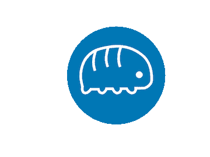
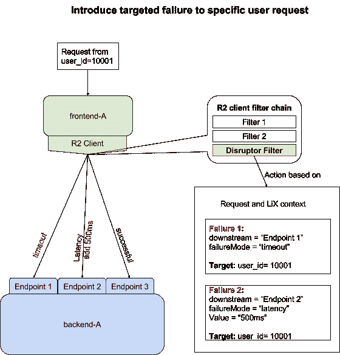

# LinkedIn 的 Project Waterbear 是一个防止软件超新星的弹性工具

> 原文：<https://thenewstack.io/linkedins-project-waterbear-resiliency-tool-preventing-software-supernovas/>

当构建软件时，大多数开发人员和工程师都专注于让它工作。然而，软件弹性工程师从另一面着手:以失败为标准进行设计。

没有听起来那么疯狂。在一个越来越复杂的系统时代，我们的构建由如此多的移动部件组成，以至于几乎不可避免地会出现一些问题，而且越早越好。容器化的基本点是至少组织和隔离组件，所以它们有希望在隔离中而不是在一起失败。更不用说平衡容器之间的负载了，因此即使出现问题，服务也有望至少部分可用。

《现场可靠性工程》( SRE)是关于失败作为新常态的禅:设计系统不仅仅是为了预测失败，而是拥抱失败。

LinkedIn 的 SRE 团队最近推出了[Project water bear](https://engineering.linkedin.com/blog/2017/11/resilience-engineering-at-linkedin-with-project-waterbear)——本质上是一种有组织的努力，为整个公司的应用程序和工程团队提供“应用程序弹性即服务”。这个项目奇怪的名字是向[缓步动物](https://en.wikipedia.org/wiki/Tardigrade)致敬，通常被称为“水熊”——微小的八条腿[微型动物](https://en.wikipedia.org/wiki/Micro-animal)能够在对几乎任何其他生命形式都致命的极端条件下生存，从海底火山到外层空间冰冷的黑色真空。

LinkedIn 网站可靠性工程高级主管 Bhaskaran Devaraj 表示，大约一年前，Waterbear 项目开始兴起。Devaraj 说:“在深入研究了许多网站问题后，我们发现了一个共同的模式——许多这些问题都是由不可预测的系统和应用程序故障引起的。“我们还意识到，尽管我们有令人惊叹的工程文化，但弹性并不是它固有的一部分。”

他继续说，理论上，每个开发人员都想编写有弹性的代码。然而，事实上，我们中很少有人有能力、训练或工具来度量他们代码的弹性。Devaraj 说:“大多数开发人员只是‘希望’他们的代码——或者框架——能够神奇地恢复，或者系统中永远不会出现故障。

因此，Waterbear 进入了这一空白，它旨在为开发人员提供一种切实可行的方法和一套工具，以了解他们的代码/系统依赖性……然后像老板一样接受失败，有选择地模拟失败场景，以观察他们的代码将如何表现。

例如，LinkedIn SRE 团队的另一名成员小李(音译)解释说，“水熊将使前端开发人员了解他们的哪一个依赖关系会导致他们的页面只需点击几下就崩溃。”当您公司的当前主页依赖于其依赖关系树中超过 550 个不同的端点时，这是一个特别有用的功能。

或者，比方说，允许分布式存储团队模拟网络分区或主机磁盘故障。“当然，Waterbear 给了开发者一些很棒的工具，”李补充道。“更重要的是，通过在现有的 CI/CD 管道中构建这些检查和防护，Waterbear 可以帮助开发人员自信地构建能够抵御现实世界动荡的系统。”

那么，水熊具体做什么呢？

Devaraj 说，成功地将弹性工程整合到一个组织的软件开发工作流程中有两个组成部分:不仅是技术变化，还有文化。SRE 团队确定了他们最初关注的两个广泛的技术领域，但意识到他们需要推动公司内部的文化变革，以便该技术真正成功地提高整体弹性。

水熊计划的标志:缓步动物

## 变得技术化

在技术方面，努力的目标是当前的需求和预期的未来。这归结为确保 LinkedIn 系统在智能处理故障的同时运行在一个有弹性的资源集群上，最终目标是设计自我修复系统。努力分为“混沌工程”类别——建立引入失败的智能工具——和改进 [Rest.li](https://github.com/linkedin/rest.li) ，该公司定制的开源 Rest 框架。

Devaraj 说:“Waterbear 需要改变框架本身的默认行为。“也就是说，通过为框架的重要设置提供价值，然后引入以弹性为中心的功能，以确保我们可以将优雅的降级功能融入我们所做的一切。(“适度降级”指的是确保当非核心依赖关系出现故障时(例如，广告无法加载到页面上)，页面仍将加载减少的信息。不理想，但对 UX 的影响仍小于重定向错误/“游标”页面)。

Waterbear 的“故障注入”工具库中的工具包括 LinkedOut，这是一个框架和工具，与 REST.li 客户端一起实现，允许工程师测试用户体验在整个应用程序堆栈的不同故障场景中如何降级。“这就像去掉一个依赖项并启用一个配置值一样简单，”李说。“从那里，任何 LinkedIn 员工都可以使用我们的 Ember web 应用程序或 Chrome 扩展来触发整个堆栈的故障。”

为了确保下游成员不会受到故障测试实验的影响，团队利用了 LinkedIn 现有的 [LiX A/B 测试和实验框架](https://engineering.linkedin.com/testing/quality-control-linkedins-testing-methodology)，李解释说，该框架通过对故障发生的位置和用户进行精确控制，“最小化故障测试的爆炸半径”。“有了 LiX targeting，我们可以最大限度地减少对参数的破坏，小到特定用户使用特定的 Rest.li 方法发出特定的请求，”他说。

另一个好玩的新玩具:FireDrill，负责基础设施故障感应。李说，目前，团队正在使用 FireDrill 作为自动化和系统化的方法来模拟生产中的基础设施故障，以便主动构建能够承受 DNS 污染、高网络延迟甚至数据中心故障等情况的应用程序。目前，他们使用 SaltStack 中的模块来模拟主机级故障，包括网络故障和 CPU/内存故障。FireDrill 的下一阶段将“在我们的数据中心制造电源、开关和机架故障。”

## 拥抱(水)熊

Devaraj 说，在文化方面，SRE 团队理解需要得到整个公司工程师的认可——毕竟，如果他们不来，建设有什么用？“我们预计会有阻力，因为在生产中引入故障和要求弹性功能都可能会对产品交付时间表造成拖累，”他说。SRE 团队的 hearts and minds 方法包括通过现场“路演”向其他工程团队展示 Waterbear 的“胜利”,以及创建培训视频以简化入职。

他补充说，这不全是技术会谈:正在进行的是一系列竞争游戏和挑战，旨在“让人们发现和解决他们特定项目中的弹性问题变得有趣。”

到目前为止，一切顺利:Devaraj 报告说“总体反应是积极的。”

“我们的产品和工程团队致力于保证正常运行时间。我们向他们展示了我们理解这一点——这正是驱使我们创造水熊的原因，”他说。“SRE 团队知道功能交付的速度很重要，通过与开发人员合作，我们的目标是将工具注入开发过程中的正确位置，以便最大限度地减少摩擦。”

他总结道，从长远来看，采用 Waterbear 将使开发人员能够构建更具弹性的产品，这反过来意味着花在处理生产故障上的时间更少，而有更多的时间来开发功能。

LinkedIn 的母公司微软是新堆栈的赞助商。

通过 Pixabay 的背景特征图像。

<svg xmlns:xlink="http://www.w3.org/1999/xlink" viewBox="0 0 68 31" version="1.1"><title>Group</title> <desc>Created with Sketch.</desc></svg>