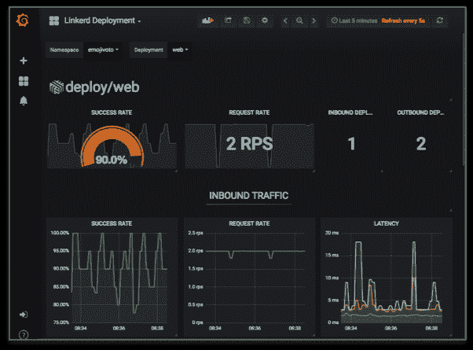

# Linkerd 2.0:面向服务所有者、平台架构师、sre 的服务网格

> 原文：<https://thenewstack.io/linkerd-2-0-the-service-mesh-for-service-owners-platform-architects-sres/>

微服务的兴起带来了新的挑战和有趣的解决方案。服务网格是已经成为微服务基础设施核心基础的技术之一。在执行服务编排的 Kubernetes 之后，服务网格已经成为管理部署在生产环境中的微服务的最关键技术。

当前的服务网格生态系统由三个开源项目主导:

由于有 Google、Red Hat 和 IBM 的支持，Istio 受到了开发人员的极大关注。Linkerd 正在从基于 Java 的平台过渡到 Kubernetes 优化的平台。Consul Connect 旨在成为一种通用的服务到服务连接授权和发现机制。

让我们仔细看看 Linkerd。

### Linkerd 1.0:领先于时代的服务网格技术

管理 Linkerd 的公司[浮力](https://buoyant.io/)于 2017 年发布了初始版本。Linkerd 1.0 显然走在了时代的前面。它试图解决当前微服务开发者和运营商面临的大部分问题。

Linkerd 1.0 构建在 Netty 和 Finagle 之上，后者是一个经过生产测试的 RPC 框架，被 Twitter、Pinterest、Tumblr、PagerDuty 等高流量公司使用。它在 Java 和 JVM 中有很强的根基，这使得它在使用容器和微服务时显得有些笨重。但是作为一个网络代理，Linkerd 1.0 非常可靠，提供了诸如服务发现、电路中断、分布式跟踪和透明代理等功能。它甚至有一个 Prometheus 和 Grafana 的插件 linkerd-viz 来可视化关键指标。

Linkerd 1.0 可以部署在基于主机或服务的模型中。在基于主机的部署中，主机/节点上运行的所有服务都将通过 Linkerd 实例路由流量。每服务模型基于 sidecar 模式，这种模式现在在服务网格部署中非常普遍。这种部署选择使得 Linkerd 1.0 可以在各种环境中工作，包括裸机、Amazon EC2、Docker、Kubernetes 和 Mesosphere。

与当前的服务网格平台不同，Linkerd 1.0 没有分离控制平面和数据平面。运行实例链接的每个主机/服务将所有组件封装在一个部署单元中。

Linkerd 是第一个成为[云本地计算基金会](https://www.cncf.io/)一部分的服务网格项目。

### 进入 Linkerd 2.0:超轻量级的现代服务网格

2018 年 9 月，bubbly 宣布推出 Linkerd 2.0，这是一个从头开始为当代微服务编写的服务网格。有了完全重写的代码库，它没有前代的遗留问题。

Linkerd 2.0 的设计和架构与 Istio 非常相似。像 Istio 一样，它有一个清晰分离的控制平面和数据平面。数据平面由靠近服务的边车代理组成。控制平面在其自己的上下文中运行，管理数据平面中运行的代理群。

Linkerd 2.0 的创造者选择 Rust 和 Go 作为语言的选择。代理是用 Rust 开发的，而控制平面是用 Go 编写的。这种组合以极小的尺寸提供了所需的性能。

与它的前身不同，Linkerd 的当前版本不会因为试图支持多种环境而使自己过于分散。相反，它只是支持 Kubernetes，并为此进行了高度优化。将来可能会包括对其他环境的支持。

### 为什么选择 Linkerd 2.0 而不是其他服务网格技术？

我个人是 Istio 的忠实粉丝。这是我在一些项目中遇到并实现的第一个服务网格。我还喜欢它正在成为许多混合部署场景的基础，包括虚拟机/容器、本地/云以及 IaaS/CaaS。Kubernetes 生态系统中一些最令人兴奋的项目，如 Knative，都是基于 Istio 构建的。

Istio 是一个独立技术的集合，这些技术协同工作来交付服务网格功能。例如，Envoy 作为一个独立的代理存在，可以在 Istio 的上下文之外使用。Pilot 是 Istio 控制平面的核心组件之一，负责将 Istio 的策略定义转换为 Envoy。类似地，与特使代理对话的端点 Mixer 作为一个单独的组件实现。Istio 组件的这种混合和匹配使其模块化，但同时增加了复杂性和可管理性。

Linkerd 2.0 的灵感来自于 Istio 的设计。但是相比较而言，Linkerd 是轻量级的，易于安装，并且扩展速度快得多。

Linkerd 2.0 不必处理在 Istio 中导致复杂性的异构性。代替 Envoy，Linkerd 2.0 实现了自己的代理，它与控制平面紧密集成。控制平面是极简主义的，关注核心方面，如可观察性、安全性和策略。控制平面嵌入了 Prometheus 和 Grafana，用于跟踪和收集关键指标。

目前，Linkerd 2.3 包括遥测、重试、超时、自动注入、mTLS，默认为零配置。下一个版本将实现流量转移，以实现蓝/绿部署、金丝雀版本、路由策略支持和网格扩展。电路中断和分布式跟踪等功能也在开发中。

Linkerd 2.0 的极简方法使其成为服务所有者、平台架构师和 sre 的理想服务网格选择。我最喜欢一些特性，比如请求的实时视图、内置的服务拓扑图和服务配置文件。

对于您的下一个微服务项目，请给 Linkerd 2.0 一个机会。您可能会对它提供的简单性、性能和规模印象深刻。

*贾纳基拉姆·MSV 的网络研讨会系列“[机器智能和现代基础设施(MI2)](https://mi2.janakiram.com/) ”提供了涵盖前沿技术的信息丰富、见解深刻的会议。[注册](https://mi2.janakiram.com/)参加即将举行的 MI2 网络研讨会，了解如何开始使用 Google Coral 开发套件和 USB 加速器。*

云计算原生计算基金会是新堆栈的赞助商。

图片由来自 Pixabay 的 Hans Benn 提供。

<svg xmlns:xlink="http://www.w3.org/1999/xlink" viewBox="0 0 68 31" version="1.1"><title>Group</title> <desc>Created with Sketch.</desc></svg>