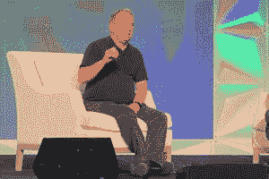

# Linus Torvalds 谈社区、Rust 和 Linux 的长寿

> 原文：<https://thenewstack.io/linus-torvalds-on-community-rust-and-linuxs-longevity/>

本周，在今年于西雅图举行的[北美开源峰会](https://events.linuxfoundation.org/open-source-summit-north-america/)上，与 [Linux](https://training.linuxfoundation.org/training/course-catalog/?utm_content=inline-mention) 创造者 [Linus Torvalds](https://twitter.com/linus__torvalds) 进行了[年度签到](https://thenewstack.io/linus-torvalds-on-diversity-longevity-rust-and-arm-chips/)。

周二，托瓦尔兹在西雅图凯悦酒店的舞厅登台，参加了该活动传统的半小时提问，提问者是早期 Linux 贡献者 Dirk Hohndel(现在也是 VMware 的首席开源官和副总裁)。

仪式以一个特殊的时刻开始，一个生日蛋糕被隆重地送到托瓦尔兹，以纪念 Linux 的 30 周年，赢得了观众的热烈掌声。Hohndel 补充说，他正在向“所有内核开发者”提供 30 岁生日祝福——这确实也是一个社区

社区的主题似乎不断出现——特别是关于那个社区最终教会了 Linus Torvalds 什么。

## 放松和极客

它始于托瓦尔兹对操作系统发布的最初几个小时的珍贵记忆。虽然他打算把他新发明的操作系统命名为 Freax，但我已经被告知，我放在上面的 FTP 站点，不是我维护的，有一个名为 Linux 的目录。所以我实际上已经在内核主 make 文件中把名字改成了 Linux。”

他补充道，“我永远感谢另外两个人比我更有品味。”

但是接着托沃兹想起来，他本希望继续下一个新的有趣的项目，把 Linux 留在“差不多完成了”的状态中。不太好用。但是做的够多了，已经没什么意思了。

“很明显，开源改变了这一点。因为突然之间，这个项目——如果只有我一个人的话，我可能会放弃它——我开始受到质疑，并最终得到修补——这只是让动力继续下去。30 年后的今天，这仍然是我们前进的动力。

“因为就我而言，这 30 年中有 29 年都是这样，从那以后的每一部电影都是关于其他人需要或想要或感兴趣的东西。”

## 又一堂人生课

构建 Linux 教会了托沃兹很多关于计算机架构的知识；他最初的目标是学习他的 386 微处理器计算机的所有特性。但他也建立了一些关系，包括在硅谷创办一家小公司克隆 386 硬件的人(他最终加入了这家公司)。

Hohndel 提到了这个故事，他指出，在托瓦尔兹的第一本书里，书名甚至以“只是为了好玩”开始

“但在某个时候，你得到了第一份工作，”霍恩德尔说。“你获得了第一个商业利益，也许不是 Linux，而是作为开发者的你。”

托沃兹最终从他周围的 IT 工作者那里学到了另一门人生课程。他记得看到他周围的人“每三年左右”换一次公司。我是说，这就是硅谷的方式。这并不普遍，但却相当普遍。

“我刚刚意识到，我不喜欢这样做。我有这些长期项目。并不是每个人都是这样的——很多人发现他们已经做了几年的事情，这开始让他们感到厌倦，他们希望找到新的东西。”

他继续说道，“我意识到我是那种很无聊，只想做一件事的人。而我是一根筋。”

## 一个改变的世界

霍恩德尔回忆起 30 年前硬件是多么的不同。“我的第一台 Linux 机器有两兆字节的内存——兆字节带一个‘M ’,适用于这里的年轻人。所以这是一个非常不同的世界。”

但是他也记得打印出了 Linux 的全部内核代码。“我不建议今天这样做。”

这让霍恩德尔想到了一个有趣的问题。“当我们开始时，进入一个项目似乎真的很容易。这一切似乎都很容易处理；似乎有可能让一个*概述*进入一个项目。如果我今天四处看看，你用几个微服务和几个容器构建了一个快速的小 Kubernetes 东西，并使用了几个 s3 后端，你不知道你的计算机上实际运行的是什么。

“那么，如果你从今天开始，”他问托瓦尔兹，“你认为你会做些什么？”

托沃兹回答说，虽然他是一名软件工程师，但他对控制一切的硬件和编译器更感兴趣。但后来他承认，他成长在一个家用电脑如此简单的世界，“你实际上可以理解它们，这不再是真的了。”

“如果我今天长大，”他补充道，“我不确定我是否会足够接近硬件，让我感觉理解起来很舒服。”

托沃兹说，另一方面，今天的世界有更多的资源，包括树莓派和“所有这些微控制器，比我长大时更容易获得。”

他回忆说，在 20 世纪 90 年代初，他不得不订购一本 386 架构手册，“因为它在书店里没有我能接触到的书……它必须从另一个国家订购，只是为了获得我所拥有的硬件的手册！”

为了了解今天的 386，他说，“你上网，去谷歌，输入‘386 架构手册’。”"

## 乐趣和铁锈

当霍恩德尔问托瓦尔兹他是否有任何遗憾时，托瓦尔兹最终回答了相反的问题。

“我非常自豪的事实是，实际上有相当多的人仍然参与 1991 年问世的内核——我的意思是，实际上是 30 年前。”(霍恩德尔就是其中之一。)

托沃兹说，鉴于 1991 年时,*很少有贡献者，Linux 社区的长寿尤其令人印象深刻:“我认为这证明了社区整体上是多么好，它是多么有趣。”*

是的，很有趣——托沃兹仍然认为这是 Linux 社区的基石之一；“只是为了好玩，”他说，这是他仍在努力的一部分。

当人们谈论使用 Rust 编写一些 Linux 内核模块的可能性时，它就出现了。"从技术角度来看，这有意义吗？"托沃兹问道。“谁知道。这不是重点。关键是一个项目要保持有趣，而且要保持有趣，你必须玩它。”

即使现在有数十亿设备依赖于 Linux，该项目仍然强调寻找有趣的新方向来探索。“这仍然是我非常自豪的一件事。”

在用 C 开发了 30 年的操作系统之后，Hohndel 承认他“非常惊讶地看到你对在新系统中引入 [Rust 模块](https://thenewstack.io/the-case-for-rust-as-the-future-of-javascript-infrastructure/)的想法如此开放。”

“我真的很喜欢 C，”托沃兹承认道。“我认为 C 是一种伟大的语言，对我来说，C 是一种在相当低的水平上控制硬件的方法。所以当我看到 C 代码的时候，我可以很接近地猜出编译器在做什么。它离硬件如此之近，你可以用它做任何事情。”

然而，托瓦尔兹也看到了霍恩德尔的类比，即它可以像杂耍电锯一样。作为一个 C 语言的长期观察者，托沃兹知道 C 语言微妙的类型交互“并不总是合乎逻辑的”并且“对几乎任何人来说都是陷阱”。它们很容易被忽略，在内核中这并不总是一件好事。”托沃兹称 Rust 是“我看到的第一种看起来像是解决方案的语言”

C 程序员还看重其他一些因素，比如高性能和易于调试，但是对于 Rust 的实验还是有一些开放性的。“到目前为止，人们已经谈论内核中的铁锈有很长一段时间了——它还没有结束，”Linux 的创造者说。“那么我们走着瞧吧。

“可能明年，我们将开始看到一些用 Rust 编写的第一批无畏模块，也许会集成到主线内核中。”

## 20 年预测？

但是托沃兹能接受多少实验是有限度的。当霍恩德尔建议下一次峰会在斐济举行时，主持人打趣地说，那会很费钱，“所以我想提个建议。”

考虑到 Linux 的 30 周年纪念，他建议，“如果我们可以拿着 1991 年的电子邮件，制作一个 NFT，拍卖它……”毕竟，[的第一条推文是在 3 月](https://www.reuters.com/article/us-twitter-dorsey-nft/twitter-boss-jack-dorseys-first-tweet-sold-for-2-9-million-as-an-nft-idUSKBN2BE2KJ)以 290 万美元的价格在以太网上拍卖的，现在的价值是 520 万美元。

托沃兹不会上钩的。“我要远离 crypto 和 NFT 氏症的疯狂。我就像，”他阴谋地小声说，“那些人是布谷鸟！”

主题演讲结束时，霍恩德尔问他们应该为 2041 年的 Linux 50 周年纪念做些什么，那时他们都将 70 多岁了。

托沃兹很有个性地回答说，就像 Linux 内核一样，他不会制定超过六个月的计划。但是这个问题确实引起了一些思考。“30 年来，我一直非常乐意做内核，”托沃兹沉思着开始说道。

“不知何故，我看不到自己 70 岁时还在做内核编程。但另一方面，几年前我 50 岁的时候也没有看到自己在做内核编程。所以……我们走着瞧。”

<svg xmlns:xlink="http://www.w3.org/1999/xlink" viewBox="0 0 68 31" version="1.1"><title>Group</title> <desc>Created with Sketch.</desc></svg>