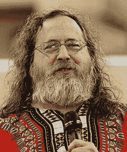

# 莱纳斯·托沃兹还记得“开源”之前的日子

> 原文：<https://thenewstack.io/linus-torvalds-remembers-the-days-before-open-source/>

20 年前，克里斯汀·彼得森创造了“开源”这个词。但即使在那时，我们现在所知的开源社区已经全面展开，这要归功于 Linux、PHP、Apache 和许多其他免费分发的程序的日益流行。

作为一个深入研究那段历史的机会，以及把我们带到今天的力量，我决定问一个问题:在 1998 年之前，人们使用“开源”这个词吗？如果不是，他们是如何提及该软件的？

我联系了 Linux 的创造者 [Linus Torvalds](https://github.com/torvalds) (以及 [git](https://git-scm.com/) ，另一个几乎普遍使用的开源程序)。“我真的不记得了，”他回答道。

在一封详细的电子邮件中，托沃兹展示了他自己的回忆:“我想每个人都同意，这个术语在 1998 年初基本上被‘正式’采用了。有过关于它的会议和讨论，但就我而言，它是在 1998 年 4 月 7 日在帕洛阿尔托举行的所谓的[‘开源峰会上正式宣布的。](http://www.linuxjournal.com/article/2918)

并且 [Eric Raymond](http://www.catb.org/esr/) ，那个会议上的长期开源倡导者[证实了 Peterson 对事件](http://esr.ibiblio.org/?p=7834)的版本，在她的帖子上留下了一些额外的想法。“我可以补充一点，的确是我明确提出了术语问题，”他写道。“我比那里的其他人有更清晰的初步感觉(尽管他们后来追上了我),我们实际上是在策划一场营销和品牌推广活动……但我没有过多谈论这件事，因为我知道‘营销’对这些彻头彻尾的极客来说是一个不好的词，他们需要逐渐习惯于思考这件事。”

Peterson 记得在 1998 年之前，[布莱恩·贝伦多夫](https://www.linkedin.com/in/brianbehlendorf/)实际上是在使用“源代码可用”软件这个笨拙的短语——尽管“开源”软件的官方定义后来也坚持了修改和重新发布代码的能力。在此之前，有一个人似乎至少说过“开源”这个神奇的词，那就是莱尔·鲍尔，他是卡尔德拉的公共关系主管。

早在 1996 年，他就撰写了[这篇“互联网出现之前”的新闻稿](http://www.xent.com/FoRK-archive/fall96/0269.html)(分发给“传统”媒体)，宣布该公司将开始公开 OpenDOS 的源代码(“通过互联网”)。卡尔德拉营销和销售副总裁兰森·洛夫(Ransom Love)说，该公司的最终用户、开发伙伴和原始设备制造商“支持我们的开源技术方向。”

克里斯汀·彼得森。图片来自 Foresight.org

后来，同一份声明指出，DOS 用户将从“开源开发环境中最终用户之间的技术支持交流”中受益，并多次使用该短语，例如，声明 Caldera“认为开源代码模型在许多方面有利于行业。”

这算是“开源”的首次使用吗？

为了获得开源社区的意见，我询问了我的老朋友[里克·摩恩](http://linuxmafia.com/~rick/)，他是旧金山湾区的长期系统管理员和开源倡导者，他看到了一个明显的区别。“Caldera 在 1996 年发布的 OpenDOS 产品公告，尽管对具体细节含糊其辞，但*非常明确地暗示 OpenDOS 将在专利许可条款下发布。他们所说的“开放”是指公众可以查看(但不能分叉，也不能用于任何目的)OpenDOS 源代码。在现代术语中，我们称之为可视源代码许可(或类似的表述)，以区别于开源……”*

“一百万年来，Caldera 从未打算*实际上*开源 OpenLinux 或 OpenDOS。整个商业模式依赖于利用专有优势，”他说。他注意到一个很大的讽刺:尽管 OpenDOS 的原始代码已经从一家公司传到另一家公司超过 30 年了，但“它仍然是专有代码”

重要的是要记住，正如一位博客作者所指出的，“卡尔德拉今天被人们记住主要是因为他成为了 SCO 组织，并被微软用来攻击 Linux(事实上，还有开源本身)”——所以卡尔德拉本身并不一定被认为对更大的开源运动是友好的。

摩恩指出，这个短语在 1998 年被开源倡议正式化时，意思完全不同——包括修改和重新发布代码的能力。“让 OSI 的用法从几个已知的前辈中真正脱颖而出的一件事是，OSI 让这个术语有了特定的含义，并制定了非常明确的身份标准(开源定义)…”

人们经常想知道在新闻组搜索是否会产生更早的“开源”一词——但是摩恩实际上早在 2004 年就进行了这样的搜索。他发现这个短语只有 16 个用户——其中 13 个是无意义的代码片段，比如 `error("cannot open source file for input");`

其余三个中:

*   1989 年[的一篇帖子](https://groups.google.com/d/msg/comp.virus/pwUbdtdRzF0/5DfydHr1ZtgJ)称赞在线时事通讯“多年来为我们用户提供了关于计算机病毒主题的最佳可用的开源信息。”
*   1990 年[的一篇帖子](https://groups.google.com/forum/#!search/open%2420source%2420before%243A1995%242F01%242F01%7Csort:relevance/sci.crypt/_696x9zT8MI/AMO9lJLuQwIJ)引用了美国国家安全局 1987 年的一份关于软件“从开源材料开发而来”的文件
*   一篇 1990 年的帖子在一场关于“黑客”是否阻碍了 Unix 被接受的辩论中偶然提到。一位名叫 Kent Paul Dolan 的退休软件开发人员认为，“BSD 的开源政策意味着用户开发的软件可以在不同平台之间移植，这意味着他们的客户看到了一个更具成本效益、具有领先能力的软硬件结合平台。”

我尝试了类似的搜索，找不到“开源”这个词的更多用法——除了 2003 年一封来自新闻组客户的邮件，它显然被错误配置为显示日期为 1997 年 1 月 1 日——以及更多像这个 1994 年的代码样本这样的“误报”。

`open(SRC, $source_name) || return;`

虽然我确实在新闻组小组 comp . OS . ms-windows . programmer . win32 上找到了一篇 1993 年的文章，其中 Jerome (Jerry) Schneider 抱怨说“也许对于 DOS 或 Windows 来说，二进制文件是可以的，但似乎没有源代码的 NT 程序除了偶尔的最终用户之外没有什么用处……从长远来看，开源对每个人都是最好的。”

但这些例外似乎证明了一个规律:在过去的十年里，这个短语显然没有被广泛使用。“可查看的源代码”显然与修改和重新发布有价值的代码库的权利不是一回事。

莱尔·鲍尔(Caldera 前公关主管)——通过 LinkedIn

尽管如此，当历史被创造的时候呆在这里一定很有趣。Lyle Ball 于 1995 年 11 月加入 Caldera，1993 年毕业于杨百翰大学，获得公共关系和商业沟通学士学位。他在卡尔德拉一直呆到 2001 年 7 月，在最近发表的一次采访中，他回忆起在卡尔德拉的任期是一段激动人心的时光。“实际上，我有无限的预算来资助一个小型的火山口传道者团队…我们专门教授分析机构(即 Gartner、Forrester)和媒体机构(在北美、欧洲和亚洲的所有主要市场和语言中)。)……我亲自与 COMDEX 的组织者合作，创建了‘开源馆’。”

但是当我联系 Ball 问那些开源的亭子是不是发生在 1998 年之前的时候，他并不确定。(“我已经搜索了我的档案，我根本没有保留那个时代的很多东西……在无处不在的备份状态之前，我在一个不幸的数据中丢失了很多东西。”)

然而，在他的采访中，鲍尔还声称，当他在 1995 年加入卡尔德拉时，“我们当时肯定广泛地使用了‘开源’。”不清楚他是否仅仅指代码可视软件，但在同一次采访中，Ball 甚至声称，与此同时，Linus 也“广泛地”使用了“开源”一词。(“我和莱纳斯还有他当时的女朋友尤特在德国吃饭，当时他还是个学生……”)

但在我们的电子邮件交流中，托沃兹反驳道，“我不会 100%相信莱尔·鲍尔对我的回忆……因为我当时的女朋友(现在的妻子)的名字是托弗，而不是尤特。”

“我很可能使用了‘开源’这个术语，”托沃兹写道。“我不喜欢‘自由软件’这个词，不仅因为这个词被 FSF 政治化和两极化了，而且还因为它与英语中的‘自由’一词混淆了。在我的母语瑞典语中，不存在这种混淆:“免费”是“免费的”，而“免费”(“自由”)是“星期五”，两者之间从来没有任何模糊之处。”

“但我不会声称我是它的源头…我真的不想卷入这场混乱，因为我没有确切的记忆，我也没有保存邮件档案或类似的东西…”

他还补充道，“我绝对不是唯一一个不喜欢政治和混乱的人。”

自由软件创始人理查德·斯托尔曼。图片来自维基百科

强烈支持自由软件这个术语的是[理查德·斯托尔曼](https://stallman.org/)，他指出自由软件运动始于 1983 年，并认为“1998 年，自由软件社区的一部分[分裂出来，并以‘开源’](https://www.gnu.org/philosophy/open-source-misses-the-point.html)的名义开始活动……”

这两个术语描述了几乎相同的软件类别，但是它们代表了基于根本不同的价值观的观点。开源是一种开发方法论；自由软件是一场社会运动。对于自由软件运动来说，自由软件是一种道德要求，是对用户自由的基本尊重。相比之下，开源哲学从如何让软件变得“更好”的角度来考虑问题——仅在实际意义上……大多数关于“开源”的讨论不关注对错，只关注流行和成功。"

在 2001 年的纪录片“[革命](https://www.youtube.com/watch?v=NrI-0u4npGo)”中，Eric Raymond 反驳说“自由软件”这个词的问题在于它给企业高管带来的含义。

埃里克·雷蒙德，来自维基百科

*“如果你幸运的话，你会得到类似‘嗯，自由软件——一定很便宜，粗制滥造毫无价值’的回应，如果你不幸运的话，这与自由软件基金会对知识产权的大规模攻击有关，不管你怎么看待这种道德——这是糟糕的营销。这不是企业想听到的。”*

让讨论更加混乱的是，“开放”这个词已经被主要的科技公司在完全不同的环境中使用。Rick Moen 记得 Sun Microsystems“将它的整个 SunOS 软件生态系统称为‘开放计算’,理由是网络协议和 API 都有完整的文档记录，因此是可互操作的……作为 Sun Microsystems 宣传材料基础的‘开放系统’的概念实际上是相当重要的……但肯定与开放源代码完全不同。”

托沃兹对此表示同意:“我记得我对使用‘开放源代码’的一个担心并不是它的名字本身，而是‘开放’在 IT 界是一个如此流行的词，而且它是一个如此明显的名字，并且有着来自所有其他使用过‘开放’的人的包袱……所有这些都是在 1998 年之前:‘开放系统’，‘X/Open’(现在的‘开放集团’)，‘开放软件基金会’等等，它们都是关于 Unix 战争的。他们对 Linux 和我们所谓的‘开源’不感兴趣。”

甚至可以追溯到更远。在对新堆栈的评论中，Mark Cathcart 记得当他在 1974 年第一次开始使用它时，您可以查看甚至重新编译供应商的源代码，以便在更便宜的大型机上使用。“人们已经依赖于它，并捍卫他们访问源代码的权利，”他在他的博客“系统领域的冒险中写道[，称之为当今开源运动的明显先驱。](https://cathcam.wordpress.com/2018/02/22/remembering-the-dawn-of-the-open-source-movement/)

但托瓦尔兹强调，1998 年的会议不应被低估。“我认为，当你有意识地有意同意做某事，而不是一些非正式的偶然用法时，这是一件大事，因此‘1998 年初’无疑非常重要。”

“我确实记得，一旦人们同意使用这个术语，它实际上就迅速流行起来了。”

<svg xmlns:xlink="http://www.w3.org/1999/xlink" viewBox="0 0 68 31" version="1.1"><title>Group</title> <desc>Created with Sketch.</desc></svg>