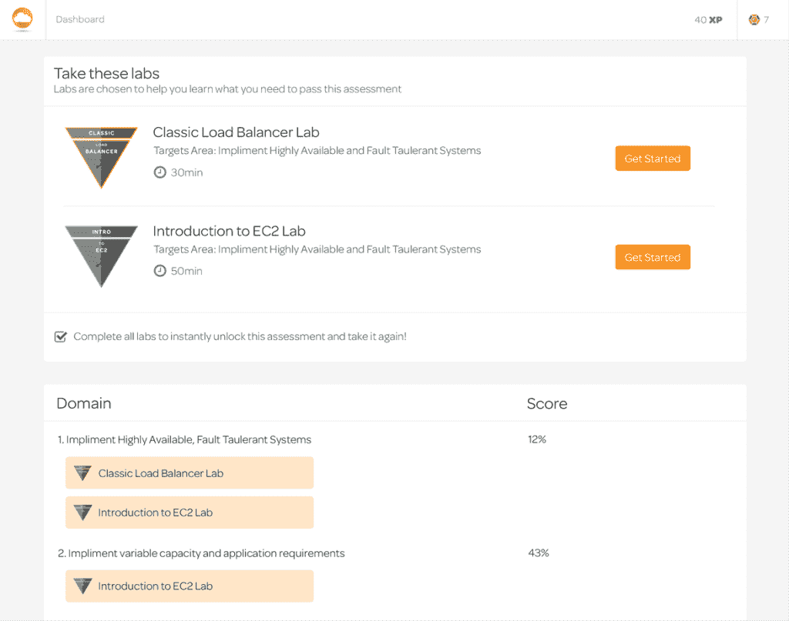

# Linux 学院为亚马逊网络服务开放在线培训

> 原文：<https://thenewstack.io/linux-academy-opens-online-training-amazon-web-services/>

据多项调查显示，IT 专业人才的供需缺口巨大。由于缺乏熟练劳动力，公司正在努力跟上云技术和新业务机会的爆炸式增长。

为了帮助解决这个问题，在线培训公司 [Linux Academy](https://linuxacademy.com/) 推出了[云评估](https://cloudassessments.com/login)计划，该计划提供了一种让企业测试和培训其 IT 团队以及潜在求职者的方式。个人还可以利用云评估来证明真实的实践技能，并获得微观认证。第一批云评估产品将专注于亚马逊网络服务。

“在许多科技行业，普遍存在技能缺口。不久前，我们进行了一项调查，发现相当多的雇主很难找到在 Linux 和云计算方面拥有足够技能的员工，”Linux Academy 创始人兼首席执行官[安东尼·詹姆斯说。](https://www.linkedin.com/in/anthonydjames/)

根据最近对 6000 多名 IT 专业人士的调查，一般人需要几周甚至几个月的时间来熟悉新公司的技术。“云评估可以大大减少这一时间，因为它可以确保新员工不仅了解，而且能够在开始工作之前有效地使用公司的技术，”詹姆斯说。

这些公司有两个选择，要么培训现有员工，要么解雇他们并雇佣新员工。因为已经缺乏技能，所以没有足够的工程师可以雇佣。接受 Linux Academy 调查的超过 65%的公司表示，他们很难招聘到这些专业人员，因此通过培训获得晋升的机会很大。

简而言之，培训现有员工是最简单的方法。

“随着行业需求和技能缺口的不断扩大，我们看到一些公司转向 Linux Academy 来帮助员工培训和技能发展，以便从内部晋升。鉴于 Linux 和云计算专业人才的短缺，我们也看到许多学生将 Linux Academy 作为获得新公司职位的工具，”詹姆斯说。

对于 AWS 课程，云评估允许企业用于测试、培训和评估员工和求职者的真实 AWS 知识，以及个人证明技能和获得微观认证。詹姆斯说，云评估不是使用传统的基于问答的评估，而是使用真实世界的场景和实际的云环境。

未来，该平台将使企业能够向用户分配评估。除了加快招聘流程之外，公司还可以使用云评估来培训 AWS 技能，从内部促进发展。

云评估使用真实场景和实际的云环境。

就云平台而言，最初 Linux Academy 专注于 AWS，因为这是云技术方面最大的技能缺口，尽管随着时间的推移，Linux Academy 可能也会涵盖微软 Azure 和谷歌云平台。

## 是给谁的？

Linux Academy 正在与 Rackspace 等公司合作，以确保其微认证在行业中带来专业的有效性。

目前，您可以免费参加许多评估和实验。“我们以一种经济高效的方式设计了该平台，这意味着这些节省下来的成本可以转移到任何寻求培训的人身上，”詹姆斯说。

Linux 学院云评估引擎。

云评估是 Linux Academy 提供给企业的众多项目之一。它还为企业客户提供[团队](https://linuxacademy.com/teams)，旨在保持团队在 Linux、AWS、OpenStack、DevOps 和其他基于云的技术上的最新技能；它允许企业访问 Linux Academy 的完整内容库，包括数千个视频、动手实验室和六个用于团队培训的云服务器。

团队计划通过专用仪表板进行管理，培训经理可通过该仪表板查看团队整体培训绩效的摘要，并针对特定角色、任务和职责对团队成员进行培训。

借助定制学习路径功能，可以将培训分配给小组或个人，并在讲师的及时支持下对整个培训过程进行评估。用户可以将完整的课程、测验、动手实验和评估添加到他们的自定义学习路径中。通过实验室和练习功能，用户可以在真实环境中进行基于场景的动手实验。

<svg xmlns:xlink="http://www.w3.org/1999/xlink" viewBox="0 0 68 31" version="1.1"><title>Group</title> <desc>Created with Sketch.</desc></svg>