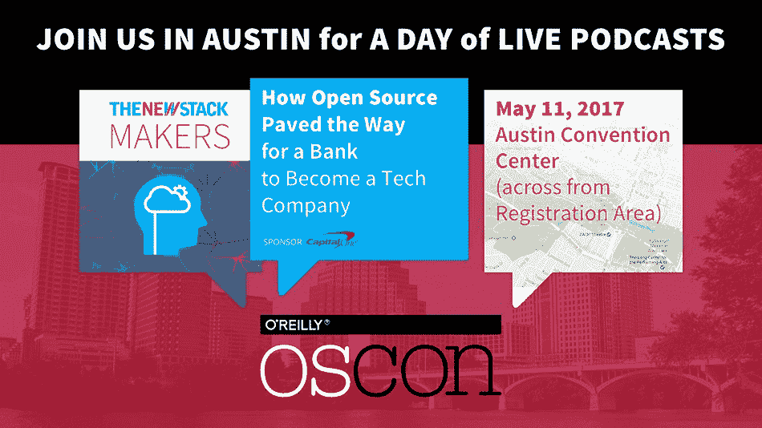

# Linux 基金会及其批评者

> 原文：<https://thenewstack.io/linux-foundation-critics/>

局外人通常认为 [Linux 基金会](https://www.linuxfoundation.org)是 Linux 的官方形象。然而，在开源社区中，前景可能会有所不同。人们一再指责 Linux 基金会是一个与社区及其许可和透明度标准不同步的企业组织。批评家们提出了一个激烈的论点，尽管它是否准确完全是另一个问题。

Linux 基金会是开源社区中发展最快的组织之一。它的目标基于开源是可持续的这一理念。但这只是开源世界的一小部分，它跨越了广泛的社区。许多人植根于自由软件运动，并可能对企业参与持怀疑态度。

部分批评可能是由于该基金会在 2007 年的突然出现，当时开源开发实验室与自由标准组织合并，并从现在的 Geeknet 那里购买了 Linux.com 的 URL，当时 geek net 正将其用于一个新闻网站。该基金会的立场是自封的，有些人认为这是在排挤现有的组织，如自由软件基金会。

或许，基金会也继承了社区长期以来对企业的不信任。尽管公司很久以前就成为了促成开源成功的不稳定联盟的一部分，但是怀疑依然存在。即使在今天，人们仍然普遍怀疑公司为了他们自己的短期利益而支持开源，而忽视了社区的需求，这种怀疑可能是因为 Linux 基金会被认为是公司的组织。

这种态度在 2016 年 11 月获得了新的力量，当时该基金会接受微软为[白金会员](http://thehackernews.com/2016/11/microsoft-linux-foundation.html)，并宣布微软已经成为开源的支持者，微软前首席执行官史蒂夫·鲍尔默曾将 Linux 称为“[癌症](http://www.theregister.co.uk/2001/06/02/ballmer_linux_is_a_cancer/)”和“[共产主义](https://www.theregister.co.uk/2000/07/31/ms_ballmer_linux_is_communism/)”。尽管微软多年来一直在为 Linux 做出贡献，但这个消息还是遭到了怀疑——更不用说无数博客和邮件列表上的警告了——事实上，微软只对让开源软件与自己的专有软件兼容感兴趣。

Foss Force 最近攻击 Foundation 的一位评论者(见下文)甚至说，接受微软为会员是“确保即使 Linux 在所有其他市场‘获胜’,桌面仍将是微软的一个完美方式”。如果你喜欢拥抱 Linux，把有用的部分扩展到 Windows (hello Bash on Windows)以消除 Linux 桌面获得立足之地的任何机会。”

换句话说，这位评论者认为，该基金会不仅在桌面上积极扼杀 Linux，而且还与开源的敌人合作，这远远不是 Linux 的声音。她也不是唯一持这种观点的人。

## 批评家们

不管批评的来源是什么，它仍然广泛存在。例如，2016 年 1 月，知名开发商 [Matthew Garrett](https://twitter.com/mjg59) 批评该基金会取消了个人会员的投票权，并使其董事会的网络普通用户成员成为可选成员。加勒特推测这些改变是为了阻止软件自由保护协会的 T4 凯伦·桑德勒竞选董事会成员，因为她对 GNU 通用许可证(GPL)的支持与该基金会对其他许可证的所谓偏好不一致。

在一份目前无法获得的回应中，基金会执行董事 [Jim Zemlin](https://twitter.com/jzemlin) 认为网络普通用户成员以及一名由内核开发人员任命的董事继续留在理事会中——所有这些[在今天仍然适用](https://www.linuxfoundation.org/about/board-members)。

然而，尽管加勒特的批评在很大程度上没有得到支持，但它们被不加批判地重复，包括在流行的 [FOSS Force](http://fossforce.com/) 网站上，标题为“ [Linux 基金会售罄](http://fossforce.com/2016/01/linux-foundation-sells-out-brave-new-browser-more/)”这篇文章引来了另外一系列的批评:基金会对桌面 Linux 没有兴趣，只不过是“另一个公司的权力游戏”，社区需要与公司的“虚伪”作斗争，并确保它们永远不会控制开源开发的方向。

这个问题很快就被淡忘了，但是最近当 FOSS Force 在标题“[Linux Foundation:不是桌面 Linux、GPL 或开放性的朋友](http://fossforce.com/2017/04/lin-desktop-linux-gpl-openness/)”下列出了对该基金会的批评时，这个问题又被重新提起这篇文章是对基金会网站上一篇文章的回应，该文章呼应了微软过去的批评，描述了像 GPL 这样的左版权许可证，要求衍生作品使用与“病毒”相同的许可证。这篇文章很快就被撤下了，但在此之前，FOSS Force 的观点文章引发了超过 50 条评论。

> 正如乔治·奥威尔(George Orwell)曾经观察到的那样，没有其他人也拥有路灯，富人就无法拥有路灯。

Jon Phillips 评论道:“请将这篇文章广为传播，并建议你在 Linux 桌面世界的朋友们，他们的慈善事业最好不要局限于 Linux 基金会。”许多人对此表示赞同，并一再将基金会描述为企业利益的工具。

并不是所有的社区成员都将 Linux 基金会视为敌人。事实上，一些对 FOSS Force 的批评的评论者试图为基金会辩护。同样，[马特·阿萨伊](https://twitter.com/mjasay)在 TechRepublic 上驳斥了这些批评，认为这是向“早期开源的愚蠢宗教辩论”的倒退，并补充说，古老的“[荒谬的辱骂和指责仍然存在](https://www.techrepublic.com/article/why-the-latest-linux-foundation-flame-war-is-a-waste-of-time-for-open-source-advocates/)

然而，捍卫基金会的努力在没有被完全忽视的情况下很快就被驳回了。显然，社区中的许多人认为该基金会与他们的利益相敌对，完全不像它原本打算成为的统一机构。

## 与批评家一起生活

Linux 基金会通常不会回应这些批评。有时，有争议的声明会被直接从基金会的网站上删除，批评者称这种策略缺乏透明度。然而，Linux 基金会执行董事吉姆·泽姆林有不同的观点。

虽然不否认“我们肯定会犯错误”，但 Zemlin 观察到“批评是反体制情绪的一部分，这种情绪使开源社区变得伟大。任何接触开源一段时间的人都知道，回应每一个批评基本上可以成为一份全职工作。[此外，]我们确实认为我们的工作代表了自己。”

泽姆林对社区批评的描述似乎特别恰当，因为这种批评往往充其量只是半真半假。首先，即使基金会面向企业，这并不意味着它不为个人服务。正如乔治·奥威尔(George Orwell)曾经观察到的那样，没有其他人也拥有路灯，富人就无法拥有路灯。同样，该基金会创建的核心基础设施计划可能会使企业受益最大，但当 openSSH 等项目得到资助，T2 heart bleed 等恶意软件得到快速修补时，所有 Linux 用户——不仅仅是企业——都会受益。

同样重要的是，虽然董事会由公司主导，但批评者经常忽略这样一个事实，即[技术顾问委员会](https://www.linuxfoundation.org/about/technical-advisory-board/)的大多数开发人员都来自社区或 [Linux 基金会本身](https://www.linuxfoundation.org/about/board-members)。根据 Zemlin 的说法，“公司主要通过支付数千名全职开发人员的工资来参与我们的项目，这些开发人员在 Linux 或我们的许多其他项目中工作，”以及参加会议和其他特别活动。

如果有什么不同的话，泽姆林更喜欢强调开发商而不是公司。“我们项目中的技术角色与公司是分开的，”他说。“没有人的提交被贴上他们公司身份的标签:在 Linux 基金会项目中，代码说得最多。我们项目中的开发人员可以从一家公司转到另一家公司，他们在项目中的角色将保持不变。随后商业或政府对该代码的采用创造了价值，这反过来又可以再投资到项目中。这种良性循环惠及所有人，也是我们所有项目的目标。”

换句话说，基金会是公司和开发商之间的中介。非正式地，我听说过几次，不直接从公司拿钱的开源项目会从基金会拿钱，因为它被认为是不结盟的第三方。

尽管有许多幼稚的犬儒主义批评，也没有任何迹象表明公司曾经影响过 Linux 内核或基金会赞助的任何项目中的开源开发过程。同样，与对 GPL 偏见的指控相反，刚刚发布的 OpenChain 1.1 规范在解释[自由许可](https://www.openchainproject.org/)时一丝不苟地保持中立。在一个像开源一样热衷于流言蜚语的社区中，企业干预超过半天仍未被发现的想法似乎不太可能引起严重的担忧。

无论如何，基金会不为个人或社区做任何事情的想法反映了媒体对报道的重视，而不是基金会实际提供的服务。

“任何个人都可以参与任何 Linux 基金会项目，”Zemlin 说。“您可以参加活动，加入邮件列表，报告错误，成为提交者，志愿参加我们的多元化项目，参加我们的许多法律论坛，等等。这是我们积极鼓励的事情，我们去年为 150 名社区成员提供了旅行资助、奖学金计划，并为世界各地的数百名个人提供了指导。”

该基金会提供的其他面向社区的服务包括鼓励妇女参与的联合培训、开放源代码基础知识的电子培训课程，以及迄今为止的 500 多项培训奖学金。通常，这类项目是在其他非营利组织的帮助下设计和协调的，如[大数据领域的女性](https://www.womeninbigdata.org/)、[技术领域的黑人](https://www.blacksintechnology.net/)，以及[国家妇女和信息技术中心](https://www.ncwit.org/)。

为了证明他的观点，Zemlin 举了一个小学生 Zachary Dupoint 的例子，基金会派他去参加一个活动[会见 Linux 创始人 Linus Torvalds](https://www.youtube.com/watch?v=_dmDKS_MKAw) 。同样，基金会赞助了 17 岁的芬兰开发者 Lucas kld strm 参加了几次会议。这些例子很大程度上证明了基金会

Zemlin 指出，“我们的希望是围绕我们主持的解决大问题的项目创造可持续的生态系统，而不是以牺牲彼此为代价来关注个人或企业。无论是 [Let's Encrypt](https://letsencrypt.org/) ，它现在是世界上最大的免费认证机构，还是我们的 [Hyperledger 项目](https://www.hyperledger.org/)，它正被用来为柬埔寨公民提供低成本的汇款和收款方式。NASA 使用 Node.js 来保证[火箭科学家的安全](https://hackernoon.com/ground-control-to-major-tom-how-nasa-uses-node-js-8d011e167436)，当然，Linux 是世界上最大、最成功的集体开发项目。”

泽姆林经常把开发人员称为诗人。相比之下，他将那些受雇于 Linux 基金会的人描述为“看门人、管理员和我们社区中开发人员所做的令人难以置信的工作的支持人员。”虽然不能排除幕后企业的影响，但该基金会支持个人的努力表明，此类言论不仅仅是夸张或公关。如果这些努力没有引起注意，原因可能是泽姆林提到的项目有自己的网站，他们的主页没有显示他们与基金会的联系。

## 取得平衡

这并不是说 Linux 基金会无可非议。活动家们不会更愿意看到基于社区的成员和女性在董事会和员工名单中做出更大的努力。同样，基金会或许可以做出更大的努力，让更多的社区成员参与决策——尽管在 Ubuntu 这样的项目中，仁慈的终身独裁者是可以容忍的，但批评基金会的决策结构就有点虚伪了。此外，根据基金会发言人的说法，基金会雇员中有一半，甚至更多，是女性。

然而，基金会只代表企业的想法仍然是一种扭曲。经过检查，出现的画面是一个尽最大努力在商业和私人利益之间保持平衡的组织。它偶尔出错的事实不应该分散旁观者对它在为每个人推进开源事业中的作用的注意力。

通过 Pixabay 的特征图像。

<svg xmlns:xlink="http://www.w3.org/1999/xlink" viewBox="0 0 68 31" version="1.1"><title>Group</title> <desc>Created with Sketch.</desc></svg>