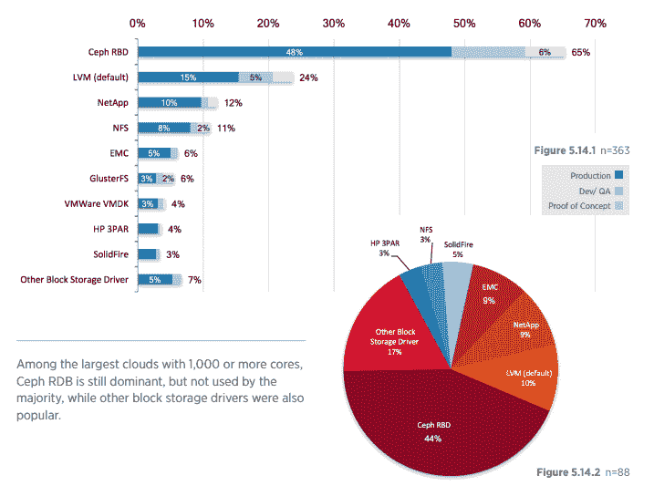

# Linux 基金会启动了 Ceph 文件系统的基础

> 原文：<https://thenewstack.io/linux-foundation-launches-a-foundation-for-the-ceph-file-system/>

自从 Ceph，即开源的统一分布式存储系统，[向世界宣布它已经完全可以生产了](https://thenewstack.io/converging-storage-cephfs-now-production-ready/)已经有两年多了，现在，在又发布了两个主要版本之后，这个项目又向前迈进了一步。

正好赶上本周在柏林举行的 [OpenStack 峰会](https://www.openstack.org/summit/berlin-2018/),[Linux 基金会](https://www.linuxfoundation.org/)已经启动了 Ceph 基金会，根据 Linux 基金会的一份声明，该基金会将“以一种协调的、厂商中立的方式组织和分配财政捐助，以直接造福社区”。Canonical、Intel、SUSE、Red Hat、Western Digital 和其他公司将参与该基金会。该基金会是 2015 年成立的 Ceph 咨询委员会的继承者。

Linux 基金会负责战略项目的副总裁 Mike Dolan 表示，Ceph 基金会将是 Linux 基金会今年成立的第 32 个这样的组织，就在该组织宣布 GraphQL 基金会成立[的一周之后。Linux 基金会也是](https://thenewstack.io/graphql-gets-its-own-foundation/)[云本地计算基金会](https://www.cncf.io/)(CNCF)[JS 基金会](https://js.foundation/)、 [Linux](https://www.linuxfoundation.org/projects/linux/) 内核社区以及大约 [150 个其他项目](https://www.linuxfoundation.org/projects/)背后的上级组织。

“开源社区需要的不仅仅是 GitHub，他们需要合适的基础设施来接受资金，并使用这些资金来帮助他们成为一个社区，”多兰说。“该基金会让他们有能力在一个中立的论坛上做一些事情。许多公司可以参与进来，以一种他们在供应商对供应商或供应商对客户的关系中无法做到的方式进行合作。”

Ceph 在 2012 年发布了第一个稳定版本，并在 2014 年被卖给了 Red Hat，此后它成为了开源文件系统中的一支力量。 [2017 OpenStack 用户调查](https://www.openstack.org/assets/survey/April2017SurveyReport.pdf)显示，用户采用率接近 70 %,高于去年的不到 60%。

Ceph 的创建者之一、项目负责人、Red Hat for Ceph 的首席架构师 Sage Weil 说，关键的优先事项包括改进可用性和管理。

“早期采用者是使用 Puppet 和 Chef 的 OpenStack 用户，他们想要低级别的 Linux 工具，”Weil 解释道。“为了让 Ceph 在传统 IT 环境中取得成功，它需要一个控制面板 GUI 和自动化集群管理流程等。在过去的一两年里，我们做了大量的工作来简化 Ceph，让它更容易使用。”

Weil 还将性能列为关注的领域，并指出 Ceph 是在硬盘的世界中成长起来的，而闪存和 SSD 存储正日益成为人们的选择。此外，Weil 还指出了让 Ceph 很好地与容器一起工作的重要性——他最初对此持怀疑态度。根据新闻稿，Ceph 目前正由 CNCF 项目 [Rook](/cncfs-rook-project-brings-storage-capability-cloud-native-workloads/) 用于这一目的，该项目“将文件、块和对象存储服务的无缝供应引入 Kubernetes 环境，在容器中运行 Ceph 存储基础设施以及消耗该存储的应用程序”。

除了产品功能，Weil 还表示，该基金会还将帮助举办未来的活动，例如明年的[cephalicon](https://ceph.com/cephalocon/)，将于 2019 年 5 月 19 日至 20 日在西班牙巴塞罗纳与[kube con/CloudNativeCon Europe](https://events.linuxfoundation.org/events/kubecon-cloudnativecon-europe-2019/)共同举办。

Weil 在一份声明中说:“Ceph 的指导愿景是成为可靠的横向扩展存储的最先进技术，并以 100%开源的方式实现这一目标。”“虽然早期的公共云提供商普及了自助式存储基础架构，但 Ceph 为服务提供商、企业和个人等带来了相同的功能，强大的开发和用户社区推动了存储领域的未来创新。

Linux 基金会和 OpenStack 基金会是新堆栈的赞助商。

通过 Pixabay 的特征图像。

<svg xmlns:xlink="http://www.w3.org/1999/xlink" viewBox="0 0 68 31" version="1.1"><title>Group</title> <desc>Created with Sketch.</desc></svg>