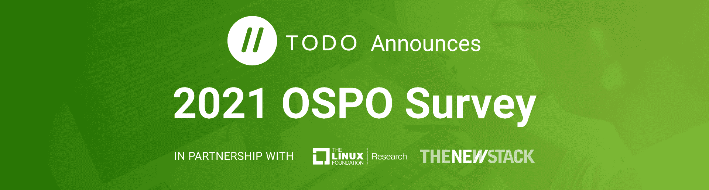
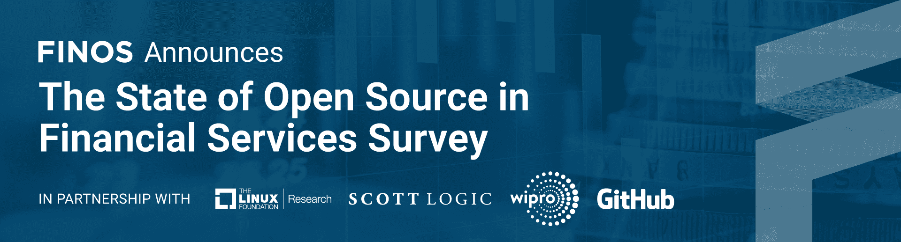

# Linux 基金会:为什么开源现在需要研究

> 原文：<https://thenewstack.io/linux-foundation-research-why-open-source-needs-it-now/>

近年来，新的开源项目出现了寒武纪式的爆炸，这在一定程度上是由大流行相关的问题和大型组织的数字化转型所驱动的。在 Linux 基金会，我们还见证了许多新的垂直行业和行业在传统上与开源无关的共享技术和标准上进行合作，包括公共卫生、气候和农业领域。

 [杰森·佩洛

Jason 是 Linux 基金会战略项目的编辑主任。他住在南佛罗里达，25 年来一直在撰写关于开源和技术行业的文章。](https://www.linkedin.com/in/jasonperlow/) 

现实情况是，由于 Linux 的成功和各种各样精心策划的开源产品的出现，开源软件的成熟和采用在过去十年中已经大大加快，这些产品已经帮助 IT 以外的行业实现了转型和加速。

尽管有这些进步，开源软件有时还是会与封闭的解决方案发生不准确的竞争，因为“开放”意味着“不太安全”。公共和私营部门一直在努力理解开源软件的性质和影响，这对决策过程没有帮助。

有了这些认识，很明显是时候对开源过程、项目、它们的范围和效用进行新的研究了。需要进行研究来消除神话，以便对开源是什么和不是什么有更广泛的理解，并创建一个开源环境现在支持的各种创新的知识库。

为了实现这一目标，Linux 基金会最近宣布成立 [Linux 基金会研究](https://www.linuxfoundation.org/research/)，这是一个新的部门，旨在拓宽对开源项目、生态系统动态和影响的理解。

## 作为重点领域的研究

在过去的五年里，Linux 基金会通过与哈佛大学 LISH 分校和其他机构的学术研究人员合作，已经站在了开源研究的最前沿。它之前在 2015 年和 2020 年由[核心基础设施倡议](https://www.coreinfrastructure.org/)领导的关于 FOSS 组件和开源软件供应链安全的研究，启发了[开源安全基金会](https://openssf.org/)的创建。

此外，自 2019 年首次发布以来，LF 的 [CHAOSS](https://chaoss.community/) 社区一直致力于分析开源项目健康状况的指标。其大部分技术现已被纳入 [LFX 洞察](https://insights.lfx.linuxfoundation.org/projects)，这是一个新的社区门户网站，提供关于 Linux 基金会托管的开源项目的数据分析。

## 数据和情报

这个世界现在变得越来越由数据驱动。对开源项目如何工作以及它们如何被使用的定量分析使我们能够深入了解以前在这些社区中没有出现的数据。

虽然数学和统计学是研究的基础，但通过结构化面试，结合正确的问题，可以获得更深刻的见解。访谈有助于填补分散的调查问题的空白，其方式可以是深刻的、个人的、有趣的和意想不到的。访谈还可以为了解调查的详细结果提供背景，并根据基础数据确认或调整模型。

在延续其建立开源社区的悠久传统的过程中，LF Research 作为基金会新成立的一部分，将允许开源组织利用其跨行业垂直和技术水平的庞大数据、工具和社区库，并从中获得有助于决策的见解。

## 研究方法和交付成果

LF Research 的方法所产生的完整交付成果将满足具有不同学习风格的个人的需求，并作为有益于全球开源社区、学术界和工业界的首选资源。将提供以下交付品:

*   **调查公告和邮件:**这些将以针对特定调查的目标社区撰写的针对性博客帖子和电子邮件的形式发布。将在 Linux 基金会的网站和社交媒体账户上推广调查，以提供所需的可见性。
*   **调查工具:** LF Research 使用 SurveyMonkey 作为其定量研究平台，并专门为每个社区调查定制问卷。典型的调查问卷有 25-30 个问题。
*   **访谈:**根据研究的性质，LF Research 可能会与参与的 IT 组织或开发人员社区的人员进行访谈，以更好地了解开源项目的用户群和参与者。
*   **书面报告:** LF Research 将根据其开展的调查和访谈的定量结果生成书面报告，然后汇总其发现的数据。
*   **关键调查结果演示文稿:** LF Research 将针对每个调查的每个问题创建一个所有定量调查结果的总结演示文稿，包括使用演示图形来说明结果并提供高水平的调查结果。
*   **关键调查结果的信息图表:**LF Research 将与 Linux Foundation Creative Services 合作，创建独特的信息图表，以说明从其开展的调查中发现的关键要点，并使用 LFX 洞察关于给定项目生态系统的数据。
*   **开放数据链接:** LF Research 将以完全匿名的形式提供所有回复数据的开放链接。

## LF Research 进行的当前研究和调查

*   [SODA Foundation](https://sodafoundation.io/) 最近[进行了一项调查](https://www.linuxfoundation.org/press-release/soda-foundation-announces-2021-data-storage-trends-survey/)，以确定云原生、边缘、人工智能和 5G 时代数据和存储的当前挑战、差距和趋势。
*   [Hyperledger](https://www.hyperledger.org/) 最近[还进行了一项调查](https://www.linuxfoundation.org/press-release/hyperledger-announces-2021-brand-study/)，以衡量 Hyperledger 及其项目相对于其他各行业使用的区块链平台的市场认知度和认知度，特别是识别神话和误解。
*   [TODO Group](https://todogroup.org/) 和新的 Stack,[正在进行一项调查](https://www.linuxfoundation.org/press-release/todo-group-announces-2021-state-of-ospo-survey/),作为全球不同组织之间开源项目流行程度和成果研究项目的一部分。
*   [FINOS](https://www.finos.org/) ，金融科技开源基金会，连同 Scott Logic，WIPRO 和 GitHub，正在[进行一项调查](https://www.research.net/r/NS8XV6W)，作为金融服务业开源采用、贡献和准备状态研究项目的一部分。
*   [SBOM 准备情况调查](https://www.research.net/r/YXSQGH9)与[开源安全基金会](https://openssf.org/)、 [OpenChain](https://www.openchainproject.org/) 和 [SPDX](https://spdx.dev/) 合作，是 Linux 基金会解决如何保护软件供应链的第一个项目。该项目的基础是对了解其组织的软件开发、采购、合规性或安全性方法的 IT 专业人员进行全球调查。被调查的组织将包括软件生产者和消费者。这项调查的一个重要驱动力是最近关于网络安全的行政命令，该命令侧重于生产和消费 SBOMs(软件材料清单)。

## 结论

这些只是将作为这个新部门的一部分发布的行业、技术和生态系统级主题中的几个。因此，Linux 基金会处于令人羡慕的地位，与 IT 名人、学者、数百个 OSS 项目和相当一部分 IT 社区有着密切的关系。

[Linux Foundation Research](https://www.linuxfoundation.org/research/)有一个极好的机会来开发世界级的研究产品，帮助 IT 社区、行业和政府更好地理解开源在塑造 IT 发展中的关键作用，并提供一个知识中心来吸引我们的社区。

<svg xmlns:xlink="http://www.w3.org/1999/xlink" viewBox="0 0 68 31" version="1.1"><title>Group</title> <desc>Created with Sketch.</desc></svg>