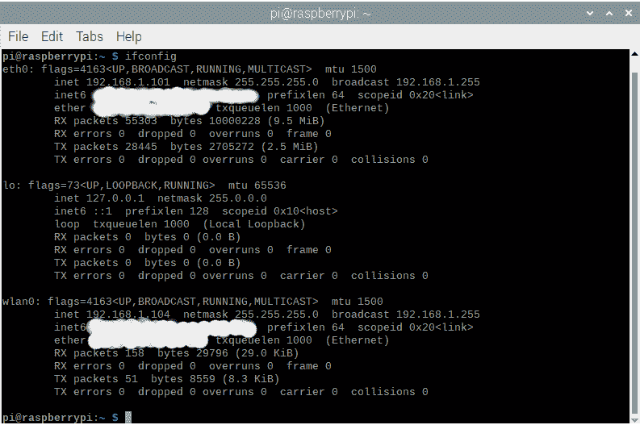
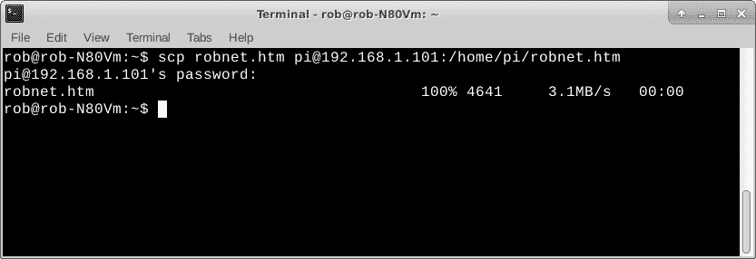
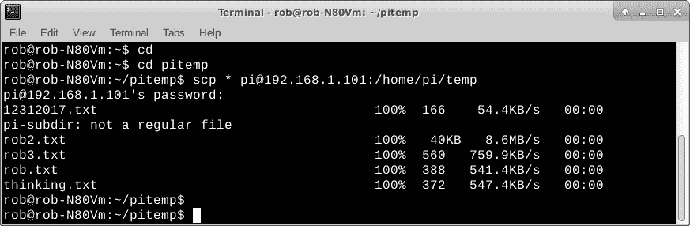
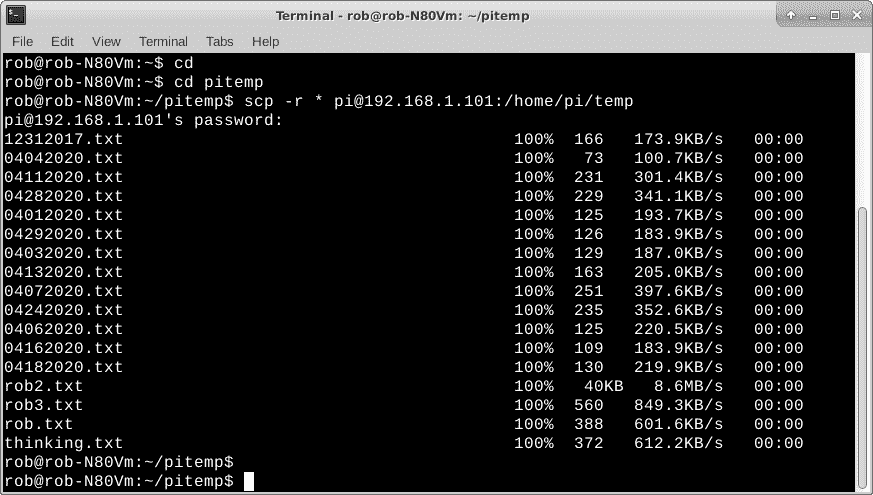
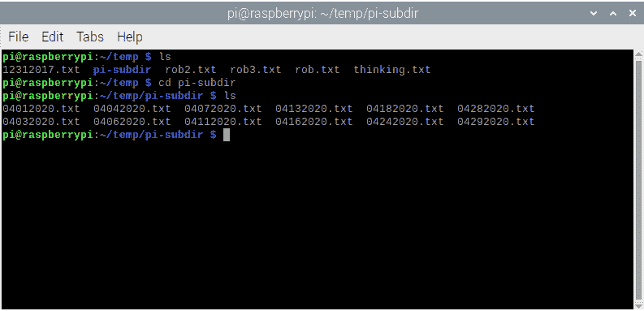

# Linux 课程:使用 scp 通过网络复制文件

> 原文：<https://thenewstack.io/linux-lesson-copy-files-over-your-network-with-scp/>

我偶尔需要在本地网络上的计算机之间复制文件。它可能是我的[机器人头骨的](https://thenewstack.io/off-the-shelf-hacker-buy-or-build-parts-for-a-robotic-skull/)声音的声音文件(在 Raspberry Pi 上)，为一篇科技文章捕获的截图或任何数量的文本配置文件。因为我所有的机器都是基于 Linux 的，所以最简单的方法就是使用 [scp 命令](http://man7.org/linux/man-pages/man1/scp.1.html)。 **scp** 代表安全拷贝。

**scp** 是远程网络访问服务 [SSH 家族](https://www.openssh.com/)的一部分，原生于 Linux/Unix 操作系统。如果安装了 ssh，你可能也已经有了 scp。我们在最近的一篇 TNS 文章中讨论了[使用 ssh。要使用 scp，您只需要在您的远程机器上安装一个可运行的 ssh 服务器，并在您正在使用的机器上运行一个 ssh 客户端，比如您的 Linux 笔记本。](https://thenewstack.io/dr-torq-go-remote-with-ssh/)

**开放互联网上的 scp** 工作正常，因为**宋承宪**也在那里工作，考虑到上述需求。我过去常常把文件从我的 Linux 笔记本上传到我的 GoDaddy 网站。尽管 scp 已经被加固和加密，但是当你冒险穿越防火墙局域网时，一定要采取适当的安全措施。

今天，我们将看看如何使用 scp 把文件从一台机器复制到局域网上的另一台机器。

## 设置和使用

使用 scp 需要一端有一个 ssh 服务器，另一端有一个 ssh 客户机。我的许多基于 Raspberry Pi 的项目都设置了 ssh 服务器，以便在启动后自动运行。这样，当我想传输一些文件时，我只需要在我的 Linux 笔记本上安装一个 ssh 客户端。

我通常不会在我日常使用的华硕 Linux 笔记本上运行 ssh 服务器，因为它会占用计算资源，而且我不希望任何人能够通过 ssh 进入我的机器。安装了 ssh-client 软件，我通常从笔记本连接到其他机器。

在确保 ssh 服务器在您的远程机器上运行之后，您还应该记下它的 IP 地址。您需要在本地机器上使用 scp 进行连接。在远程机器上使用 [ifconfig 命令](https://linux.die.net/man/8/ifconfig)获取 IP 地址。如果远程机器在 wifi 上，使用 *wlan0* 接口的 IP 地址。有线连接将有一个用于 *eth0* 接口的 IP 地址，该接口可能具有更快的传输速度。您也可以使用带有`a`选项的 [ip 命令](http://man7.org/linux/man-pages/man8/ip.8.html)。

`pi@raspberrypi: ifconfig`

下面是我的一个 Raspberry Pi 项目中的 **ifconfig** 命令返回的内容。

在 Raspberry Pi 上使用 ifconfig 查找 IP 地址

如果您需要在您的本地(我的 Linux 笔记本)机器上加载 ssh 客户端(包括 **scp** ),请在命令行使用 **apt-get** 。

`rob@rob-N80Vm:~$ sudo apt-get install ssh-client`

一旦安装了 ssh 客户端软件，您就可以使用 **scp** 命令与远程机器(运行 ssh 服务器的 Raspberry Pi)连接和传输文件。

该命令的基本形式是`scp`，即源文件名，然后是目标文件名。这里有一个例子。

`rob@rob-N80Vm:~$ scp robnet.htm pi@192.168.1.101:/home/pi/robnet.htm`

使用 scp 将 HTML 文本文件从 Linux 笔记本复制到 Raspberry Pi。

在本例中，robnet.htm 是我用于主页的本地 HTML 文件，其余部分是目标 Raspberry Pi 上的完全限定文件名。

注意，使用的目的地包括用户名、`pi`和目的地机器的 IP 地址。注意，我使用的是 **eth0** 或“有线”连接。我还将路径名与目录一起使用，并明确地拼写出来。出现提示时，输入用户的密码(在本例中为`pi`)。

如果愿意，可以在源引用中使用完整的路径名。因为我经常一次复制几个文件，所以只将 **cd** 复制到源文件目录，然后不在命令中包含它通常是有意义的。scp 会在你当前的目录中寻找源文件。如果您得到一个“找不到文件”的错误，请确保您在正确的目录，一切拼写正确。使用[命令行历史和剪切/粘贴命令](https://thenewstack.io/dr-torq-timely-tips-for-the-linux-history-command/)对你的打字准确性和使用速度有很大帮助。

从远程机器复制到本地笔记本也同样简单。只需翻转源和目标引用。

`rob@rob-N80Vm:~$ scp pi@192.168.1.101:/home/pi/robnet.htm robnet.htm`

请记住， **scp** 会在此过程中覆盖文件。你不会得到警告，所以要小心。这受本地文件权限的影响。例如，如果本地 robnet.htm 是只读的，它将不会被覆盖，并将返回一个“权限被拒绝”的警告。底线是在命令行上工作时，始终保持专注和深思熟虑。

## 额外的 scp 零零碎碎

您也可以使用通配符(如`*`符号)来复制文件。在命令行中，`*`符号表示匹配任何内容。

假设我在 Linux 笔记本的`pitemp`目录下有一个小的文件集合。我想将该集合复制到树莓 Pi 项目的`temp`目录中。我可以在笔记本上将目录更改为`pitemp`，然后对 Pi 执行 **scp** 。

`rob@rob-N80Vm:~$ cd
rob@rob-N80Vm:~$ cd pitemp
rob@rob-N80Vm:~/pitemp$ scp * pi@192.168.1.101:/home/pi/temp` 

使用 scp 复制一组带有*通配符的文件。

注意这个错误，它说 pi-subdir 不是一个文件。事实上，它是一个目录，里面有一些文件。在这种情况下，它不包括在副本中。我们可能只想复制文件，而不想复制文件和任何较低级别的目录。

对于从一台机器到另一台机器复制文件，包括任何子目录，我们使用`-r`命令行选项。在这里，我们将引用我的 Linux 笔记本上前面提到的 pitemp 目录中的文件。

`rob@rob-N80Vm:~$ cd
rob@rob-N80Vm:~$ cd pitemp
rob@rob-N80Vm:~$ scp -r * pi@192.168.1.101:/home/pi/temp` 

使用 scp 复制文件和目录。

Raspberry Pi 上 scp -r 选项副本的结果。

## 包裹

我们已经看到了如何使用 **scp** 将文件从一台机器复制到局域网上的另一台机器。对于偶尔出现的单个或少数几个文件，它非常有用。一旦你一次超过十几个或者有很多单独的文件和/或目录，你可能应该使用 tar 把所有的东西打包成一个大文件，然后再把它转移到另一台机器上。在最近的 TNS 故事中，我们介绍了使用 tar 的[。](https://thenewstack.io/get-to-know-tar-linuxs-original-packaging-format/)

我想你会发现 **scp** 对你的 Linux 命令行工具箱是一个实用的补充。

*在[doc@drtorq.com](mailto:doc@drtorq.com)或 407-718-3274 联系 [Rob "drtorq" Reilly](/author/rob-reilly/) 咨询、演讲约定和委托项目。*

<svg xmlns:xlink="http://www.w3.org/1999/xlink" viewBox="0 0 68 31" version="1.1"><title>Group</title> <desc>Created with Sketch.</desc></svg>