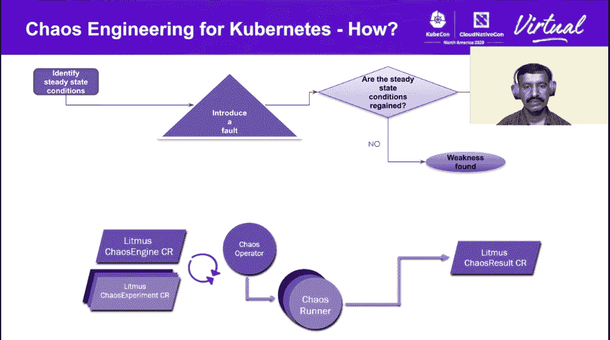
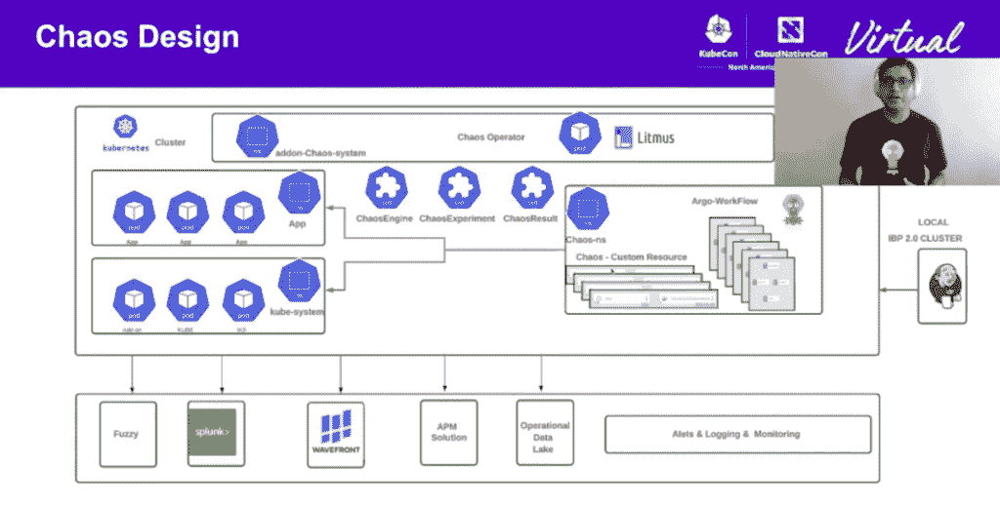
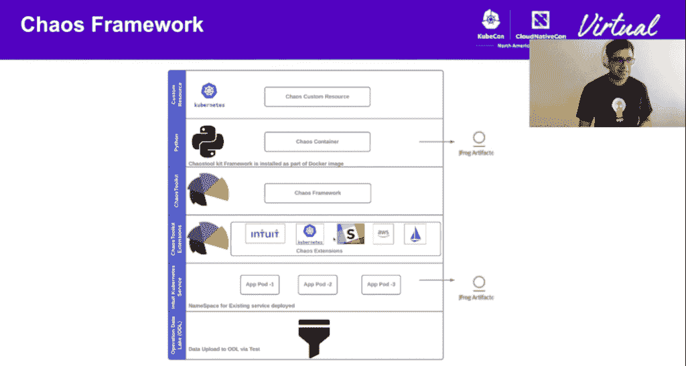

# LitmusChaos 和 Argo 为 Kubernetes 带来了混沌工作流

> 原文：<https://thenewstack.io/litmuschaos-and-argo-bring-chaos-workflows-to-kubernetes/>

[Honeycomb](https://www.honeycomb.io/) 正在赞助新 Stack 对 Kubecon+CloudNativeCon 北美 2020 的报道。

“为什么[要为 Kubernetes 做](https://thenewstack.io/chaos-engineering-can-give-distributed-systems-stability/)混沌工程？这是因为您的应用弹性依赖于其他云原生应用。”

这就是云原生存储软件提供商 [MayaData](https://mayadata.io/) 、 [Umasankar Mukkara](https://github.com/umamukkara) 的首席运营官上周在 [KubeCon+CloudNativeCon](https://events.linuxfoundation.org/kubecon-cloudnativecon-north-america/) 上开始演讲的方式。事实上，他指出，一般应用程序 90%的弹性都依赖于其他应用程序。

他将混沌工程的稳定效应描述为在稳定状态下运行的系统中引入随机故障的过程。如果它保持稳定，你很好。如果你没有，你就找到了弱点。

Mukkara 和 Intuit 公司的首席工程师 Sumit Nagal 一起参加了会议。两人都是 [LitmusChaos](https://litmuschaos.io/) 的维护者，这是一个面向 Kubernetes 的开源云原生混沌工程框架 [LitmusChaos](https://github.com/litmuschaos) ，它[于去年 6 月](https://thenewstack.io/litmuschaos-brings-chaos-engineering-to-cncf-sandbox/)进入云原生计算基金会沙箱。他们展示了作为 CNCF 终端用户的 Intuit 如何使用 LitmusChaos 来管理和编排云原生实验，包括创建 DevOps 混沌工作流。

## 石蕊的混沌工程的声明味道

LitmusChaos 通过 CustomResourceDefinitions 或 CRD 提供定制 API，在 Kubernetes 集群上编排混乱。

Mukkara 说，LitmusChaos“以云原生的、完全声明性的方式工作”，这意味着它允许你像 Kubernetes 中的自定义资源一样定义混沌。这种可定制性在基础设施级别、应用程序级别、Kubernetes 节点内以及节点内的其他资源(如内存、CPU 和磁盘)中同样适用。

他接着说，“Litmus 提供了在你的企业中大规模运行混沌工程所需的一切。”

这包括 ChaosHub，它甚至允许经验有限的用户将“现成的”混乱引入他们的系统，只需三个简单的步骤。它现在包括 22 个普通实验:

*   Pod 删除
*   集装箱杀人
*   Pod 网络延迟
*   Pod 网络损耗
*   Pod CPU 猪
*   Pod 内存猪
*   磁盘填充
*   轮盘摩擦损失
*   节点 CPU 占用
*   节点内存猪
*   节点漏极
*   库伯莱服务杀死
*   Pod 网络复制
*   节点污染
*   码头工人服务终止
*   Pod 自动缩放器
*   服务窗格—应用程序
*   应用服务
*   集群 pod — kiam
*   Pod IO 胁迫
*   节点 IO 应力

Pod delete 是目前为止最流行的混沌模板，而内存和服务可靠性也经常使用。

Mukkara 说 LitmusChaos 是高度可扩展的，用户可以使用 BYOC 的 Litmus SDK“带来你自己的混乱”，然后鼓励他们为项目做出贡献。

Litmus 使用另一个 2020 年 CNCF 沙盒新增功能[Argo](https://argoproj.github.io/)GitOps-oriented Cloud Native Continuous Integration/Continuous Deployment(CI/CD)工具来大规模创建混沌工作流，允许整合不同实验的结果。

Mukkara 解释说，“因为整个工作流是以声明方式配置的，所以你可以使用 GitOps 来实践混沌工程”，其中“你建立了一个混沌工作流，它产生了一组混沌指标和事件，这些指标和事件被上传到 Prometheus，”这是一个 CNCF 监控工具。

这些混沌工作流是由因纽特团队发起的，目的是在并行模拟其他工作负载行为的同时执行混沌。

## Intuit 将 Litmus Chaos 工作流应用于 DevOps 模式

[Intuit 开发者平台](https://thenewstack.io/qa-intuits-developer-experience-with-kubernetes/)拥有 4，000 名软件开发者，在 230 个集群上提供 2，500 项服务，并且还在增长。纳加尔领导的可靠性团队已经与混沌工程合作了大约三年。

纳加尔和穆卡拉去年 2 月开始了他们的概念验证。10 月，他们开源了 Litmus 插件基础设施和 Litmus Python 和 Argo 工作流，其中包括 Argo 工作流、Argo 的性能和混乱，以及通过 Jenkins 的 Argo 工作流。

在 Intuit，团队建立了一个插件基础设施，他们的所有工作都由定制资源完成。他们使用基于角色的访问控制来针对特定的应用程序和 Kubernetes 特定的名称空间。所有这些数据然后被推送到各种监控和可观察性工具，由该公司的[詹金斯管道](https://www.jenkins.io/)执行。混沌操作符将寻找自定义资源。

然后这些实验被嵌入容器中。他们编写他们的混沌实验测试，并将其放入 Argo 工作流中，用 Git 编写并与 Jenkins 集成。然后 Argo 执行工作流，挑选指定的实验并启动实验。

为什么要使用这些独特的工作流程，而不是像 YAML 这样的东西呢？

Nagal 说，“从逻辑上讲，如果你真的想把所有事情都作为管道的一部分来执行，那么在很多情况下，这将变得非常具有挑战性。所以自动化是一回事。现在 Argo 的工作流程，一切都像一个 YAML 一样，我们只需使用其中一个参数即可提交。”

他接着说，既然一切都是代码，你就不必在数百个软件集群中维护不同种类的 YAML。它也正好适合 Intuit CI/CD 管道，将自动化和基础设施作为代码。

Nagal 继续列举 Litmus-Argo 工作流程的好处，包括:

*   通过优化资源利用节省成本
*   性能混乱时的可靠性
*   构建复杂场景的能力
*   轻松实现自助快速入职
*   涵盖整个生命周期

他说，这不仅能让你获得混沌的无状态，也能让你获得表演的无状态。

“由于整个执行过程是以一种非常可预测的方式进行的，这给整个设置带来了很多信心，”Nagal 说。

<svg xmlns:xlink="http://www.w3.org/1999/xlink" viewBox="0 0 68 31" version="1.1"><title>Group</title> <desc>Created with Sketch.</desc></svg>