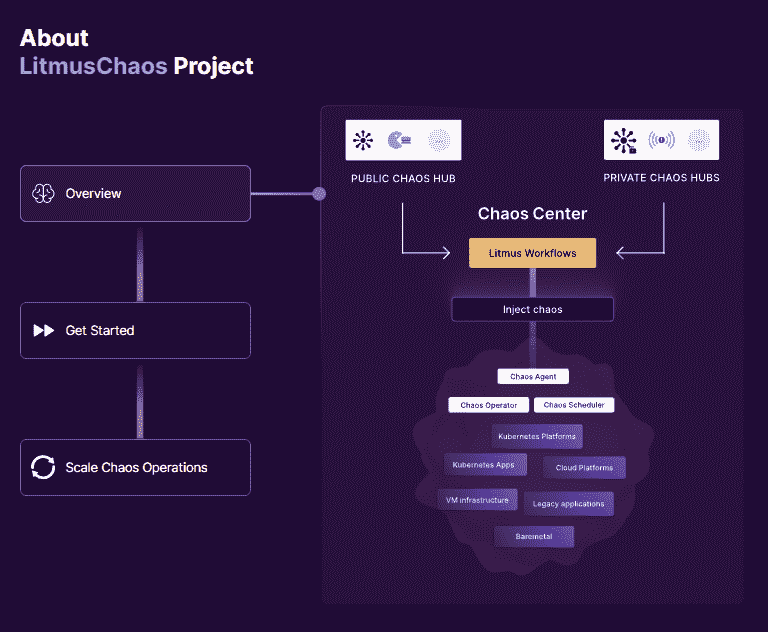

# LitmusChaos 成为 CNCF 孵化器项目

> 原文：<https://thenewstack.io/litmuschaos-becomes-a-cncf-incubator-project/>

你想把[混沌工程](https://thenewstack.io/chaos-engineering-made-simple/)引入你的云和 Kubernetes 开发吗？简而言之，您是否希望在真实的生产世界有机会击败您的应用程序之前，在开发中击败它们？如果是这样，你会很高兴地知道[云本地计算基金会](https://cncf.io/?utm_content=inline-mention) (CNCF)技术监督委员会(TOC)已经将 [LitmusChaos](https://litmuschaos.io/) 从 CNCF 的沙箱推向孵化阶段。

LitmusChaos 当然是一个开源的混沌工程平台。它使您能够通过以可控的方式引入混乱测试来识别基础设施中的弱点和潜在的中断。它通过为您提供经过良好测试的、高度可调的和声明性的混沌实验来做到这一点。

使用 LitmusChaos，您可以按顺序或并行地链接测试，以构建一个混沌场景。工作流本身是声明性的、可调度的和可浏览的。您还可以运行工作流分析。

### 整个应用程序陷入混乱

[云原生混沌工程](https://thenewstack.io/chaos-engineering-for-cloud-native/)的想法是确保负责整个应用程序正常运行的每个组件都具有弹性，能够承受现实生活中的动荡条件。LitmusChaos 使您能够给整个应用程序带来混乱，而不仅仅是特定的微服务。

这一切都始于 2017 年，当时是一个为 [Kubernetes](https://thenewstack.io/category/kubernetes/) 提供简单混沌工作的项目。它在 2020 年成为了一个 CNCF 沙盒项目，如今拥有来自云原生厂商、解决方案提供商和最终用户的五个不同组织的维护人员。从那以后，它变得越来越大，越来越好。

今天，LitmusChaos 已经被超过 25 个组织用于生产。其中包括大型终端用户公司，如 Intuit、Lenskart 和 Orange，以及技术巨头，如 Red Hat 和 VMware。自 2021 年初以来，Litmus operator 的安装量从每天 50 个增加到每天 2000 多个。简而言之，它已经非常受欢迎，并且有着良好的记录。

### 构建健壮系统的关键

正如 CNCF 首席技术官 Chris Aniszczyk 所观察到的，“混沌工程技术使组织能够在其生产环境中培养可靠性和健壮性。这种实践将是构建强大系统的关键，LitmusChaos 已经在寻求提高生产部署弹性的组织中取得了成功。”

具体来说，像红帽高级软件工程师[乔迪·吉尔](https://www.linkedin.com/in/jordigilh/)这样的开发者非常喜欢 LitmusChaos。Gil 说，“在开发我们的云原生混沌场景时，Litmus 是我们的首选。它的大量实验、开源特性和友好的社区为我们提供了成功完成目标所需的所有要素。”

终端用户也喜欢它。[Orange 首席工程师 Samar Sidharth](https://www.crunchbase.com/person/samar-sidharth) 说，“Litmus 是一个伟大的工具，它提供了开箱即用的通用混沌测试，在实验的不同时间使用不同类型的探针进行验证，这使得自动化变得容易。”

“在过去的几年中，实践混沌的人物角色越来越多，”Litmus 的项目维护者和开放源代码领导者 Karthik Satchitanand 观察到。“这带来了许多观点，产生了围绕混沌管理、可观察性& CI/CD 集成的特性。看到开发人员使用 Litmus 的 BYOC(自带混沌)方法构建自己的稳态假设验证和实验探针也令人振奋。”

### 快速改进

该计划也在继续快速改进。LitmusChaos 2.0 于 8 月发布。这个版本带来了改进的可伸缩性和新特性。其中包括测试和测量稳态假设的输出，以及一组增加的 [Prometheus](https://prometheus.io/) 指标，用于检测应用仪表板以获得更好的可观察性。

今天，它的主要组成部分是:

*   **混沌操作符**:使用操作符 SDK 框架构建，管理混沌实验的生命周期。
*   ChaosHub :主持快速启动混沌工程所需的大部分混沌实验。
*   **Litmus 工作流程**:混沌实验或者按顺序或者并行链接，以构建一个混沌场景。工作流是声明性的、可调度的和可浏览的。工作流分析也是可用的。
*   **ChaosCenter** :设计、调度&监控 Litmus 工作流的集中控制平面，能够通过代理管理多个目标环境中的混乱。chaos-center 支持团队合作，以促进混乱场景的协作，并帮助分析跨运行的弹性行为。
*   **Litmus Probes** :各种探针帮助用户创建完整的混沌场景，具有自动化的稳态验证和修复动作，接近失败时的真实应用体验。
*   **混乱可观察性** : Litmus 导出普罗米修斯指标，通过内部仪表盘和 APM 工具上的外部可视化，帮助实时突出和量化混乱对应用程序或基础架构的影响。

### 自带

LitmusChaos 也支持有趣的命名为“自带混乱”(BYOC)。有了这个，就可以集成第三方混沌工具来注入混沌。今后，它还将支持 IOChaos、HTTPChaos 和 JVMChaos 等故障注入类型。

展望未来， [LitmusChaos 的路线图](https://github.com/litmuschaos/litmus/blob/master/ROADMAP.md)包括新功能。这些功能将包括针对 Kubernetes 和非 Kubernetes 目标的一组增加的实验，改进的可观测性和通过 [OpenTelemetry](https://opentelemetry.io/) 与其他平台的集成，等等。此外，它的开发人员看到了与其他 CNCF 连续交付和服务网格项目携手合作。这个想法是将 LitmusChaos 完全融入 CNCF 生态系统。

LitmusChaos 是为云原生混沌工程而创建的。但是，其开发者也计划将其扩展到旧式虚拟机和云基础设施，如亚马逊网络服务、GCP、Azure、VMWare，甚至裸机。简而言之，如果一切顺利，它将成为一个通用的混沌工程工具。

这个项目已经做得很好了。如果您正在考虑在您的云原生程序中使用混沌测试——您应该这样做——LitmusChaos 值得您关注。

<svg xmlns:xlink="http://www.w3.org/1999/xlink" viewBox="0 0 68 31" version="1.1"><title>Group</title> <desc>Created with Sketch.</desc></svg>