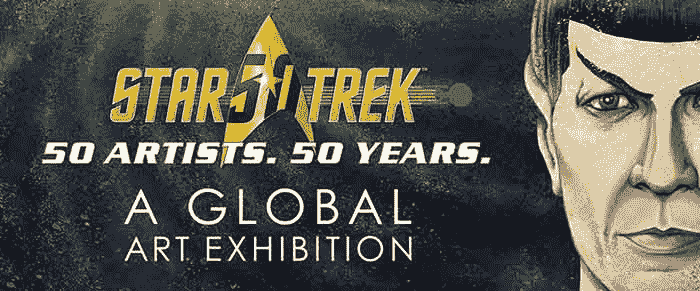
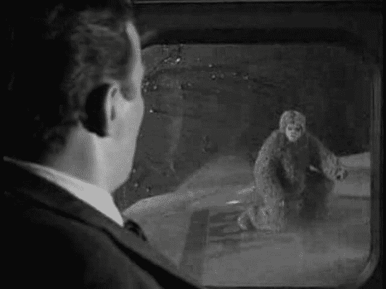
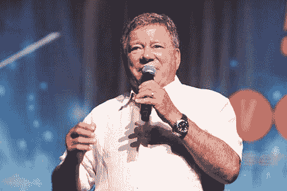
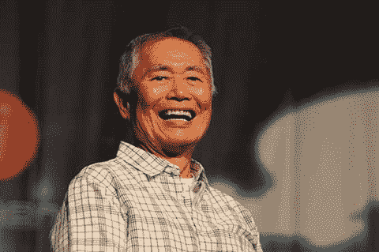
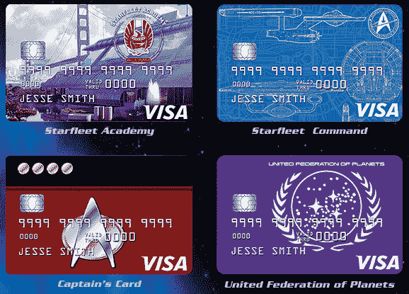

# 生动的星际迷航大会庆祝历史性的 50 周年

> 原文：<https://thenewstack.io/lively-star-trek-convention-celebrates-historic-50th-anniversary/>

《星际迷航》50 周年纪念日正以惊人的速度临近，这引发了一些银河系规模的庆祝活动。

上周，粉丝们聚集在拉斯维加斯参加[一场非常特别的*星际旅行*大会](http://www.creationent.com/cal/st_lasvegas.html)。虽然该剧的官方周年纪念日是 9 月 8 日，距离 CBS 播出该剧第一集的那个决定性的日子已经过去了半个世纪，但大会的组织者已经召集了一大批名人和工作人员与他们的粉丝见面，分享回忆。它可能代表着极客的最高峰——或者至少是科幻电视史上的一个重要里程碑。

据大家说，大家都过得很愉快。

到目前为止，过去 50 年中的每一年都有不同的《星际迷航》电视剧(如果你算上从 1973 年到 1974 年播放的动画《星际迷航》卡通片)，总共有 6 部电视剧，以及 1979 年到 2016 年这 37 年间的 12 部电影。因此，这次大会为所有年龄的粉丝提供了一些东西。门票很快售罄，在拉斯维加斯一个炎热的周三下午，一群盛装的暴民开始来到里约套房酒店，迎接他们的英雄。

因为大会在拉斯维加斯举行，有人甚至扮成了《星际迷航》中的猫王。

大会从 8 月 3 日持续到 8 月 7 日，组织者安排了几场特别活动。亚当·尼莫伊为他的父亲伦纳德举办了一场悼念活动，伦纳德曾扮演科学官员斯波克先生，还有一张巨大的海报，粉丝们可以在海报上签名，纪念在最新的《星际迷航》电影中扮演契诃夫的演员安东·尤金，他在大会前几个月的一场车祸中丧生。还有一个名为[“星际迷航:50 位艺术家”的特别展览，展出了纪念整个系列的绘画作品。50 年。”](https://www.cnet.com/pictures/star-trek-50-years-50-artists/)还有一个生动的分组会议，演示如何使用博格化妆品[。](https://www.cnet.com/news/how-to-build-a-borg-lessons-from-a-star-trek-makeup-legend/)

但是最吸引人的可能是这部剧的演员。6000 名观众聆听了 85 岁的威廉·夏特纳讨论他的事业——而不仅仅是在《星际迷航》中扮演柯克船长。他说，有时他仍然会把空乘人员叫过来，看着飞机的机翼，好像上面有个小精灵——就像他 1963 年的《暮光之城》(Twilight Zone)剧集《20000 英尺的噩梦》(mornight at 20000 ft)中那样

沙特纳甚至告诉一个 12 岁的粉丝，是的，他确实喜欢玩口袋妖怪 Go。CNET 报道说，沙特纳“在采访中表现得风度翩翩，谈吐大方，这是对《星际迷航》50 周年纪念的恰当致敬。”

同样出现的还有 79 岁的竹井乔治，他分享了一个关于《星际迷航》的创作者吉恩·罗登伯里的辛酸故事，他说虽然他支持同性恋平等，但电视工作室不允许他把它写进电视剧里。虽然武井真本人是同性恋，但他认为他扮演的苏鲁是异性恋，他更希望最新电影《星际迷航之外》用一个完全不同的角色来处理这个问题。

奥斯卡获奖女演员乌比·戈德堡——她曾在《星际迷航:下一代》中扮演酒保桂南——也出现在大会上与 T2 分享她自己的观点。戈德堡记得，在 20 世纪 60 年代，当他还是个少年的时候，“在吉恩·罗登伯里让一个美丽的黑人女性出现在那个节目之前，你永远不会看到未来的黑人。不仅仅是一个美丽的黑人女性，而是一个美丽的黑人女性，她是通讯官。她没有打扫房间，”据 CNet 报道。

那位通信官员——或者至少是现年 83 岁的女演员尼切尔·尼克斯——也出席了大会，当乌比拿着麦克风凑过来时，CNET 拍下了她微笑的眼睛。不幸的是，在《深空九号》(T4)中扮演威廉·罗斯海军上将的巴里·詹纳本周去世，享年 80 岁。他的粉丝这周会想着他。

当然，大会并不是唯一庆祝《星际迷航》的地方。《新闻周刊》[向美国各地的报摊发行了一期特刊](http://www.trektoday.com/content/2016/08/special-star-trek-newsweek-issue/), NASA 的信用合作社开始用信用卡[提供 50，000 奖励积分](http://www.prnewswire.com/news-releases/nasa-federal-credit-union-celebrates-the-50th-anniversary-of-star-trek-with-a-special-50000-bonus-point-offer-on-their-official-star-trek-credit-cards-300309831.html),并抽奖出售 NASA 的飞行夹克。

但是影迷聚会一直是《星际迷航》整个文化的一个重要部分。事实上，有来自六部电视剧的几十名演员，以及像约翰和贝蒂·乔·特林布尔这样的特邀嘉宾，他们是超级粉丝，他们在 1968 年的写信活动挽救了被取消的原版电视剧。

因此，虽然主要嘉宾包括上世纪 60 年代末第一部系列电影的演员，但粉丝们也有机会见到第二部系列电影《星际迷航:下一代》的大部分演员一同亮相的还有在《深空九号》中扮演酒保费伦吉·夸克的阿尔明·谢摩尔曼，以及扮演维克·方丹的詹姆斯·达伦，后者是该剧对 20 世纪 60 年代拉斯维加斯艺人的 24 世纪全息模拟。粉丝们也惊讶于在《深空九号》*中将他们最喜欢的外星人拟人化的人——奥多、罗姆、诺格、马托克、莉塔、基拉·奈里斯、贾迪亚和埃兹里·达克斯——以及《航海家》*中的演员，如凯特·穆格鲁、蒂姆·罗斯、罗伯特·皮卡多、洁蕊·瑞恩。《量子飞跃》中的斯科特·巴库拉还在最后一集《企业号*》*(2001 年至 2005 年)中扮演了星际飞船阿彻船长，并与扮演星际舰队军官特里普·塔克和马尔科姆·里德以及塔拉西安·尼利斯的演员一起出现。**

 **粉丝遇到明星，照片被抓拍，回忆被分享，新的回忆形成。但在一天结束时，这一切都有趣地提醒了《星际迷航》的快乐——它充满希望的精神和对更光明和更美好未来的真诚祝愿。而且不说别的，也许这也肯定了《星际迷航》永远都会有，只要有粉丝来庆祝。一部新的电视剧甚至正在制作中——由吉恩·罗登伯里的儿子罗德制作。大会怎么样？现在可能有成千上万的影迷在响应柯克船长在第七部电影《星际迷航:世代》中的临终遗言。

“这……很有趣。”

* * *

# WebReduce

专题图片[来自](https://www.instagram.com/p/BIxhfAcjplJ/?taken-by=startrek)星际迷航 Instagram feed 其他照片来自[星际迷航拉斯维加斯](http://www.creationent.com/cal/st_lasvegas.html)宣传网站。

<svg xmlns:xlink="http://www.w3.org/1999/xlink" viewBox="0 0 68 31" version="1.1"><title>Group</title> <desc>Created with Sketch.</desc></svg>**